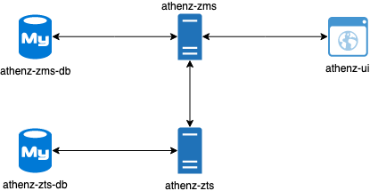
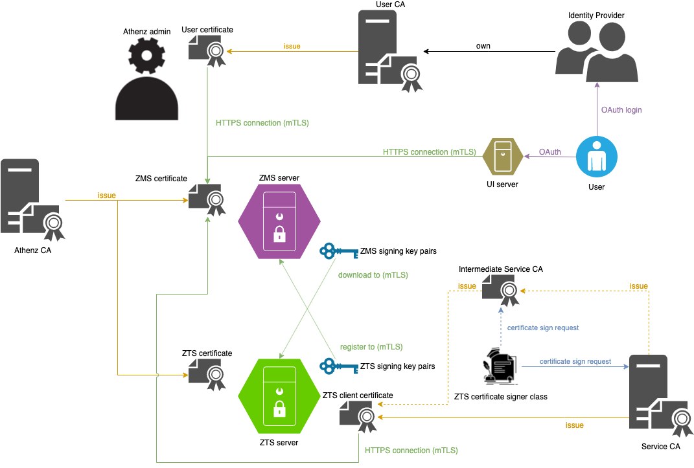

<a id="markdown-athenz-bootstrap-with-docker" name="athenz-bootstrap-with-docker"></a>
# Athenz bootstrap with docker

<!-- TOC -->

- [Athenz bootstrap with docker](#athenz-bootstrap-with-docker)
    - [Athenz components](#athenz-components)
    - [Trust in Athenz](#trust-in-athenz)
    - [Bootstrap steps](#bootstrap-steps)
    - [Appendix](#appendix)
        - [Athenz Demo Playback (cast)](#athenz-demo-playback-cast)
        - [points to note](#points-to-note)
        - [automation shortcut](#automation-shortcut)
        - [TODO](#todo)

<!-- /TOC -->

<a id="markdown-athenz-components" name="athenz-components"></a>
## Athenz components



<a id="markdown-trust-in-athenz" name="trust-in-athenz"></a>
## Trust in Athenz

In Athenz, we often have 3 types of CA:
1. Athenz CA
    - issuing certificates for all Athenz components
        - Athenz components include
            - ZMS
            - ZTS
            - Athenz UI
1. User CA
    - issuing certificates for Athenz users
        - Athenz users are users required to access the Athenz API directly
        - Athenz users include
            - Athenz admin
            - Domain admin of other services
    - usually provided by an identity provider
1. Service CA
    - issuing certificates for applications/robots/workloads (service)
    - a service can access Athenz API by
        1. acting on behalf the service user's identity
        1. using the pre-injected service identity during deployment phase
    - usually provided by an identity framework running on the deployment environment
        - example of identity framework
            - Athenz
            - SPIFFE
        - example of deployment environment
            - Kubernetes
            - OpenStack



<a id="markdown-bootstrap-steps" name="bootstrap-steps"></a>
## Bootstrap steps

> If you just want to try out Athenz, please jump to [automation-shortcut](#automation-shortcut) section.
> 
> For details, please read [try-out-Athenz-with-self-signed-CA](./try-out-Athenz-with-self-signed-CA.md) and then start from step 4 (Set up ZMS).

1. Ask your CA to sign the following certificates
    - Athenz CA
        - ZMS API server certificate
        - ZTS API server certificate
    - User CA
        - Athenz domain admin certificate
    - Service CA
        - Intermediate CA certificate for ZTS certificate signer
        - ZTS client certificate
1. Set up your deployment environment with [env.sh](../env.sh) (you may want to modify it beforehand)
    ```bash
    BASE_DIR="$(git rev-parse --show-toplevel)"

    . "${BASE_DIR}/docker/env.sh"
    ```
1. Copy your CAs certificates in `$CA_DIR`
    ```bash
    echo ${ATHENZ_CA_PATH}
    echo ${USER_CA_PATH}
    echo ${SERVICE_CA_PATH}
    ```
1. Set up ZMS ([zms-setup](./zms-setup.md))
1. Set up ZTS ([zts-setup](./zts-setup.md))
1. Simple verification of the deployment (`make verify`)
1. Verify your setup ([acceptance-test](./acceptance-test.md))
1. [optional] Setup Athenz with external IdP ([using-public-OAuth2-IdP](./using-public-OAuth2-IdP.md))

<a id="markdown-appendix" name="appendix"></a>
## Appendix

<a id="markdown-athenz-demo-playback-castcast" name="athenz-demo-playback-castcast"></a>
### Athenz Demo Playback ([cast](./cast))

[](https://asciinema.org/a/330037)

<a id="markdown-points-to-note" name="points-to-note"></a>
### points to note

1. All Athenz principal are normalized to lower case.
1. The suggested MySQL settings only provide the minimal functionality. Please consult your DB administrator to have the optimal configuration.
1. The order of the Authority classes is important. `OAuth > certificate`

<a id="markdown-automation-shortcut" name="automation-shortcut"></a>
### automation shortcut

same as `make deploy-dev`
```bash
BASE_DIR="$(git rev-parse --show-toplevel)"
. "${BASE_DIR}/docker/env.sh"

# generate self-signed certificates
docker run --rm -t \
    -v "${BASE_DIR}:/athenz" \
    --user "$(id -u):$(id -g)" \
    athenz-setup-env \
    sh /athenz/docker/setup-scripts/self-signed-certificates.sh

# ZMS config
docker run --rm -t \
    -v "${BASE_DIR}:/athenz" \
    --user "$(id -u):$(id -g)" \
    athenz-setup-env \
    sh /athenz/docker/setup-scripts/zms-auto-config.sh
# ZMS deploy
sh "${DOCKER_DIR}/deploy-scripts/zms-deploy.sh"
# ZMS debug
docker run --rm -t \
    --network="${DOCKER_NETWORK}" \
    -v "${BASE_DIR}:/athenz" \
    --user "$(id -u):$(id -g)" \
    athenz-setup-env \
    sh /athenz/docker/deploy-scripts/zms-debug.sh

# ZTS config
docker run --rm -t \
    --network="${DOCKER_NETWORK}" \
    -v "${BASE_DIR}:/athenz" \
    --user "$(id -u):$(id -g)" \
    athenz-setup-env \
    sh /athenz/docker/setup-scripts/zts-auto-config.sh
# ZTS deploy
sh "${DOCKER_DIR}/deploy-scripts/zts-deploy.sh"
# ZTS debug
docker run --rm -t \
    --network="${DOCKER_NETWORK}" \
    -v "${BASE_DIR}:/athenz" \
    --user "$(id -u):$(id -g)" \
    athenz-setup-env \
    sh /athenz/docker/deploy-scripts/zts-debug.sh
```

<a id="markdown-todo" name="todo"></a>
### TODO

1. [later] integrate `HttpCertSigner` with [Let's Encrypt](https://letsencrypt.org/)
1. [later] fix "Missing key manager password for the key store: " in `com.yahoo.athenz.common.utils.SSLUtils`
    - remove `athenz.zms.client.keymanager_password=dummy` in `zts.properties`
1. [later] support auto ZTS client certificate rotation in ZMS client inside ZTS (`ZMSFileChangeLogStore`)
