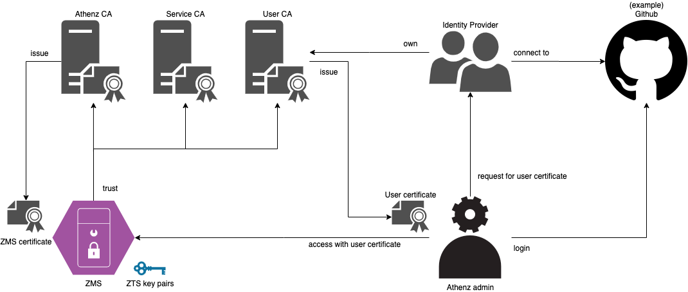

<a id="markdown-setup-zms-in-production-env" name="setup-zms-in-production-env"></a>
# Setup ZMS in production env.

<!-- TOC -->

- [Setup ZMS in production env.](#setup-zms-in-production-env)
    - [Prerequisites](#prerequisites)
    - [Target](#target)
    - [Steps](#steps)
        - [1. update your passwords](#1-update-your-passwords)
        - [2. get a server certificate for ZMS](#2-get-a-server-certificate-for-zms)
        - [3. create ZMS key pairs for signing Athenz token](#3-create-zms-key-pairs-for-signing-athenz-token)
        - [4. create ZMS trust store for HTTPS connections](#4-create-zms-trust-store-for-https-connections)
        - [5. create ZMS key store with ZMS server certificate](#5-create-zms-key-store-with-zms-server-certificate)
        - [6. config the Athenz domain admin](#6-config-the-athenz-domain-admin)
        - [7. summary](#7-summary)
    - [Get Athenz domain admin user certificate for accessing ZMS](#get-athenz-domain-admin-user-certificate-for-accessing-zms)
    - [Deploy ZMS](#deploy-zms)
        - [Debug ZMS](#debug-zms)

<!-- /TOC -->

<a id="markdown-prerequisites" name="prerequisites"></a>
## Prerequisites

1. `openssl`
1. `keytool`
1. Env. setup done. ([env.sh](../env.sh))
1. Bootstrap setup done. ([Done step 1, 2, 3](./Athenz-bootstrap.md#bootstrap-steps))

<a id="markdown-target" name="target"></a>
## Target



<a id="markdown-steps" name="steps"></a>
## Steps


<a id="markdown-1-update-your-passwords" name="1-update-your-passwords"></a>
### 1. update your passwords

```bash
# ZMS passwords
export ZMS_DB_ROOT_PASS=<your_password>
export ZMS_DB_ADMIN_PASS=<your_password>
export ZMS_KEYSTORE_PASS=<your_password>
export ZMS_TRUSTSTORE_PASS=<your_password>
```

<a id="markdown-2-get-a-server-certificate-for-zms" name="2-get-a-server-certificate-for-zms"></a>
### 2. get a server certificate for ZMS

- Create your CSR and private key for ZMS (TODO: provide template .cnf file)
- Ask your **Athenz CA** to sign the CSR and get the server certificate for ZMS
```bash
# copy your file in the following paths
echo "${ZMS_CERT_KEY_PATH}"
echo "${ZMS_CERT_PATH}"
```

<a id="markdown-3-create-zms-key-pairs-for-signing-athenz-token" name="3-create-zms-key-pairs-for-signing-athenz-token"></a>
### 3. create ZMS key pairs for signing Athenz token

```bash
openssl genrsa -out "${ZMS_PRIVATE_KEY_PATH}" 4096
openssl rsa -pubout -in "${ZMS_PRIVATE_KEY_PATH}" -out "${ZMS_PUBLIC_KEY_PATH}"
```

<a id="markdown-4-create-zms-trust-store-for-https-connections" name="4-create-zms-trust-store-for-https-connections"></a>
### 4. create ZMS trust store for HTTPS connections

- Verify CA file paths
```bash
ls -l "${ATHENZ_CA_PATH}"
ls -l "${USER_CA_PATH}"
ls -l "${SERVICE_CA_PATH}"
```
- Create the ZMS trust store
```bash
rm -f "${ZMS_TRUSTSTORE_PATH}"

CERT_ALIAS='athenz_ca'
openssl x509 -outform pem -in "${ATHENZ_CA_PATH}" | keytool -importcert -noprompt \
    -keystore "${ZMS_TRUSTSTORE_PATH}" -storepass "${ZMS_TRUSTSTORE_PASS}" \
    -storetype JKS -alias "${CERT_ALIAS}"

CERT_ALIAS='user_ca'
openssl x509 -outform pem -in "${USER_CA_PATH}" | keytool -importcert -noprompt \
    -keystore "${ZMS_TRUSTSTORE_PATH}" -storepass "${ZMS_TRUSTSTORE_PASS}" \
    -storetype JKS -alias "${CERT_ALIAS}"

CERT_ALIAS='service_ca'
openssl x509 -outform pem -in "${SERVICE_CA_PATH}" | keytool -importcert -noprompt \
    -keystore "${ZMS_TRUSTSTORE_PATH}" -storepass "${ZMS_TRUSTSTORE_PASS}" \
    -storetype JKS -alias "${CERT_ALIAS}"

# keytool -list -storepass "${ZMS_TRUSTSTORE_PASS}" -keystore "${ZMS_TRUSTSTORE_PATH}"
```

<a id="markdown-5-create-zms-key-store-with-zms-server-certificate" name="5-create-zms-key-store-with-zms-server-certificate"></a>
### 5. create ZMS key store with ZMS server certificate

```bash
openssl pkcs12 -export -noiter -nomaciter \
    -out "${ZMS_KEYSTORE_PATH}" -passout "pass:${ZMS_KEYSTORE_PASS}" \
    -in "${ZMS_CERT_PATH}" -inkey "${ZMS_CERT_KEY_PATH}"

# keytool -list -storepass "${ZMS_KEYSTORE_PASS}" -keystore "${ZMS_KEYSTORE_PATH}"
```

<a id="markdown-6-config-the-athenz-domain-admin" name="6-config-the-athenz-domain-admin"></a>
### 6. config the Athenz domain admin

As a demo, we will use the github identity. You can use any identity provider at your will.

- Get your github ID by the following API.
```bash
curl --silent https://api.github.com/users/<your github username> | grep '"id":'

export DOMAIN_ADMIN='user.github-<your github ID>'
# export DOMAIN_ADMIN='user.github-7654321'
```
- To simplify the set up, we will just configure a single admin.
```bash
# replace the placeholder in the sample configuration
sed -i "s/user.github-1234567/${DOMAIN_ADMIN}/g" "${ZMS_CONF_DIR}/zms.properties"
```

<a id="markdown-7-summary" name="7-summary"></a>
### 7. summary

```bash
$ tree "${CA_DIR}"
prod/CAs
├── athenz_ca.pem
├── service_ca.pem
└── user_ca.pem

$ tree "${PROD_ZMS_DIR}"
prod/zms
├── zms_cert.pem
├── zms_csr.pem
└── zms_key.pem

$ tree "${ZMS_DIR}"
zms
├── Dockerfile
├── conf
│   ├── athenz.properties
│   ├── authorized_services.json
│   ├── logback.xml
│   ├── solution_templates.json
│   └── zms.properties
└── var
    ├── certs
    │   ├── zms_keystore.pkcs12
    │   └── zms_truststore.jks
    └── keys
        ├── zms_private.pem
        └── zms_public.pem
```

<a id="markdown-get-athenz-domain-admin-user-certificate-for-accessing-zms" name="get-athenz-domain-admin-user-certificate-for-accessing-zms"></a>
## Get Athenz domain admin user certificate for accessing ZMS

- Request your identity provider to get a user certificate with `CN=user.<your github ID>`
```bash
# copy your file in the following paths
echo "${DOMAIN_ADMIN_CERT_KEY_PATH}"
echo "${DOMAIN_ADMIN_CERT_PATH}"
```

- If your certificate provider cannot issue user certificate with customized common name, you need to change the `zms.properties` configuration accordingly.
```properties
# related properties
athenz.user_domain=user
athenz.zms.domain_admin=user.github-1234567
```

<a id="markdown-deploy-zms" name="deploy-zms"></a>
## Deploy ZMS

```bash
sh "${DOCKER_DIR}/deploy-scripts/1.1.deploy-ZMS.sh"
```

<a id="markdown-debug-zms" name="debug-zms"></a>
### Debug ZMS

```bash
alias llm="less ${DOCKER_DIR}/logs/zms/server.log"
llm | tail

# add ZMS host
# grep "${ZMS_HOST}" /etc/hosts && echo '/etc/hosts already set' || sudo sed -i "$ a\127.0.0.1 ${ZMS_HOST}" /etc/hosts

# ZMS health check
curl --silent --cacert "${ATHENZ_CA_PATH}" "https://${ZMS_HOST}:${ZMS_PORT}/zms/v1/status"; echo '';

# get domains
ZMS_URL="http://${ZMS_HOST}:${ZMS_PORT}"
curl --silent \
    --cacert "${ATHENZ_CA_PATH}" \
    --key "${DOMAIN_ADMIN_CERT_KEY_PATH}" \
    --cert "${DOMAIN_ADMIN_CERT_PATH}" \
    "${ZMS_URL}/zms/v1/domain"; echo '';
```
