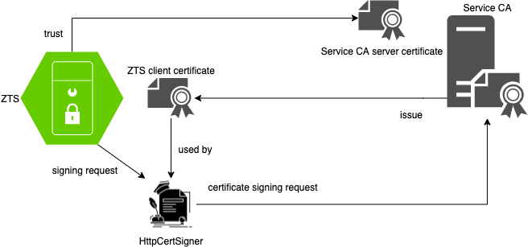

<a id="markdown-setup-zts-in-production-env" name="setup-zts-in-production-env"></a>
# Setup ZTS in production env.

<!-- TOC -->

- [Setup ZTS in production env.](#setup-zts-in-production-env)
    - [Prerequisites](#prerequisites)
    - [Target](#target)
    - [Steps](#steps)
        - [1. update your passwords](#1-update-your-passwords)
        - [2. get a server certificate for ZTS](#2-get-a-server-certificate-for-zts)
        - [3. create ZTS key pairs for signing Athenz token](#3-create-zts-key-pairs-for-signing-athenz-token)
        - [4. create trust store containing all the trusted CAs](#4-create-trust-store-containing-all-the-trusted-cas)
        - [5. create key store containing the ZTS server certificate](#5-create-key-store-containing-the-zts-server-certificate)
        - [6. set up for certificate signing](#6-set-up-for-certificate-signing)
            - [HttpCertSigner](#httpcertsigner)
            - [KeyStoreCertSigner](#keystorecertsigner)
        - [7. set up for ZMS connection](#7-set-up-for-zms-connection)
            - [Note](#note)
        - [8. summary](#8-summary)
        - [9. register ZTS service to Athenz](#9-register-zts-service-to-athenz)
        - [10. create athenz.conf](#10-create-athenzconf)
    - [Deploy ZTS](#deploy-zts)
        - [Debug ZTS](#debug-zts)
    - [Appendix](#appendix)
        - [HttpCertSigner Details](#httpcertsigner-details)

<!-- /TOC -->


<a id="markdown-prerequisites" name="prerequisites"></a>
## Prerequisites

1. `openssl`
1. `keytool`
1. Env. setup done. ([env.sh](../env.sh))
1. Bootstrap setup done. ([Done step 1, 2, 3, 4](./Athenz-bootstrap.md#bootstrap-steps))
1. ZMS setup done. ([zms-setup](./zms-setup.md))

<a id="markdown-target" name="target"></a>
## Target


<a id="markdown-steps" name="steps"></a>
## Steps

<a id="markdown-1-update-your-passwords" name="1-update-your-passwords"></a>
### 1. update your passwords

```bash
# ZTS passwords
export ZTS_DB_ROOT_PASS=<your_password>
export ZTS_DB_ADMIN_PASS=<your_password>
export ZTS_KEYSTORE_PASS=<your_password>
export ZTS_TRUSTSTORE_PASS=<your_password>

# used by com.yahoo.athenz.zts.cert.impl.HttpCertSigner, com.yahoo.athenz.zts.cert.impl.crypki.HttpCertSigner
export ZTS_SIGNER_KEYSTORE_PASS=<your_password>
export ZTS_SIGNER_TRUSTSTORE_PASS=<your_password>

# used by ZMS client in ZTS for ZMS connection
export ZMS_CLIENT_KEYSTORE_PASS=<your_password>
export ZMS_CLIENT_TRUSTSTORE_PASS=<your_password>

# javax.net.ssl.trustStorePassword
# export ZTS_JAVAX_TRUSTSTORE_PASS=<your_password>
```

<a id="markdown-2-get-a-server-certificate-for-zts" name="2-get-a-server-certificate-for-zts"></a>
### 2. get a server certificate for ZTS

- Create your CSR and private key for ZTS (TODO: provide template .cnf file)
- Ask your **Athenz CA** to sign the CSR and get the server certificate for ZTS
```bash
# copy your file in the following paths
echo ${ZTS_CERT_KEY_PATH}
echo ${ZTS_CERT_PATH}
```

<a id="markdown-3-create-zts-key-pairs-for-signing-athenz-token" name="3-create-zts-key-pairs-for-signing-athenz-token"></a>
### 3. create ZTS key pairs for signing Athenz token
```bash
openssl genrsa -out "${ZTS_PRIVATE_KEY_PATH}" 4096
openssl rsa -pubout -in "${ZTS_PRIVATE_KEY_PATH}" -out "${ZTS_PUBLIC_KEY_PATH}"
```

<a id="markdown-4-create-trust-store-containing-all-the-trusted-cas" name="4-create-trust-store-containing-all-the-trusted-cas"></a>
### 4. create trust store containing all the trusted CAs

- Verify CA file paths
```bash
ls -l "${ATHENZ_CA_PATH}"
ls -l "${USER_CA_PATH}"
ls -l "${SERVICE_CA_PATH}"
```
- Create the ZTS trust store
```bash
rm -f "${ZTS_TRUSTSTORE_PATH}"

CERT_ALIAS='athenz_ca'
openssl x509 -outform pem -in "${ATHENZ_CA_PATH}" | keytool -importcert -noprompt \
    -keystore "${ZTS_TRUSTSTORE_PATH}" -storepass "${ZTS_TRUSTSTORE_PASS}" \
    -storetype JKS -alias "${CERT_ALIAS}"

CERT_ALIAS='user_ca'
openssl x509 -outform pem -in "${USER_CA_PATH}" | keytool -importcert -noprompt \
    -keystore "${ZTS_TRUSTSTORE_PATH}" -storepass "${ZTS_TRUSTSTORE_PASS}" \
    -storetype JKS -alias "${CERT_ALIAS}"

CERT_ALIAS='service_ca'
openssl x509 -outform pem -in "${SERVICE_CA_PATH}" | keytool -importcert -noprompt \
    -keystore "${ZTS_TRUSTSTORE_PATH}" -storepass "${ZTS_TRUSTSTORE_PASS}" \
    -storetype JKS -alias "${CERT_ALIAS}"

# keytool -list -storepass "${ZTS_TRUSTSTORE_PASS}" -keystore "${ZTS_TRUSTSTORE_PATH}"
```

<a id="markdown-5-create-key-store-containing-the-zts-server-certificate" name="5-create-key-store-containing-the-zts-server-certificate"></a>
### 5. create key store containing the ZTS server certificate

```bash
openssl pkcs12 -export -noiter -nomaciter \
    -out "${ZTS_KEYSTORE_PATH}" -passout "pass:${ZTS_KEYSTORE_PASS}" \
    -in "${ZTS_CERT_PATH}" -inkey "${ZTS_CERT_KEY_PATH}"

# keytool -list -storepass "${ZTS_KEYSTORE_PASS}" -keystore "${ZTS_KEYSTORE_PATH}"
```

<a id="markdown-6-set-up-for-certificate-signing" name="6-set-up-for-certificate-signing"></a>
### 6. set up for certificate signing

<a id="markdown-httpcertsigner" name="httpcertsigner"></a>
#### HttpCertSigner
For production environment, we suggest to use the [HttpCertSigner.java](https://github.com/yahoo/athenz/blob/master/servers/zts/src/main/java/com/yahoo/athenz/zts/cert/impl/HttpCertSigner.java), so that you do not need to manage the signer CA's private key in Athenz server. For details, please refer to [HttpCertSigner Details](./zts-setup.md#httpcertsigner-details).

<a id="markdown-keystorecertsigner" name="keystorecertsigner"></a>
#### KeyStoreCertSigner
However, to simplify the setup, we will create an intermediate CA signed by the **Service CA** (1), and then use that intermediate CA to sign the service certificates issued by Athenz (2).

1. Create an intermediate CA certificate
    - Create your CSR and private key for the intermediate CA (TODO: provide template .cnf file)
    - Ask your **Service CA** to sign the CSR and get the intermediate CA certificate
    ```bash
    # copy your file in the following paths
    echo "${ZMS_CERT_KEY_PATH}"
    echo "${ZMS_CERT_PATH}"
    ```
1. Create the key store and trust store for the certificate signer
    ```bash
    # create key store
    openssl pkcs12 -export -noiter -nomaciter \
        -out "${ZTS_SIGNER_KEYSTORE_PATH}" -passout "pass:${ZTS_SIGNER_KEYSTORE_PASS}" \
        -in "${ZTS_SIGNER_CERT_PATH}" -inkey "${ZTS_SIGNER_CERT_KEY_PATH}"
    # keytool -list -storepass "${ZTS_SIGNER_KEYSTORE_PASS}" -keystore "${ZTS_SIGNER_KEYSTORE_PATH}"

    # create trust store (only used by HttpCertSigner)
    rm -f "${ZTS_SIGNER_TRUSTSTORE_PATH}"
    CERT_ALIAS='athenz_ca'
    openssl x509 -outform pem -in "${ATHENZ_CA_PATH}" | keytool -importcert -noprompt \
        -keystore "${ZTS_SIGNER_TRUSTSTORE_PATH}" -storepass "${ZTS_SIGNER_TRUSTSTORE_PASS}" \
        -storetype JKS -alias "${CERT_ALIAS}"
    # keytool -list -storepass "${ZTS_SIGNER_TRUSTSTORE_PASS}" -keystore "${ZTS_SIGNER_TRUSTSTORE_PATH}"
    ```

<a id="markdown-7-set-up-for-zms-connection" name="7-set-up-for-zms-connection"></a>
### 7. set up for ZMS connection

1. Create ZTS client certificate
    - Create your CSR and private key for the ZTS client certificate (TODO: provide template .cnf file)
    - Ask your **Service CA** to sign the CSR and get the ZTS client certificate
    ```bash
    # copy your file in the following paths
    echo "${ZMS_CLIENT_CERT_KEY_PATH}"
    echo "${ZMS_CLIENT_CERT_PATH}"
    ```
1. Create key store and trust store for ZMS connection
    ```bash
    # create key store
    openssl pkcs12 -export -noiter -nomaciter \
        -out "${ZMS_CLIENT_KEYSTORE_PATH}" -passout "pass:${ZMS_CLIENT_KEYSTORE_PASS}" \
        -in "${ZMS_CLIENT_CERT_PATH}" -inkey "${ZMS_CLIENT_CERT_KEY_PATH}"
    # keytool -list -storepass "${ZMS_CLIENT_KEYSTORE_PASS}" -keystore "${ZMS_CLIENT_KEYSTORE_PATH}" -v | grep 'Certificate\[' -A 3

    # create trust store for verifying the ZMS server certificate
    rm -f "${ZMS_CLIENT_TRUSTSTORE_PATH}"
    CERT_ALIAS='athenz_ca'
    openssl x509 -outform pem -in "${ATHENZ_CA_PATH}" | keytool -importcert -noprompt \
        -keystore "${ZMS_CLIENT_TRUSTSTORE_PATH}" -storepass "${ZMS_CLIENT_TRUSTSTORE_PASS}" \
        -storetype JKS -alias "${CERT_ALIAS}"
    # keytool -list -storepass "${ZMS_CLIENT_TRUSTSTORE_PASS}" -keystore "${ZMS_CLIENT_TRUSTSTORE_PATH}"
    ```

<a id="markdown-note" name="note"></a>
#### Note

1. You will need to bundle the intermediate CA if your ZTS client certificate is not signed by the **Service CA** directly.
1. Currently, ZTS cannot rotate its client certificate automatically. Please rotate the keystore file with the new client certificate manually.

<a id="markdown-8-summary" name="8-summary"></a>
### 8. summary

```log
$ tree "${CA_DIR}"
prod/CAs
├── athenz_ca.pem
├── service_ca.pem
└── user_ca.pem

$ tree "${PROD_ZTS_DIR}"
prod/zts
├── zms_client_cert.pem
├── zms_client_csr.pem
├── zms_client_key.pem
├── zts_cert.pem
├── zts_csr.pem
├── zts_key.pem
├── zts_signer_cert.pem
├── zts_signer_csr.pem
└── zts_signer_key.pem

$ tree "${ZTS_DIR}"
zts
├── Dockerfile
├── conf
│   ├── athenz.properties
│   ├── logback.xml
│   └── zts.properties
└── var
    ├── certs
    │   ├── zms_client_keystore.pkcs12
    │   ├── zms_client_truststore.jks
    │   ├── zts_keystore.pkcs12
    │   ├── zts_signer_keystore.pkcs12
    │   ├── zts_signer_truststore.jks
    │   └── zts_truststore.jks
    └── keys
        ├── zts_private.pem
        └── zts_public.pem
```

<a id="markdown-9-register-zts-service-to-athenz" name="9-register-zts-service-to-athenz"></a>
### 9. register ZTS service to Athenz

- Verify Athenz domain admin certificate file paths (created in [zms-setup](./zms-setup.md#get-athenz-domain-admin-user-certificate-for-accessing-zms))
```bash
ls -l "${DOMAIN_ADMIN_CERT_KEY_PATH}"
ls -l "${DOMAIN_ADMIN_CERT_PATH}"
```
- Add ZTS service using ZMS API
```bash
# get encoded ZTS public key string
ENCODED_ZTS_PUBLIC_KEY=`base64 -w 0 "${ZTS_PUBLIC_KEY_PATH}" | tr '\+\=\/' '\.\-\_'`
# ENCODED_ZTS_PUBLIC_KEY=`base64 -w 0 "${ZTS_PUBLIC_KEY_PATH}" | sed 's/+/./g; s/=/-/g; s:_:/:g'`
# decode: cat <file> | tr '\.\-\_' '\+\=\/' | base64 -d

DATA='{"name": "sys.auth.zts","publicKeys": [{"id": "0","key": "'"${ENCODED_ZTS_PUBLIC_KEY}"'"}]}'

# add ZTS service using ZMS API
ZMS_URL="https://${ZMS_HOST}:${ZMS_PORT}"
curl --silent --request PUT \
    --cacert "${ATHENZ_CA_PATH}" \
    --key "${DOMAIN_ADMIN_CERT_KEY_PATH}" \
    --cert "${DOMAIN_ADMIN_CERT_PATH}" \
    --url "${ZMS_URL}/zms/v1/domain/sys.auth/service/zts" \
    --header 'content-type: application/json' \
    --data "${DATA}"
# verify
curl --silent --request GET \
    --cacert "${ATHENZ_CA_PATH}" \
    --key "${DOMAIN_ADMIN_CERT_KEY_PATH}" \
    --cert "${DOMAIN_ADMIN_CERT_PATH}" \
    --url "${ZMS_URL}/zms/v1/domain/sys.auth/service/zts"; echo '';
```

<a id="markdown-10-create-athenzconf" name="10-create-athenzconf"></a>
### 10. create athenz.conf

Download the public keys of ZMS, so that ZTS can verify contents (e.g. policy, token, etc.) signed by ZMS.
```bash
docker run --rm --network="${DOCKER_NETWORK}" \
    --user "$(id -u):$(id -g)" \
    -v "${DOMAIN_ADMIN_CERT_KEY_PATH}:/etc/domain-admin/key.pem" \
    -v "${DOMAIN_ADMIN_CERT_PATH}:/etc/domain-admin/cert.pem" \
    -v "${ATHENZ_CA_PATH}:/etc/certs/athenz_ca.pem" \
    -v "${ZTS_CONF_DIR}:/zts/conf" \
    --name athenz-conf athenz-conf \
    -svc-key-file /etc/domain-admin/key.pem \
    -svc-cert-file /etc/domain-admin/cert.pem \
    -c /etc/certs/athenz_ca.pem \
    -z "https://${ZMS_HOST}:${ZMS_PORT}" \
    -t "https://${ZTS_HOST}:${ZTS_PORT}" \
    -o /zts/conf/athenz.conf

# less "${ZTS_ATHENZ_CONF}"
```

<a id="markdown-deploy-zts" name="deploy-zts"></a>
## Deploy ZTS

```bash
sh "${DOCKER_DIR}/deploy-scripts/2.3.deploy-ZTS.sh"
```

<a id="markdown-debug-zts" name="debug-zts"></a>
### Debug ZTS

```bash
alias llm="less ${DOCKER_DIR}/logs/zms/server.log"
alias llt="less ${DOCKER_DIR}/logs/zts/server.log"
alias llmf="less -f ${DOCKER_DIR}/logs/zms/server.log"
alias lltf="less -f ${DOCKER_DIR}/logs/zts/server.log"
llt | tail

# add ZTS host
# grep "${ZTS_HOST}" /etc/hosts && echo '/etc/hosts already set' || sudo sed -i "$ a\127.0.0.1 ${ZTS_HOST}" /etc/hosts

# ZTS health check
curl --silent --cacert "${ATHENZ_CA_PATH}" "https://${ZTS_HOST}:${ZTS_PORT}/zts/v1/status"; echo '';
```

<a id="markdown-appendix" name="appendix"></a>
## Appendix

<a id="markdown-httpcertsigner-details" name="httpcertsigner-details"></a>
### HttpCertSigner Details


Update the following properties in `zts.properties`.
```properties
athenz.zts.cert_signer_factory_class=com.yahoo.athenz.zts.cert.impl.HttpCertSignerFactory

athenz.zts.ssl_key_store=/opt/athenz/zts/var/certs/zts_signer_keystore.pkcs12
athenz.zts.ssl_key_store_type=PKCS12
#athenz.zts.ssl_key_store_password=athenz
athenz.zts.ssl_trust_store=/opt/athenz/zts/var/certs/zts_signer_truststore.jks
#athenz.zts.ssl_trust_store_password=athenz
athenz.zts.ssl_trust_store_type=JKS
javax.net.ssl.trustStore=/opt/athenz/zts/var/certs/zts_signer_truststore.jks
#javax.net.ssl.trustStorePassword=athenz
javax.net.ssl.trustStoreType=JKS

#athenz.zts.certsign_base_uri=
#athenz.zts.certsign_connect_timeout=10
#athenz.zts.certsign_request_timeout=5
#athenz.zts.certsign_retry_count=3
```
