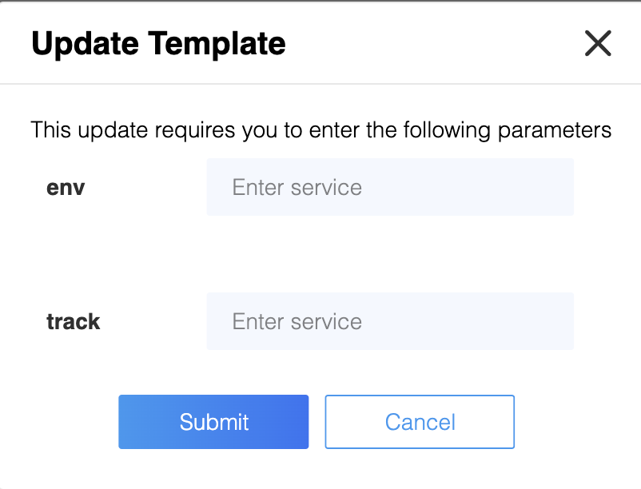
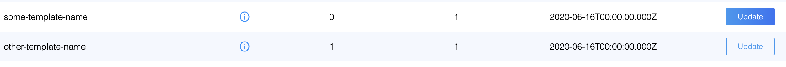

# Introducing Athenz Templates
Templates are a collection of predefined roles, 
policies and services that can be applied on a domain. 
Imagine in a real world scenario if you are creating a solution
for any organization(Openstack, Kubernetes) 
and subsequently want to set up provisioning rules(a static set of 
roles and policies) for the solution, rather than requiring each domain 
admin to create each of these roles and policies manually, 
you can pre-bundle the roles and policies as a template and Athenz 
will automatically apply them for you while creating or updating a domain.
    
## Templates

### Creating and updating templates
All templates will be managed by the Athenz System Administrators. To create / update templates, 
the administrators should create a file named solution_templates.json and store it in their 
data repository.

The file should follow the format below
```
{
	"<template_name>": {
		"metadata": {},
		"roles": [<athenz-roles>],
	        "policies": [<athenz-policies>],
		"services": [<athenz-services>]
      }
}
```

A sample file can be found at `servers/zms/conf/solution_templates.json`

## Template Entities
A Template consists of metadata, services, roles and role metadata, 
policies with assertions. Please find the explanation for every entity below

### MetaData
Metadata contains critical fields to represent vital characteristics of a template. 
Look at the sample structure below for one of the templates in use.

```         
 "metadata":
                {
                    "latestVersion": 1,
                    "timestamp": "2020-06-16T00:00:00.000Z",
                    "description": "Description of template",
                    "keywordsToReplace": "_env_,_track_",
                    "autoUpdate": false
                }
```

A - Description - description of the template (restrict it to 140 characters if possible)

B - latestVersion - to manage versioning. Everytime there is a change in the template including a template metadata change, Make sure to bump up the latestVersion field by 1.

C - Timestamp - recorded timestamp when you update(including 
metadata change) a template. This is purely to help you time track template changes.

D - keywordsToReplace - this field is a comma separated placeholder you can add to your role/policy name which will be auto replaced on the fly. for ex: keywordsToReplace will be set to 
“_env_, _track_” for a role name “_domain_:role.some-role._env_.track._track_.emitters". You should leave keywordsToReplace field empty if you do not have any placeholders in your role or policy name. (for ex: "keywordsToReplace": "",)

Note: _domain_ is the only exception here. When applying a template to a domain, the server will automatically include the correct domain name in role/policy names by replacing the _domain_ placeholder with the appropriate value so do not worry about adding it.

Example structure of roles/policies which uses multiple placeholders:

```
"roles": [
                {
                    "name": "_domain_:role.some-role._env_.track._track_.emitters",
                    "modified": "1970-01-01T00:00:00.000Z"
                }
            ],
            "policies": [
                {
                    "name": "_domain_:policy.some-policy._env_.track._track_.emitters",
                    "modified": "1970-01-01T00:00:00.000Z",
                    "assertions": [
                        {
                            "resource": "some-resource._env_:role.track._track_.emitters",
                            "role": "_domain_:role.some-role._env_.track._track_.emitters",
                            "action": "assume_role"
                        }
                    ]
                }
            ]
```

### Roles
Roles can have attributes like name, modified timestamp, Role Meta attributes
 (check the complete role meta attributes list below) and roleMembers. 
 By default roles that are created by the template will not have any members 
 unless the role members are hard-coded in the template 
 (check the example structure below). The domain administrator will 
 need to add members to those roles after the domain is created or the 
 template has been applied to a domain. Now if you notice role members array 
 in the image below, members can also have placeholders which have to be added 
 to keywordsToReplace.

Sample structure for Roles with role members:
```
           "roles": [
                {
                    "name": "_domain_:role.aws_instance_launch_provider",
                    "modified": "1970-01-01T00:00:00.000Z",
                    "roleMembers": [
                        {
                            "memberName": "athens.aws.*"
                        }
                    ]
                },
                {
                    "name": "_domain_:role.aws.ssh_login",
                    "modified": "1970-01-01T00:00:00.000Z"
                },
                {
                    "name": "_domain_:role.aws_ssh_cert_request",
                    "modified": "1970-01-01T00:00:00.000Z",
                    "roleMembers": [
                        {
                            "memberName": "_domain_._service_"
                        }
                    ]
                }
            ]
```
Allowed Role Meta Attributes:
```
"selfServe": "false",
"memberExpiryDays": 90,
"tokenExpiryMins": 30,
"certExpiryMins": 10,
"serviceExpiryDays": 50,
"memberReviewDays": 65,
"serviceReviewDays": 15,
"reviewEnabled": true
```

### Policies
Array of policies with name, modified timestamp and array of assertions. 
Check the sample Json below.

           "policies": [
                {
                    "name": "_domain_:policy.aws_instance_launch_provider",
                    "modified": "1970-01-01T00:00:00.000Z",
                    "assertions": [
                        {
                            "resource": "_domain_:service._service_",
                            "role": "_domain_:role.aws_instance_launch_provider",
                            "action": "launch"
                        }
                    ]
                },
                {
                    "name": "_domain_:policy.aws.ssh_login",
                    "modified": "1970-01-01T00:00:00.000Z",
                    "assertions": [
                        {
                            "resource": "_domain_:aws._service_.*",
                            "role": "_domain_:role.aws.ssh_login",
                            "action": "ssh_login",
                            "effect": "DENY"
                        }
                    ]
                }

## Applying Templates
Templates can be applied via [ZMS CLI](zms_client.md)
and via Athenz UI. let's take a look at a few examples on how to apply 
different types of templates.

### Example 1
Templates with placeholders in role and policy names 
(aka comma separated values in keywordsToReplace under template metadata field)
will have to pass the key value pair for all placeholders via CLI.
However, Athenz UI will automatically detect the placeholders and prompt 
the user to enter those placeholder values without which you cannot apply a template

##### CLI
```
zms-cli -d some-domain set-domain-template some-template-name env=ecli track=clit
```
##### UI

 
### Example 2 
Templates with static role and policy names i.e. no placeholders 
```
zms-cli -d some-domain set-domain-template other-template-name
```
##### UI
The update button with blue background means there is a latest version of the 
template available to apply and the update button with white background means 
there is no new version but you can still apply if you accidentally deleted a 
policy or role which is part of the template and wanted to patch it up.



### Auto Update
Auto update flag in templates lets the zms server to patch up the changes 
made to roles and policies automatically. This way the template creator does 
not need to communicate the tenant domains to patch them up manually through 
Athenz UI or CLI. AutoUpdate runs on zms servers during application startup 
in an uninterrupted fashion and applies roles and policies for all eligible 
templates. This feature will work only for templates with no placeholders
at the moment i.e.  the metadata section in the template should have the 
following values keywordsToReplace="" and autoUpdate set to true.

Note: it is important to bump up the latestVersion flag to apply any changes 
in the template including metadata changes like autoUpdate and keywordsToReplace.

### FAQ
###### 1 - What happens if i set the auto-update flag to true in template metadata but did not bump up the version?
Auto update will not kick in if the server does not detect a version bump in the template.

###### 2 - Is there a way to apply a template for the first time on a newly created domain in UI?
No. you can only update a template in the UI using the apply template button. You have to apply template for the first time via Cli

###### 3 - What happens if i pass a template name that is invalid via CLI?
If any of the template names is invalid, the request will be rejected with a Bad Request error message indicating the invalid template name. If the template is not found, then the request will be rejected with a Not Found error message indicating the template name that’s not registered in ZMS.

###### 4 - What is the difference between current version and latest version in the UI?
Current version is the template version already applied on your domain and the latest version is a new version that is available for you to apply. You will see a dark blue button in the UI when there is a latest version.

###### 5 - What should i do if i deleted a role or policy which is part of a template by accident?
Go to the UI and click on the update button(with white background if the template already has the latest version) and the roles and policies will be recreated.

###### 6 - What if I accidentally created a bunch of roles and policies while experimenting with a template and wanted to delete it?
One has to manually clean it up.

###### 7 - What are the different zms-cli commands to manage templates?
```
 Template commands:
   list-server-template
   list-domain-template
   show-server-template template
   set-domain-template template [template ...] [param-key=param-value ...]
   delete-domain-template template
```