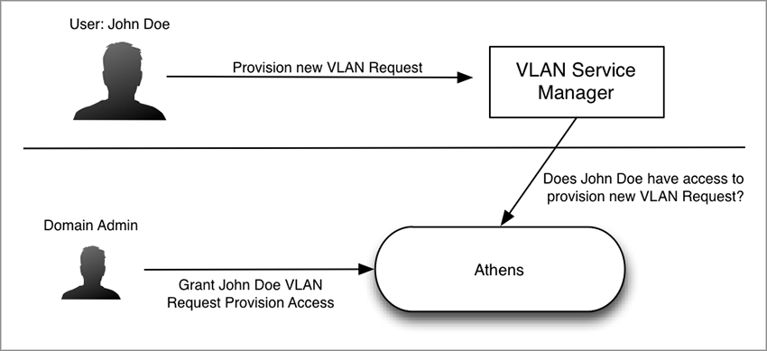

# Architecture - Authorization Flow
----------------------------------------

* [Use Cases](#use-cases)
    * [Manage Access Control / Permissions for Resources](#manage-access-control-and-permissions-for-resources)
    * [Real-Time Service Security](#real-time-service-security)
* [Authorization Flow](#authorization-flow)
    * [Centralized Access Control (Control-Plane)](#centralized-access-control-control-plane)
        * [Principals](#principals)
            * [Unix-Authenticated User](#unix-authenticated-user)
            * [Authenticated Service](#authenticated-service)
    * [Decentralized Access Control (Data-Plane)](#decentralized-access-control-data-plane)
        * [Policy Engine](#policy-engine)
* [Reserved Domains](#reserved-domains)
* [Management Scenarios](#management-scenarios)
    * [Simple Centralized Scenario](#simple-centralized-scenario)
    * [Multi-tenancy Scenario](#multi-tenancy-scenario)
    * [Service Authentication](#service-authentication)

## Use Cases
------------

### Manage Access Control and Permissions for Resources
-----------------------------------------------------

Athenz allows you to manage access control and permissions to resources
through the centralized authori**z**ation **m**anagement **s**ervice
(ZMS) and domain configuration that defines resources, roles, and
actions.

The diagram below shows a simplification of the use case without domain
configuration.

Your domain configuration file gives you fine control over who can
access resources and what actions can be taken. ZMS manages your domain
files and provides a RESTful API that allows you to create and modify
domain configurations.

This gives you the ability to control **user access**,
**tenancy**, and secure **editorial content** and **infrastructure
assets**.

### Real-Time Service Security
------------------------------

Athenz provides endpoint protection for services, so a service such as
Sports in the diagram below doesn't need to set network ACLs for other
services wanting to access data. Instead, services are authorized by
Athenz to access resources from another service based on the permissions
defined by the domain administrator.

## Authorization Flow
---------------------

### Centralized Access Control (Control-Plane)
----------------------------------------------

A traditional centralized mechanism works as expected for services that
are not dealing with the decentralized authorization: the server with
resources can simply ask the ZMS directly about access, passing the
NToken and resource/action information to get a simple boolean answer.
This does not scale well enough for data-plane access, since a central
service must be consulted, but requires no local installation of the ZPE
and related storage and synchronization logic, so it is suitable for
human interaction and control-plane provisioning uses.

#### Principals
---------------

In Athenz, actors that can assume a role are called principals.
Principals can be users or services, and users can be those looking for
resources from a service or use the ZMS management console. In the
following sections, we'll look at centralized authorization for the
principals we just discussed.

##### Unix-Authenticated User
-----------------------------

In the simplest case, we have no service management at all. When a user,
authenticated with his/her unix credentials, is to be authorized to access
a resource in a service, the user's NToken is passed straight to the target
service. That service must then make a call to ZMS to perform the check,
passing this identity on to ZMS.

The figure below shows how the user's tool fetches the user's token from
ZMS and then uses it to access a resource.

When implementing such solution, one must consider all security implications
of sending a user's NToken to another service. Athenz system already provides
some protection from user NToken reuse:
* To request RoleTokens for a given User NToken, the IP address of the
   incoming connection must match to the IP address that's in the NToken.
* To make modifications to a domain (e.g. the user is a domain admin)
   the IP address of the incoming connection must match to the IP address
   that's in the NToken.

However, if there are multiple services that are supporting centralized
authorization for user, then each one must make sure that the NToken
identifying the user is coming from the same IP address that is registered
in the NToken. Otherwise, if the service1 is compromised, then the user's
NToken can be used to access the resources authorized to that user from
service2 without user's knowledge.

##### Authenticated Service
---------------------------

Similarly, another service could be the principal (instead of a user or
domain manager), in which case it would present its NToken to the target
service, which would perform an identical check with ZMS to confirm
access.

This model is more desirable that the Authenticated User model since
the domain administrator can create a separate service that only has
access for the given provider, thus provider having access to the
service's identity will not have access to any other resource.

### Decentralized Access Control (Data-Plane)
---------------------------------------------

A more interesting scenario introduces the local policy engine (ZPE),
and a few supporting changes. Rather than directly asking for an access
check with a principal identity, the identity is instead used to get a
ZToken, and that is presented to the target service until it expires.
This mechanism allows a service to make a completely local access check
against ZPE, given a ZToken and locally cached policies.

Specifically, as shown in the diagram below, the client service/user
presents an authentication token (NToken) from SIA Provider to get an
authorization token (ZToken) from ZTS, and then presents the ZToken
to a target service to access its resources.

That service can make use of a local ZPE to validate the role assertions
in the ZToken, and then correlate them to the asynchronously updated
Policies for the domain involved. The ZPE can make the decision locally,
without going off box. It has no knowledge about specific users, only
roles, and because roles and policies are always in the domain, the
amount of data to distribute to the machine is small.

#### Policy Engine
------------------

The Policy Engine (ZPE) only needs to deal with policies and their roles,
actions, and resources. Concepts like groups would only affect how a
principal can assume a role, so is involved in getting the ZToken, but not
using it in the ZPE. When evaluating policies, the relevant assertions of
all relevant policies must be considered. Assertions are treated like a
big "OR" with the default effect of "Allow", whereas any single "Deny" will
override any other assertions. The policies can have prefix-matching wildcards,
so that glob-style matching needs to be part of the "is this assertion relevant"
logic.

The policies must be fetched from ZTS for the ZPE to operate. Additionally, the
policies must be refreshed as they change. It is expected that policies
will change at a much lower frequency than user/role assignments, so a daily
pull may be fine for this.

The policies are not sensitive (secret) information, but their integrity is
important, so the policies fetched (per domain) is signed by both ZMS and ZTS
servers. This requires a predictable serialization of the policy data structures.
That will be fields in the order the schema specifies, serialized to JSON, then
signed.

The actual fetch is performed by a locally running distribution agent, which could
be implemented as a cron job or other async fetching mechanism. The resulting policies
could be atomically changed per domain. Because the ZPE only will have policies for
the domains of services running on the same host/container, there will be relatively
few of them.

The API for getting signed policies actually gets many policies in a single list,
which is signed as a whole according to the ordering rules above.

## Reserved Domains
-------------------

The following domains are reserved and are automatically provisioned during
server startup:

* user - The reserved domain for authenticated users.
* sys - The reserved domain for managing system activities
* sys.auth - The Athenz domain itself, which is where policies governing
  the top level domains reside.

## Management Scenarios
-----------------------

### Simple Centralized Scenario
-------------------------------

In the simplest scenario, one would perform the following actions. Note that
even in this case, the management calls themselves are protected by Athenz,
so for example one property admin cannot modify another property's domain.

1. Set up domains as a super admin
2. Assign domain administrators for the domain
3. Create services in the domain
4. Create roles, as the domain admin, to model the expected activity. Assign
   users and services as needed.
5. Create policies, with references to resources that are the target of various actions
6. The services would implement the access check calls to enforce access
   based on the ZMS "access check" API. This may happen in a container or filter.

### Multi-tenancy Scenario
--------------------------

Setting up a tenant in a provider requires the concepts of a cross-domain
"trust relation". Such a trust relation can be implemented as follows:

1. A Policy is set up in the group-defining domain (Domain-A) that asserts
   that one of its local Roles can “assume” a role in the target Domain.
   The role used in this policy is arbitrary, under the control of Domain-A,
   who can add/remove users from it as it needs.
2. A Role is created in the target Domain-B, but instead of specifying users,
   the trusted domain is set to Domain-A.
3. Domain-B can then set up whatever policies it needs to protect relevant
   resources, by referring to its special role as the principal
4. At access check time, when the policy is encountered that indicates a role
   that is trusted, that role (in another Domain) must then be consulted to
   determine who can assume the role.

### Service Authentication
--------------------------

Authenticating a service involves first registering the service with some
evidence that allow verification of a signed NToken originating from the
service.

A simple scenario involves a service that is externally managed. Such a service
must arrange on its own to generate a keypair, and securely provide the private
key to the service. In such a case, the external management system must register
the service with its public key in the service management system. The result of
this will be a signing certificate. At that point, we have a public key to verify
the signature on any NTokens coming from the service.

The NToken expires periodically, so the external service must repeatedly refresh it.
This requires careful handling and rotation of the keypairs, and while simple in
concept, every service would need to implement such a system.

