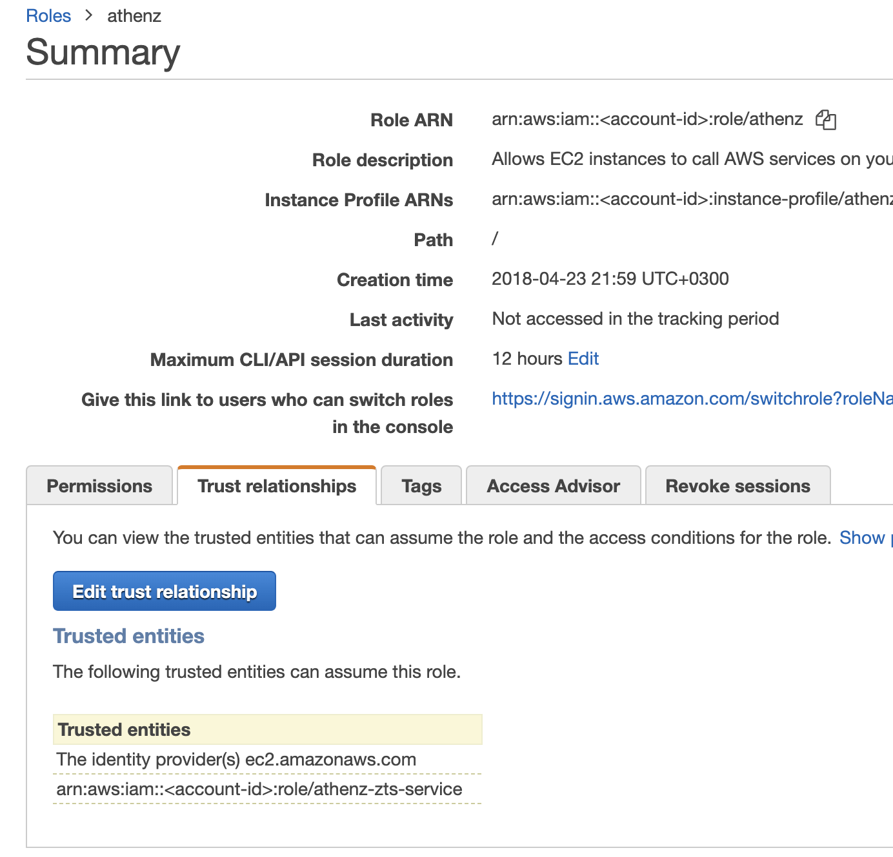
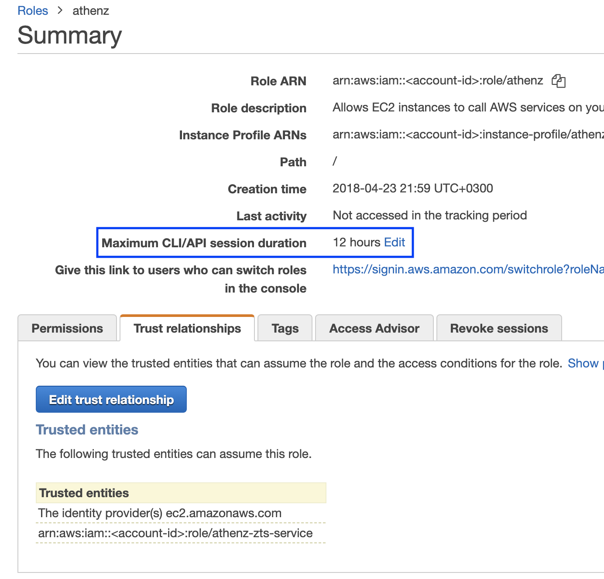
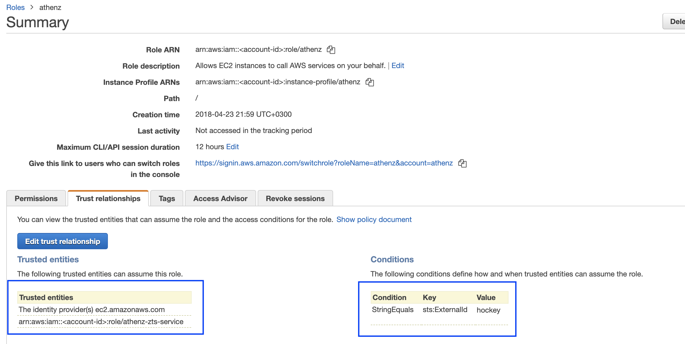
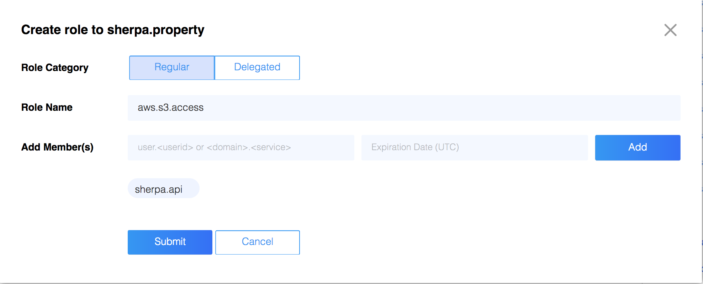
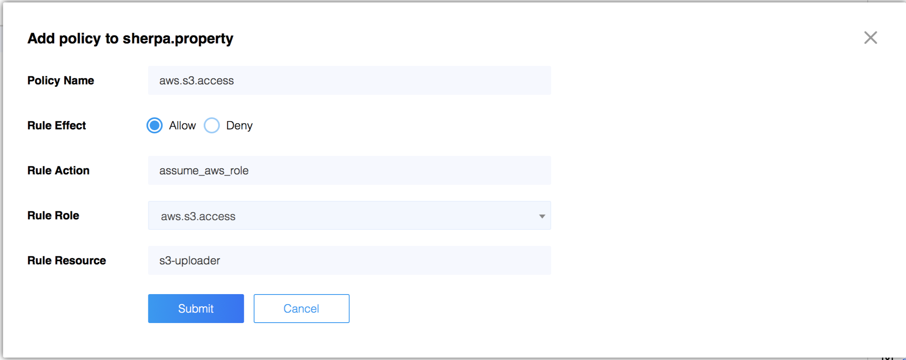

This feature allows any service to obtain temporary session credentials
for a role defined in AWS IAM to carry out operations against AWS Services.
For example, your service might need to access its own S3 bucket to
push some data to AWS. Instead of using an IAM user's credentials to
access that S3 bucket, the administrator will define a role providing
access to that S3 bucket and then configure their service to retrieve
temporary session credentials for that role through ZTS Server.

## Connection Details

To obtain temporary credentials, the client must contact ZTS Server
running in AWS.

## Client X.509 Certificate Requirements

To contact ZTS running in AWS to obtain temporary credentials, the client
service must authenticate itself using Athenz issued client X.509 certificates.
The steps are different depending on where your client service is running.

Follow [these steps](service_x509_credentials.md) to obtain a service x.509
certificate for your client service.

## AWS Account ID Registration

To register an AWS Account with a domain, run the following command:
```
zms-cli -d <domain-name> set-aws-account <aws-account-id>
```

## AWS Configuration Setup

To obtain temporary credentials for a given role through ZTS Server, the
administrator must follow through these steps:

1\. You must already have a role created in AWS IAM that you would like
to obtain temporary credentials for.

2\. In AWS, setup a trust relationship for your role such that ZTS can
assume that role. On the IAM Roles page, choose the role that you want
to modify and click on the Trust Relationships tab. Click on the Edit
Trust Relationship button and append the following section to the
current document's Statement element (don't forget to make sure to
convert the Statement element into an array and add necessary commas):

```
    {
        "Effect": "Allow",
        "Principal": {
            "AWS": "arn:aws:iam::<account-id>:role/athenz-zts-service"
        },
        "Action": "sts:AssumeRole"
    }
```

If configured correctly, the Trust Relationships tab should show
athenz-zts-service as one of entries in the Trusted Entities table.



### Expiration Period

AWS announced that they have extended the federated api access to AWS resources
from the default 1 hour to up to [12 hours](https://aws.amazon.com/blogs/security/enable-federated-api-access-to-your-aws-resources-for-up-to-12-hours-using-iam-roles/). To change the expiration
period for a role, click on the `Edit` link in the role configuration
screen in IAM and choose either one of the predefined duration or specify
a custom one.



Once the role is configured with a longer duration period.
use the ZTS client api as described in the [Obtaining AWS Temporary Credentials](#obtaining-aws-temporary-credentials)
section to specify the requested duration for the temporary credentials.

### External ID Condition

By including an external id condition in the AssumeRole policy,
the account administrator secures its roles to be accessed by
unauthorized principals in case ZTS has been compromised since
AWS STS will reject any assume role requests unless the external
id is specified as part of the request.

Once an external id has been chosen, the AssumeRole policy configured
for the role can be updated to include the external id condition. For
example, to configure an external id `hockey` for our role we'll
have the following policy:

```
    {
        "Effect": "Allow",
        "Principal": {
            "AWS": "arn:aws:iam::<account-id>:role/athenz-zts-service"
        },
        "Action": "sts:AssumeRole",
        "Condition": {
        "StringEquals": {
          "sts:ExternalId": "hockey"
        }
      }
    }
```

If configured correctly, the Trust Relationships tab should show
athenz-zts-service as one of entries in the Trusted Entities table
with a condition field specified.



Once the role is configured with an external id condition,
use the ZTS client api as described in the [Obtaining AWS Temporary Credentials](#obtaining-aws-temporary-credentials)
section to specify the external id for the temporary credentials.

The external ID must be kept securely. Your application
will need to fetch the external id and then use it
in the API call to fetch AWS temporary credentials.

## Athenz AWS Assume Role Configuration Setup

1\. In ZMS, create a role in your domain with any service identities
that may request temporary credentials for the AWS role. Go to
Athenz UI, choose your Athenz domain and
click on the `Add Role` link in the top left corner.



2\. In ZMS, create a policy authorizing your Athenz role members to
assume the AWS role. When creating the policy the action must be
`assume_aws_role`, choose the role as created in the previous step
and specify the IAM role name as the resource.



3\. Make sure your role contains all the service identities that
may request temporary credentials for this role.

4\. The changes will propagate from ZMS to ZTS running within AWS within
2 minutes, and then you can use the ZTS Client library or its REST API to
request temporary credentials.

## Obtaining AWS Temporary Credentials

We're going to look at how to obtain AWS Temporary Credentials with the
use of the ZTS Client Library in Java and directly with ZTS
Server's REST API.

By default the AWS Temporary Credentials returned are valid only for 1 hour.
If configured, it can be extended upto 12 hours - see [Expiration period](#expiration-period)
section for full details. The client must refresh the credentials before they expire.

### REST API

To obtain a AWS Temporary Credentials, the application would use the
following endpoint from ZTS Server running in AWS:

```
    GET /zts/v1/domain/{domainName}/role/{awsRoleName}/creds?durationSeconds={durationSeconds}&externalId={externalId}
    durationSeconds and externalId query arguments are optional.
```

For example, with our setup as described above, `sherpa.api` is our
service identity and we have retrieved the X.509 certificate for this
service. The file locations are as follows:

```
    private-key: /var/lib/sia/keys/sherpa.api.key.pem
    certificate: /var/lib/sia/certs/sherpa.api.cert.pem
```

The following request would retrieve AWS temporary session credentials for the
`sherpa.property` domain's aws **IAM role** `s3-uploader`:

```
    curl --key /var/lib/sia/keys/sherpa.api.key.pem --cert /var/lib/sia/certs/sherpa.api.cert.pem https://your.zts/zts/v1/domain/sherpa.property/role/s3-uploader/creds
```

Note that the `awsRoleName` URL parameter is the name of the **IAM role** you want to assume,
not the Athenz role created in ZMS.

#### Expiration Period

The following request would retrieve AWS temporary session credentials for the
`sherpa.property` domain's aws iam role `s3-uploader` with duration set to 6
hours (6 * 60 * 60 = 21600 seconds):

```
    curl --key /var/lib/sia/keys/sherpa.api.key.pem --cert /var/lib/sia/certs/sherpa.api.cert.pem https://your.zts/zts/v1/domain/sherpa.property/role/s3-uploader/creds?durationSeconds=21600
```

#### External ID Condition

If we had configured our AssumeRole policy for the `s3-uploader` role with an external id of `hockey`
then our request would be:

```
    curl --key /var/lib/sia/keys/sherpa.api.key.pem --cert /var/lib/sia/certs/sherpa.api.cert.pem https://your.zts/zts/v1/domain/sherpa.property/role/s3-uploader/creds?externalId=hockey
```

#### Case Sensitivity

While object names (e.g. in your `assume_aws_role` policy statement) in Athenz are all normalized to lower case, [role
names in IAM are case sensitive](https://docs.aws.amazon.com/IAM/latest/UserGuide/troubleshoot_roles.html#troubleshoot_roles_cant-assume-role).
When calling ZTS to fetch temporary credentials using AssumeRole, the `awsRoleName` parameter must match exactly
(including case) the role name configured in IAM or the request will be denied.

### Java

First you need to update your Java project `pom.xml` file to indicate
the dependency on the Athenz cert refresher and zts java client libraries. Checkout the
[Maven Central Athenz Cert Refresher Package](https://search.maven.org/artifact/com.yahoo.athenz/athenz-cert-refresher)
and [Maven Central ZTS Java Client Package](https://search.maven.org/artifact/com.yahoo.athenz/athenz-zts-java-client/)
pages to make sure you're using the latest release version:

```xml
  <dependencies>
    <dependency>
      <groupId>com.yahoo.athenz</groupId>
      <artifactId>athenz-zts-java-client</artifactId>
      <version>VERSION-NUMBER</version>
    </dependency>
    <dependency>
      <groupId>com.yahoo.athenz</groupId>
      <artifactId>athenz-cert-refresher</artifactId>
      <version>VERSION-NUMBER</version>
    </dependency>
  </dependencies>
```

To obtain a AWS Temporary Credentials Provider, the application would use the
following constructor:

```java
/**
 * Constructs a new AWSCredentialsProvider object with the given SSLContext object,
 * ZTS Server Url, Athenz domain name and AWS Role Name to retrieve temporary
 * credentials for. The constructor will automatically create and use the ZTS
 * client object for retrieving credentials. This object must be closed so
 * the ZTS client object is closed as well.
 * @param ztsUrl ZTS Server's URL
 * @param sslContext SSLContext that includes service's private key and x.509 certificate
 * for authenticating requests
 * @param domainName name of the Athenz domain
 * @param roleName is the name of the IAM role
 * @param minExpiryTime (optional) specifies that the returned creds must be
 *          at least valid (min/lower bound) for specified number of seconds
 * @param maxExpiryTime (optional) specifies that the returned creds must be
 *          at most valid (max/upper bound) for specified number of seconds.
 * @param externalId (optional) external id to satisfy configured assume role condition
 */
public AWSCredentialsProviderImpl(String ztsUrl, SSLContext sslContext,
        String domainName, String roleName, String externalId,
        Integer minExpiryTime, Integer maxExpiryTime)
```

For example, with our setup as described above, `sherpa.api` is our
service identity and we have retrieved the X.509 certificate for this
service. The file location are as follows:

```
    private-key: /var/lib/sia/keys/sherpa.api.key.pem
    certificate: /var/lib/sia/certs/sherpa.api.cert.pem
```

The ZTS server is running with a public X.509 certificate so
we're going to use the standard jdk truststore for our connection
which has a default password of `changeit`.

The following request would retrieve AWS temporary session credentials for the
`sherpa.property` domain's aws iam role `s3-uploader`:

```java
import javax.net.ssl.SSLContext;
import com.oath.auth.KeyRefresher;
import com.oath.auth.Utils;
import com.yahoo.athenz.zts.AWSCredentialsProviderImpl;

final String ztsUrl = "https://your.zts/zts/v1";
final String keyPath = "/var/lib/sia/keys/sherpa.api.key.pem";
final String certPath = "/var/lib/sia/certs/sherpa.api.cert.pem";
final String trustStorePath = javaHome + "/jre/lib/security/cacerts";
final String trustStorePassword = "changeit";

try {
    // Create our SSL Context object based on our private key and
    // certificate and jdk truststore

    KeyRefresher keyRefresher = Utils.generateKeyRefresher(trustStorePath, trustStorePassword,
        certPath, keyPath);
    // Default refresh period is every hour.
    keyRefresher.startup();
    // Can be adjusted to use other values in milliseconds.
    // keyRefresher.startup(900000);
    SSLContext sslContext = Utils.buildSSLContext(keyRefresher.getKeyManagerProxy(),
        keyRefresher.getTrustManagerProxy());

    // obtain temporary credential provider for our domain and role
    // without external id and default period of 1 hour

    AWSCredentialsProviderImpl awsCredProvider = new AWSCredentialsProviderImpl(ztsUrl,
        sslContext, "sherpa.property", "s3-uploader", null, null, null);

    // retrieve and display aws temporary creds. Typically you just pass
    // the AWSCredentialsProvider object to any AWS api that requires it.
    // for example, when creating an AWS S3 client
    //      AmazonS3 s3client = AmazonS3ClientBuilder.standard()
    //          .withCredentials(awsCredProvider)
    //          .withRegion(getRegion())
    //          .build();

    try {
        AWSCredentials awsCreds = awsCredProvider.getCredentials();
        if (awsCreds == null) {
            System.out.println("Error: AWS Credentials are not available");
            // handle failure
        }
        System.out.println("AWS Temporary Credentials:\n");
        System.out.println("\tAccess Key Id : " + awsCreds.getAWSAccessKeyId());
        System.out.println("\tSecret Key    : " + awsCreds.getAWSSecretKey());
    } catch (ZTSClientException ex) {
        System.out.println("Unable to retrieve AWS credentials: " + ex.getMessage());
        // handle failure
    }

    // once we're done with our api and we no longer need our
    // provider we need to make sure to close it

    awsCredProvider.close();

} catch (Exception ex) {
    // handle failure
}
```

** Important **

During the shutdown of the application, `ZTSClient.cancelPrefetch()`
must be called to stop the timer thread that automatically fetches
and refreshes any cached tokens in the ZTS Client.

#### Expiration Period

The following request would retrieve AWS temporary session credentials for the
`sherpa.property` domain's aws iam role `s3-uploader` with duration set to 6
hours (6 * 60 * 60 = 21600 seconds) and a minimum timeout of 15 minutes. This
indicates that the client will cache the token for 5 hours and 45 minutes.

```java

    // obtain temporary credential provider for our domain and role
    AWSCredentialsProviderImpl awsCredProvider = new AWSCredentialsProviderImpl(ztsUrl,
        sslContext, "sherpa.property", "s3-uploader", 900, 21600, null);
```

#### External ID Condition

If we had configured our AssumeRole policy for the `s3-uploader` role with an external id of `hockey`
then our request would be:

```
    // obtain temporary credential provider for our domain and role

    externalId = retrieveExternalIDFromYkeykey(); // would return "hockey"
    AWSCredentialsProviderImpl awsCredProvider = new AWSCredentialsProviderImpl(ztsUrl,
        sslContext, "sherpa.property", "s3-uploader", null, null, externalId);
```

### Go

To obtain a AWS Temporary Credentials, the application would use the
Athenz ZTS Go Client.

For example, with our setup as described above, `sherpa.api` is our
service identity and we have retrieved the X.509 certificate for this
service. The file location are as follows:

```
    private-key: /var/lib/sia/keys/sherpa.api.key.pem
    certificate: /var/lib/sia/certs/sherpa.api.cert.pem
```

First you need to update your Go project to indicate
the dependency on the Athenz zts go client libraries:

```
import (
    "github.com/AthenZ/athenz/clients/go/zts"
    "github.com/AthenZ/athenz/libs/go/athenzutils"
)
```

The ZTS server is running with a public X.509 certificate so
we're not going to specify CA certificates for our request:

```
    ztsUrl := "https://your.zts/zts/v1"
    key := "/var/lib/sia/keys/sherpa.api.key.pem"
    cert := "/var/lib/sia/certs/sherpa.api.cert.pem"

    ztsClient, err := athenzutils.ZtsClient(ztsUrl, key, cert, "", false)
    if err != nil {
        log.Fatalf("Fatal: Error creating zts client: %v", err)
    }

    domain := "sherpa.property"
    role := "s3-uploader"
    externalId := "hockey"

    awsCreds, err := ztsClient.GetAWSTemporaryCredentials(zts.DomainName(domain), zts.AWSArnRoleName(role), nil, externalId)
    if err != nil {
        log.Fatalf("Fatal: Error fetching AWS Credentials: %v\n", err)
    }

    fmt.Println("[default]")
    fmt.Printf("aws_access_key_id=%s\n", awsCreds.AccessKeyId)
    fmt.Printf("aws_secret_access_key=%s\n", awsCreds.SecretAccessKey)
    fmt.Printf("aws_session_token=%s\n", awsCreds.SessionToken)
```

## Using AWS Temporary Credentials

If you want to use the AWS temporary credentials with aws command
line utilities, they can be set as environment variables or be added
to the `~/.aws/credentials` file for a given profile.

The settings must include all three components returned by the api:

- access key id
- secret access key
- session token

The following example shows the use of environment variables with
temporary credentials:

```
$ export AWS_ACCESS_KEY_ID={YOUR_ACCESS_KEY_ID}
$ export AWS_SECRET_ACCESS_KEY={YOUR_SECRET_ACCESS_KEY}
$ export AWS_SESSION_TOKEN={YOUR_SESSION_TOKEN}
$ aws ec2 describe-instances --region us-west-1
```

The following example shows the use of the aws credentials file
using default profile:

```
$ cat ~/.aws/credentials

[default]
aws_access_key_id={YOUR_ACCESS_KEY_ID}
aws_secret_access_key={YOUR_SECRET_ACCESS_KEY}
aws_session_token={YOUR_SESSION_TOKEN}
```

Checkout [Using Temporary Security Credentials to Request Access to AWS Resources](https://docs.aws.amazon.com/IAM/latest/UserGuide/id_credentials_temp_use-resources.html) for full details how to use temporary credentials in AWS.

** Important **

When passing the role name that you're trying to assume in the aws-builder-creds utility as the value to the `-r` argument, it must be the AWS IAM Role name and not the role name in your Athenz domain.

## Troubleshooting

ZTS Server returns a unique error message indicating what part of the configuration is causing the failure to fetch AWS temporary credentials.


### Athenz Domain Configuration

```
Athenz Configuration Error: unable to retrieve AWS account for: <domainName>
```

The domain, identified in the `<domainName>` field, does not have AWS account id configured. Follow the steps in the `AWS Account ID Registration` section to register your AWS account id for your domain.

### Athenz Role Configuration

```
Athenz Configuration Error: Forbidden (assume_aws_role on <resource-name> for <principal>)
```

This error indicates that the principal, identified in the `<principal>` field, requesting the temporary credentials is not authorized. There are two common issues that generate this error message:

1. The caller is using the athenz role name as the value for the role name parameter (-r in the aws-builder-creds utility). The value for this parameter must be the AWS IAM role name and not the Athenz role name.

2. Make sure the `<principal>` is included as a member in the role that you had setup in the `Athenz AWS Assume Role Configuration Setup` section in this document.

### AWS Configuration

```
AWS Configuration Error: unable to assume role <roleName> in domain <domainName> for principal <principal> error: <aws-error-message>
```

This error indicates that AWS STS refused to issue temporary credentials to the Athenz ZTS service. This usually indicates that either the role name specified in the request is incorrect (you must specify the IAM Role name you're trying to assume and not the Athenz Role Name) or the role in IAM does not have the trust relationship setup for ZTS service as described in the `AWS Configuration Setup` section in this document.

If you have configured a non-default duration or an external id for your role make sure you're passing the
correct values in the API. AWS STS will reject the assume role request if the external id is not passed
or a duration value is passed that is longer than the configured period.
