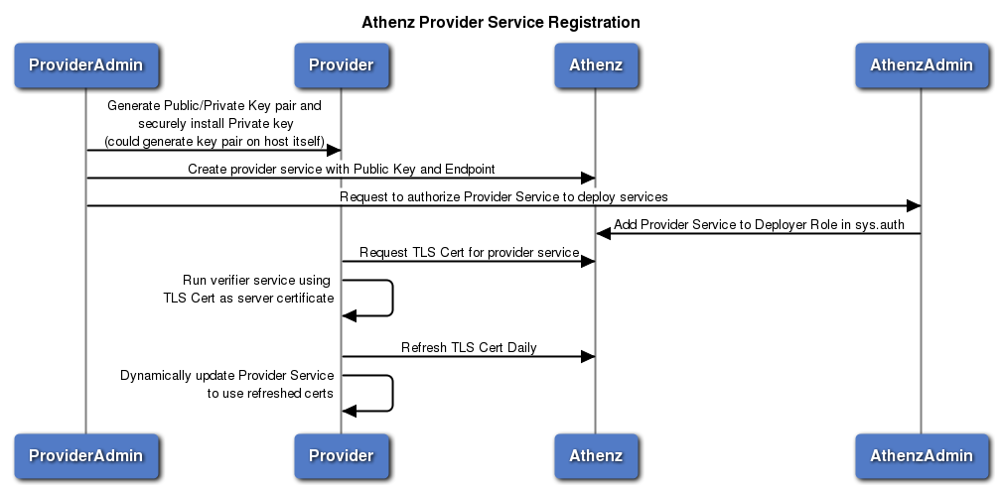

# Copper Argos: Athenz Service Identity X.509 Certificates Development
----------------------------------------------------------------------

* [What is Copper Argos](#what-is-copper-argos)
* [Provider Service Registration](#provider-service-registration)
* [Tenant Service Launch Authorization](#tenant-service-launch-authorization)
* [Instance Register Request](#instance-register-request)
* [Instance Refresh Request](#instance-refresh-request)
* [Instance Revocation Request](#instance-revocation-request)
* [Athenz RDL](#athenz-rdl)
  * [Instance Register Request](#instance-register-request)
  * [Instance Identity Response](#instance-identity-response)
  * [Instance Refresh Request](#instance-refresh-request)
  * [Instance Revoke Request](#instance-revoke-request)
* [Instance Provider RDL](#instance-provider-rdl)
* [Authorization Policies](#authorization-policies)
  * [System Providers](#system-providers)
  * [Provider Authorized DNS Suffix](#provider-authorized-dns-suffix)
  * [Service Authorized Providers](#service-authorized-providers)
* [Sample Implementation and Setup Tasks](#sample-implementation-and-setup-tasks)
  * [Athenz System Setup](#athenz-system-setup)
  * [Provider Service Implementation and Registration](#provider-service-implementation-and-registration)
  * [Athenz Authorized Provider Registration](#athenz-authorized-provider-registration)
  * [Tenant Service Registration](#tenant-service-registration)
  * [Provider Client Implementation](#provider-client-implementation)

## What is Copper Argos
-----------------------

Copper Argos extends Athenz with generalized model for service providers to launch other identities in an authorized way through a callback-based verification model. With this model each provider is responsible for their instance document verification service instead of embedding that logic inside ZTS.

## Provider Service Registration
--------------------------------

Each provider is a registered service identity object in Athenz. As such, the provider domain administrator will create the service identity object in their domain and provide the following attributes using zms-cil utility or the REST API. (Athenz UI does not expose optional service attributes since they’re not commonly used).
* Provider Endpoint - A REST API endpoint that implements Provider RDL and ZTS will contact to validate the instance document (ServiceIdentity already has the providerEndpoint attribute)

Domain administrator will then need to follow up with the Athenz Team to authorize Provider Service as an Instance Launcher Service in Athenz. The Provider will also specify the DNS suffix that will be used by its tenants.
There will be a policy in sys.auth domain that grants `launch` action to `instance` resource to the `providers` role.
Once approved, the Athenz System admin will add the provider service identity to the `providers` role in the sys.auth domain either using zms-cli or Athenz UI.
There will be policy granting access to the specified Provider SAN dnsName attribute suffix to the list service provider.

Requirements for Provider Service:
* It must retrieve a TLS certificate for its service from Athenz and use that as its Service Certificate.
* When ZTS Contacts Provider Service to validate an instance document, it will require TLS authentication and verify that the certificate the service used for authentication was issued for the expected provider service by ZTS itself.
* ZTS issues TLS certificates valid for 30 days only, so the Provider Service Admin must have the capability to periodically refresh its certificate by requesting a new one from ZTS Server (e.g. daily) and dynamically update its service to use the refreshed certificates.



## Tenant Service Launch Authorization
--------------------------------------

Before a tenant service can be launched by a specific provider and issued a TLS certificate for, the tenant domain administrator must authorize a specific provider service to launch its services.

This will require that a role and policy to be created in the tenant’s domain. For example, if weather.api service wants to authorize athenz.aws provider to launch its services, it will need to create the following policy and role in their domain:
* Policy: grant launch to aws-provider on weather:service.api
* Role: aws-provider role member: athenz.aws.us-west-2

The change can be carried out with using zms-cli or Athenz UI.

## Instance Register Request
----------------------------

Once the service admin creates the appropriate role and policy in its domain authorizing the provider service to bootstrap its instance, it can submit the launch request to the provider service.


The steps of the bootstrap process pertaining Athenz integration would include:

1. As part of the launch request, the admin will specify the Athenz domain and service that should be assigned to the instance.
1. The provider service will generate an instance identity document, sign it with its private key and securely transfer this document along with its signature onto to the bootstrapped host.
1. As part of the bootstrap process or possible as part of the image, the Service Identity Agent (SIA) will also be installed on the host.
1. SIA will generate a public/private key pair on the host, generate a CSR using the newly generated private key. The CSR requirements are as follows:
   - The Subject CN in the CSR must be the Athenz service identity name (e.g. weather.api - api service in weather domain)
   - The CSR must include a SAN dnsName attribute with the format: `<service-with-domain>.<provider-dnsname-suffix>`. The provider-dnsname-suffix must match the value registered for the provider service. The `<service-with-domain>` part is left up to to the provider to define what format they want to use (e.g. `<service>.<domain>` or `<service>.<domain-with-dashes>`). ZTS server will pass these hostnames to the provider as entries in the attribute field for validation.
   - The provider must specify a unique identifier for the instance within the provider’s namespace (this could be combination of multiple strings - e.g. instance-id.pod-id.cluster-id) and this information must be included in the CSR as another SAN dnsName attribute with the format: `<provider-unique-instance-id>.instanceid.athenz.<provider-dnsname-suffix>`. The ZTS server will use this information along with the issued TLS Certificate Serial number to revoke specific instances if they’re compromised.
1. SIA will generate an InstanceRegisterInformation object that will include attestation data (this would include the instance identity document, its signature and other attributes that will be necessary for the provider to validate and confirm the instance register request from ZTS) received from the provider and submit the post request to ZTS Server.
1. ZTS Server will carry out the following authorization and verification checks before contacting provider service:
   - The provider service in the info object has been authorized in Athenz to launch services (policy exists in sys.auth domain).
   - Service specified in the info object (domain.service) has authorized provider service in the info object to launch itself (policy exists in the service’s own domain).
   - The provider service is registered in Athenz, has a providerEndpoint (verified as internal ip address) and providerDnsNameSuffix attributes defined.
   - The cn in the CSR matches to the specific domain and service names.
   - The CSR must include only 2 dnsName attributes with the expected format:
     - `<service-with-domain>.<provider-dnsname-suffix>`
     - `<provider-unique-instance-id>.instanceid.athenz.<provider-dnsname-suffix>`
1. ZTS Server will contact Provider service at its configured endpoint and verify that the TLS certificate used for authentication by the provider service matches to the service name and was issued by ZTS server itself.
1. ZTS Server will generate an InstanceConfirmation object and submit the post request to the Provider Service. In the InstanceConfirmation object, ZTS server will include the following entries in the optional attributes map:
   - sanDNS: comma separated list of dnsNames attributes in the CSR - there will only be 2 as defined in 6(e) above
   - sanIP - comma separated list of IP addresses in the CSR if any were specified
   - clientIP - the IP address of the client
   - cloudAccount - domain’s account id if one is configured
1. The Provider Service will be responsible for:
   - Validating Signature
   - Validating the instance id
   - Validating the bootup time is within acceptable time period (e..g 5 mins)
   - Validating hostnames included in the CSR
   - Validating IP addresses (if available) included in the CSR
1. Once ZTS service receives a successful response from the Provider Service, it will submit the CSR to Certsignd to generate a X.509 Certificate
1. ZTS Server will retrieve the Serial number from the Certificate and register the certificate along with instanceid and provider service name in its certificate database. This will be used to monitor refresh certificate operations and, in case of a compromise, revoke specific instances from the capability to refresh their own certificates.

## Instance Refresh Request
---------------------------

During instance refresh request, ZTS Server again contacts provider service for verification of the instance. This is necessary in case the credentials have been compromised and the original instance is no longer running and will allow the provider to verify that the instance is indeed still running. ZTS will also verify that the connection is using the previous TLS certificate issued for the service and provider and the authorization policies are still in place. The steps would include:

1. SIA will generate a public/private key pair on the host, generate a CSR using the newly generated private key. The CSR requirements are as follows:
   - The Subject CN in the CSR must be the Athenz service identity name (e.g. weather.api - api service in weather domain)
   - The CSR must include a SAN dnsName attribute with the format: `<service-with-domain>.<provider-dnsname-suffix>` that was used in the original register request.
   - The provider must specify a unique identifier for the instance within the provider namespace (this could be combination of multiple strings - e.g. instance-id.pod-id.cluster-id) and this information must be included in the CSR as another SAN dnsName attribute with the format: `<provider-unique-instance-id>.instanceid.athenz.<provider-dnsname-suffix>`. The ZTS server will use this information along with the issued TLS Certificate Serial number to revoke specific instances if they’re compromised.
1. SIA will generate an InstanceRefreshInformation object including attestation data and submit the post request to ZTS Server. It will be required to use the TLS certificate that was issued to that instance previously by ZTS Server.
1. ZTS Server will carry out the following authorization and verification checks before contacting provider service:
   - The provider service in the info object has been authorized in Athenz to launch services (policy exists in sys.auth domain).
   - Service specified in the info object (domain.service) has authorized provider service in the info object to launch itself (policy exists in the service’s own domain).
   - The cn in the CSR matches to the specific domain and service names.
   - The TLS certificate SIA used to contact ZTS server must be for the same service.
   - The TLS certificate SIA used to contact ZTS server must have the same provider and the 2 dnsName attributes as the CSR.
1. ZTS Server will extract the instanceid from CSR and verify that the instance has not been revoked and the serial number matches to the registered entry in the certificate database.
1. ZTS Server will contact Provider service at its configured endpoint and verify that the TLS certificate used for authentication by the provider service matches to the service name and was issued by ZTS server itself.
1. ZTS Server will generate an InstanceConfirmation object and submit the post request to the Provider Service. In the InstanceConfirmation object, ZTS server will include the attestation data presented by instance.
1. The Provider Service will be responsible for:
   - Validating attestation data
   - Validating hostnames included in the CSR
   - Validating IP addresses (if available) included in the CSR
1. Once ZTS service receives a successful response from the Provider Service, it will submit the CSR to Certsignd to generate a X.509 Certificate
1. ZTS Server will retrieve the Serial number from the new Certificate and update the certificate database with the new serial number.

## Instance Revocation Request
------------------------------

If necessary, the domain administrators must be able to revoke specific instances from having the capability to refresh their certificate. The steps would be:

1. Domain Admin will issue a HTTP DELETE /instance/… request to ZTS Server.
2. ZTS Server will authorize the request and update the serial number for the requested instance id in the certificate database to -1. This operation will revoke the instance from refreshing its certificates.

## Athenz RDL
--------------

### Instance Register Request
-----------------------------

InstanceRegisterInformation is the information a provider-hosted booting instance must provide to Athenz to authenticate:

```
type InstanceRegisterInformation
 Struct {
    ServiceName provider;  //the provider service name (i.e. "aws.us-west-2")
    DomainName domain;     //the domain of the instance
    SimpleName service;    //the service this instance is supposed to run
    String attestationData;//signed identity document containing attributes 
                           //like IP address, instance-id, account#, signature, etc
    String csr;            //the Certificate Signing Request for the expected
                           //X.509 certificate in the response
    String ssh (optional); //if present, return an SSH host certificate.
                           //Format is JSON.
    Bool token (optional); // if true, return a service token signed by
                           //ZTS for this service
}

resource InstanceIdentity POST "/instance" {
    InstanceRegisterInformation info;
    String location (header="Location", out); //return location for subsequent operations
    expected CREATED;
    exceptions {
        ResourceError BAD_REQUEST;
        ResourceError FORBIDDEN;
        ResourceError UNAUTHORIZED;
        ResourceError INTERNAL_SERVER_ERROR;
    }
}
```

### Instance Identity Response
------------------------------

InstanceIdentity is returned on successful attestation. includes the certifictates, tokens, and any additional provider-specific derived attributes.

```
type InstanceIdentity Struct {
    ServiceName provider;                     //the provider service name (i.e. "aws.us-west-2")
    ServiceName name;                         //name of the identity, fully qualified, e.g weather.api
    PathElement instanceId;                   //unique instance id within provider’s namespace
    String x509Certificate (optional);        //an X.509 certificate usable for
                                              //both client and server in TLS connections
    String x509CertificateSigner (optional);  //the CA certificate chain to
                                              //verify all generated X.509 certs
    String sshCertificate (optional);         //the SSH certificate, signed by
                                              //the CA (user or host)
    String sshCertificateSigner (optional);   //the SSH CA's public key
                                              //for the sshCertificate (user or host)
    SignedToken serviceToken (optional);      //service token instead of TLS certificate
    Map<String,String> attributes (optional); //other config-like attributes
                                              //determined at boot time
}
```

### Instance Refresh Request
----------------------------

InstanceRefreshInformation is the information a provider-hosted booting instance must provide to Athenz to refresh the TLS certificate it was issued initially. The request must be done using the previously issued client TLS certificate.

```
type InstanceRefreshInformation Struct {
    String attestationData (optional); //identity attestation data including 
                                       //document with its signature containing attributes like IP
                                       //address, instance-id, account#, etc.
    String csr (optional);             //the Certificate Signing Request for the expected
                                       //X.509 certificate in the response
    String ssh (optional);             //if present, return an SSH host certificate.
                                       //Format is JSON.
    Bool token (optional);             // if true, return a service token signed by
                                       //ZTS for this service
}

resource InstanceIdentity POST "/instance/{provider}/{domain}/{service}/{instanceId}" {
    ServiceName provider;            //the provider service name (i.e. "aws.us-west-2")
    DomainName domain;               //the domain of the instance
    SimpleName service;              //the service this instance is supposed to run
    PathElement instanceId;          //the instance id that’s unique within this provider
    InstanceRefreshInformation info; //the refresh request
    authenticate;                    //only TLS Certificate authentication is allowed
    expected OK;
    exceptions {
        ResourceError BAD_REQUEST;
        ResourceError FORBIDDEN;
        ResourceError NOT_FOUND;
        ResourceError UNAUTHORIZED;
        ResourceError INTERNAL_SERVER_ERROR;
    }
}
```

### Instance Revoke Request
---------------------------

```
resource InstanceIdentity DELETE "/instance/{provider}/{domain}/{service}/{instanceId}" {
    ServiceName provider;   //the provider service name (i.e. "aws.us-west-2")
    DomainName domain;      //the domain of the instance
    SimpleName service;     //the service this instance is supposed to run
    PathElement instanceId; //the instance id that’s unique within this provider
    authorize(“delete”, {domain}:instance.{instanceId}; 
    expected NO_CONTENT;
    exceptions {
        ResourceError BAD_REQUEST;
        ResourceError FORBIDDEN;
        ResourceError NOT_FOUND;
        ResourceError UNAUTHORIZED;
        ResourceError INTERNAL_SERVER_ERROR;
    }
}
```

## Instance Provider RDL
--------------------------

This is the RDL that any provider that is authorized to create instances through Athenz must implement. This interface must be available over HTTPS only.

```
type InstanceConfirmation Struct {
ServiceName provider;                         //the provider service name
    DomainName domain;                        //the domain of the instance
    SimpleName service;                       //the service this instance is supposed to run
    String attestationData;                   //signed identity document containing attributes
                                              //like IP address, instance-id, account#, signature, etc.
    Map<String,String> attributes (optional); //additional non-signed attributes that assist
                                              //in attestation. I.e. "instanceId”, keyId", "accessKey", etc
}
```

Confirm instance identity information and return appropriate response to ZTS Server. On return from the confirmation, the resulting InstanceConfirmation may have additional useful attributes added, for example attributes taken from the identity document like "account" number or a canonical value like "network" that gets identified differently with different providers.

```
resource InstanceConfirmation POST "/instance" {
    InstanceConfirmation confirmation;
    authenticate;
    expected OK;
    exceptions {
        ResourceError BAD_REQUEST;
        ResourceError FORBIDDEN;
        ResourceError UNAUTHORIZED;
    }
}

resource InstanceConfirmation POST "/refresh" (name=PostRefreshConfirmation) {
    InstanceConfirmation confirmation;
    Authenticate;
    expected OK;
    exceptions {
        ResourceError BAD_REQUEST;
        ResourceError FORBIDDEN;
        ResourceError UNAUTHORIZED;
    }
}
```

## Authorization Policies
---------------------------

### System Providers
--------------------

Athenz will maintain list of authorized provider services in sys.auth domain. If necessary, we can configure specific policies to grant additional users access over the roles/policies used to configure the list of provider.

```
Domain: sys.auth
Role: providers
    Members: <provider-name(s)> (e.g. openstack.cluster1)
Policy: providers
Assertion: grant launch to providers on sys.auth:instance
```

### Provider Authorized DNS Suffix
----------------------------------

When generating a CSR to request a TLS certificate for a service, the sia agent must know what DNS Suffix is the provider authorized to use so it can include the dnsName attribute in the CSR in the expected form (e.g. `<service>.<domain-with-dashes>.<provider-dns-suffix>`). ZTS must validate that the provider is authorized to launch a service with that DNS suffix. For now, this information will be authorized against a policy in special sys.auth domain.

```
Domain: sys.auth
Role: provider.<provider-name> (e.g. provider.openstack.cluster1)
    Members: <provider-name(s)> (e.g. openstack.cluster1)
Policy: provider.<provider-name>
    Assertion: grant launch to provider.<provider-name> on sys.auth:dns.<provider-suffix>
```

### Service Authorized Providers
--------------------------------

Each service will have a role/policy in their own domain that they control whether or not authorize specific providers to launch their services. For example, service weather.api wants to authorize AWS services to launch its services:

```
Domain: weather.api
Role: api_providers
    Members: athenz.aws
Policy: api_providers
    Assertion: grant launch to “api_providers” on “weather:service.api”
```

## Sample Implementation and Setup Tasks
----------------------------------------

### Athenz System Setup
-----------------------

* Create the provider’s role:

```
$ zms-cli -d sys.auth add-regular-role providers
```

* Create the provider’s policy:

```
$ zms-cli -d sys.auth add-policy providers grant launch to providers on instance
```

### Provider Service Implementation and Registration
----------------------------------------------------

* Implement provider service that implements Instance Provider RDL.
* Register the provider service in Athenz in the provider’s domain. For example, we’ll be registering a provider service called openstack.cluster1.

  * Generate private/public key pair for the service.

```
$ openssl genrsa -out service_private.key 2048
$ openssl rsa -in service_private.key -pubout > service_public.key
```

  * Create the service identity in Athenz with public key id: v0

```
$ zms-cli -d openstack add-service cluster1 v0 ./service_public.key
```

  * Determine the https endpoint for your service that ZTS will contact to verify instance information. For example, https://provider-cluster1.openstack.athenz.com:4443/hostsigner/v1 and set the endpoint for the service:

```
$ zms-cli -d openstack set-service-endpoint cluster1 https://provider-cluster1.openstack.athenz.com:4443/hostsigner/v1
```

  * Obtain a TLS certificate from ZTS Server for the service to run with. If your service is Jetty based, then the private key and certificate must be added to a keystore using the openssl utility. The certificate is valid for 30 days, so you must setup a cron job that periodically retrieves an updated certificates and your service is refreshed to use to the new certificate.

```
$ zts-svccert -domain openstack -service cluster1 -private-key ./service_private.key -key-version v0 -zts https://<zts-hostname>:4443/zts/v1 -dns-domain athenz.com
```

* Determine the dns suffix for your provider service and submit a request to the Athenz system administrators to register the provider service with its dns suffix as an authorized provider service in Athenz

### Athenz Authorized Provider Registration
-------------------------------------------

* Verify the dns suffix requested for the provider and, if valid, register the service in Athenz
  * Add the service to the providers role:

```
$ zms-cli -d sys.auth add-member providers openstack.cluster1
```

  * Register the dns suffix for the provider service. For example, cluster1.ostk.athenz.cloud

```
$ zms-cli -d sys.auth add-regular-role provider.openstack.providers openstack.cluster1
$ zms-cli -d sys.auth add-policy provider.openstack.providers grant launch to provider.openstack.providers on dns.cluster1.ostk.athenz.cloud
```

### Tenant Service Registration
-------------------------------

* Authorize provider service to launch its instances. For example, weater domain wants to authorize its service api to be launched by openstack.cluster1 provider.

```
$ zms-cli -d weather add-regular-role openstack_providers openstack.cluster1
$ zms-cli -d weather add-policy openstack_providers grant launch to openstack_providers on weather:service.api
```

### Provider Client Implementation
----------------------------------

* Provider must implement a client that will communicate with ZTS and execute Instance Register and Instance Refresh requests.
* When bootstrapping the the tenant instance, the Provider service must pass to the client the following details:
  * the provider service name (e.g. openstack.cluster1)
  * its dns suffix (e.g. cluster1.ostk.athenz.cloud)
  * signed instance identity document
* The client will generate a CSR based on the details it received from its provider service, include the CSR in the InstanceRegisterInformation object and post it to ZTS.
* The client will be responsible for storing the certificate used from ZTS on the local host and use it for its subsequent requests to ZTS to refresh the certificate.

