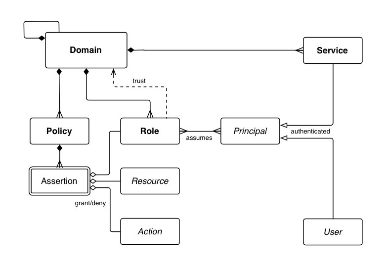

# Architecture - Data Model
-------------------------------

* [Concepts](#concepts)
* [Data Model](#data-model)
    * [Terminology](#terminology)
    * [Domains](#domains)
    * [Resources](#resources)
    * [Policies](#policies)
    * [Roles](#roles)
    * [Principals](#principals)
        * [Users](#users)
        * [Services](#services)
        * [Groups](#groups)
    * [Tokens](#tokens)
        * [Principal Token - NToken](#principal-token-ntoken)
        * [Access Tokens](#access-tokens)

Having a firm grasp on some fundamental concepts will help you
understand the Athenz architecture, the flow for both centralized and
decentralized authorization, and how to set up role-based authorization.

## Concepts
-----------

1. Role based Access Control (RBAC) system
2. Symbolic names are used to identify the entities involved in authorization,
   so humans can read and understand the assertions
3. Namespaces are strictly partitioned into Domains, which imply an ownership
   and control aspect to the names
4. Enforcement can be factored such that it can be done in a distributed way,
   making possible data-plane checks that do not go off-box
5. Administrative tasks can be delegated to created subdomains to avoid reliance
   on central "super user" administrative roles.
6. Multi-tenancy relationships across domains can also take advantage of delegated
   administration
7. Cryptographic signatures are used to ensure the fidelity of assertions and
   their lifecycle attributes
8. Policy orientation, as opposed to Resource orientation, allows few assertions
   (in policies) to affect a potentially large number of resources, and allows
   more flexible scoping via wildcarding over groups of resources.
9. In Athenz, the authorization management server converts all incoming
   data to lowercase before any processing - this applies to all data types
   within Athenz (e.g. domain names, role names, policy names, resource
   group values, etc).

## Data Model
-------------

### Terminology
---------------

* Domain - a partition/namespace/account of control and isolation
* Role - an entity that takes action on resources, when assumed by a principal
* Resource - an entity to take action on, referred to by unique name
* Policy - a set of assertions that govern usage of resources
* Assertion - a quadruple of &lt;effect, role, action, resource&gt;
* Principal - an authenticated user or service that assumes one or more roles
* User - a user identity that is authenticated by a particular authority
* Service - An identity that exposes reusable resources, authenticated by
  an Athenz-aware container, reachable via an explicit endpoint.
* Provider - a type of service that participates in the multi-tenant provisioning protocol.
* Tenant - a Domain that is provisioned to access some Resources in a Provider
* Group - A group is a collection of user and service principals
* Control Plane - operations done to provision or otherwise setup a system,
  outside its normal operation.
* Data Plane - operations done in the normal usage of a system, after it is
  set up. These operations are usually highly performance sensitive.

There are numerous domains, and domains can themselves “contain” subdomains,
from a creation/deletion perspective. However, all domains and subdomains,
regardless of their administrative relationships, are independent and share
no state. Relationships between them (i.e. quotas, billing roll ups, etc)
must be explicitly introduced if desired. Roles, Policies and their Assertions,
and Services are all defined in a Domain.

### Domains
-----------

Domains are namespaces, strictly partitioned, providing a context for
authoritative statements to be made about entities it contains. Only
system administrators can create and destroy top-level domains. Each
domain is assigned users in an administrative role. Those admins
can, in turn, create and delete subdomains, that is, domains that start
with the parent domain as a prefix, using a '.' as a domain delimiter.
For example, "media" is a top-level domain, and "media.news" is a
subdomain of it. It is important to note that the only relation between
these two domains involves creation and destruction of the domains --
the two domains share no state by default, and there is no inheritance
or other relation between them other than that implied by their names.
This allows all domains (whether top-level or subdomains) to be
completely partitioned from each other, and the ownership of the
entities defined within a domain is clear.

A domain is a place to group your resources and entities.

-   All resources are partitioned across some set of domains
-   Domains are given a symbolic name, so humans can easily understand a
    reference to them
-   The domain name is used as a namespace for resource names
-   Domains are similar the concept of an account, and provides a
    “walled garden” in which to operate

### Resources
-------------

Resources aren't explicitly modeled in Athenz, they are referred to by
name. A resource is something that is "owned" and controlled in a
specific domain.

-   Concrete example: a machine
-   Abstract example: a security policy
-   Identified by a canonical name, so humans can comprehend references
    to it

When referring to resources for authorization, a global naming system
needs to be introduced to handle names in namespaces. A Resource
Name is defined as follows:

    {Domain}:{Entity}

The Domain is the namespace mentioned above, and the Entity is an entity
path (delimited by periods) within that namespace. The two are often
used together to form a short resource name. For example, if the
media.news property provisions a table in a db service, the resource
name for the table may look like this:

    media.news:storage.db.table

### Policies
------------

To implement access control, we have policies in our domain that govern
the use of our resources. A policy is a set of assertions (rules) about
granting or denying an operation/action on a resource. For example, the
assertion `[grant, update, dev, storage.db.table]` would grant the
**update** operation/action to all the members in the **dev** role on
the **storage.db.table** resource. Note that the assertion fields are
declared as general strings, as they may contain "globbing" style
wildcards, for example "media.news:role.*", which would apply to any
entity that matched the pattern.

### Roles
---------

A role can be thought of as a group, anyone in the group can *assume*
the role that takes a particular action. Every policy assertion
describes what can be done by a role.

A role can also delegate the determination of membership to another
trusted domain. For example, a netops role managed outside a property
domain. This is how we can model tenant relations between a provider
domain and tenant domains.

Because roles are defined in domains, they can be partitioned by domain,
unlike users, which are global. This allows the distributed operation to
be more easily scaled.

### Principals
--------------

The actors in Athenz that can assume a role are called principals. These
principals are authenticated and can be users (for example, authenticated by
their Unix or Kerberos credentials). Principals can also be services that
are authenticated by a service management system. Athenz currently provides
service identity and authentication support. In either case, the identity
is expressed as a resource name, and the proof of that identity is provided
as an X509 certificate.

#### Users
----------

Users are actually defined in some external authority, e.g. Unix or Kerberos
system. A special domain is reserved for the purpose of namespacing users,
the name of that domain is **user**, so some example users are:

* user.john
* user.doe

The credentials that the external system requires are exchanged for X509 certificates 
before operating on any data.

#### Services
-------------

The concept of a Service Identity is introduced as the identity of independent
agents of execution. Services are defined as a subdomain of the managing domain,
which provides a simple way of naming them. For example:

* media.news.msbe
* sports.storage

The relationship of a service identity and its parent domain essentially means
that the parent domain is an authority for the service itself, from a management
perspective. 

A Service Identity may be used as a principal when specifying Roles, just like a
User. Athenz provides support for registering such a Service Identity, in a domain,
along with its public key that can be used to later verify an NToken that is
presented by the service.

#### Groups
-----------

To simplify principal management, the users and services can be included
in Groups. Then, the Group can be added as a principal to any role
within Athenz thus granting the members of that group access to the configured
resources. For example, if you need to add your development team members to
multiple roles in your domain, you can create a group called `dev-team`, add
those users into that group and then include the group as a member in the
corresponding roles. When you need to remove or add a member, then you only
need to modify the membership of your `dev-team` group. The groups cannot
contain other groups.

## Tokens
---------

Athenz authorization system utilizes 2 types of tokens: Principal Tokens
(NTokens) and Access Tokens.

### Principal Token (NToken)
----------------------------

The Principal token can be thought of an identity token because it
identifies either a user or a service. Users submit their credentials
to ZMS, which validates those credentials and generates, signs and
returns principal tokens. A service generates its principal token using
the service's private key. The principal token can then be used to access
role tokens.

A principal token is serialized as a string with following attributes:

-   version (v) - the version of the token - U1 for user tokens and S1
    for service tokens
-   domain (d) - the domain of principal. For users this will always be
    "user"
-   name (n) - the name of the principal
-   host (h) - the FQDN of the host that issued this token
-   salt (a) - a salt
-   time (t) - the time the token was issued
-   expires (e) - the time the token expires
-   keyId (k) - the key identifier of the private key that was used to
    sign this token
-   ip (i) - the IP address where the request to get this token was
    initiated from
-   authorized-services (b) - the list of services authorized to use
    this user token
-   signature (s) - the signature of the other items

The single letter in parentheses is the key in the serialized string,
where semicolons separate key value pairs, and the key and value are
separated by an equals sign.

For example:

    v=U1;d=user;n=joe;h=host.athenz.org;a=bb4e;t=1442255237;e=1442258837;k=0;i=10.72.42.32;s=Jw8SvYGYrk

Note that requests that include a principal token should be protected to
keep the token from being intercepted and reused (for the lifetime of
the token). It is strongly recommended to always use HTTPS for such
requests.

## Access Tokens
-----------------

Athenz supports the OAuth2 standard by enabling the generation of Access Tokens.
Access tokens represent an authoritative statement that a given principal may assume 
some number of roles in a domain for a limited period. They are signed to prevent tampering.

Using Access Tokens instead of directly asking for an access check with a principal identity,
reduces the chance of providing identity details to a compromised service. This mechanism
also allows a service to make a completely local access check against the cached policies
used by the policy engine.
