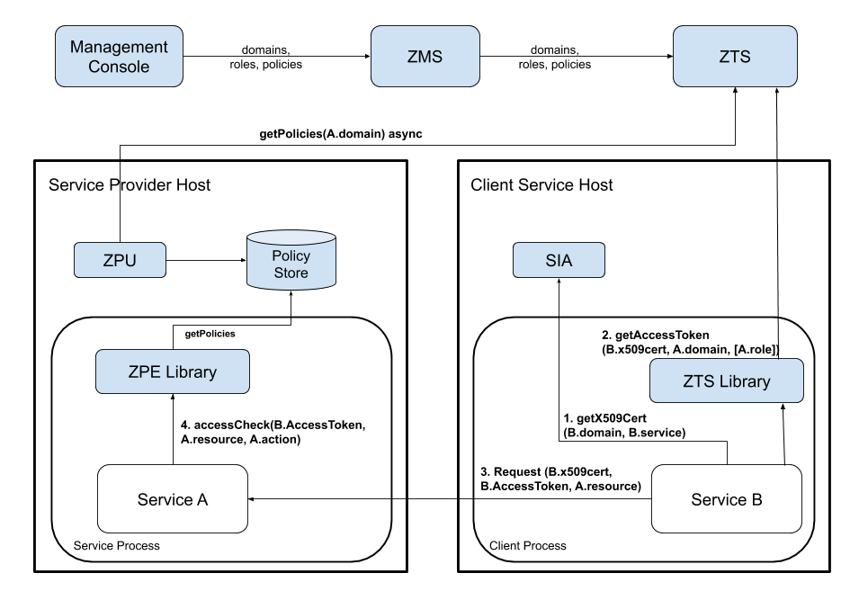

In this section, we're going to examine the decentralized authorization flow.

## Subsystems

Before we go into the details of the authorization flow, it's important
to understand the subsystems.

### ZMS (AuthZ Management System)

ZMS is where domains, roles, and policies are defined. This is Athenz's
centralized authorization system and is likely part of a larger
management system. In addition to allowing CRUD operations on the
basic entities, ZMS provides an API to replicate the entities,
per domain, to ZTS. It also can directly support the access
check, both for internal management system checks, as well as a simple
centralized deployment.

ZMS is the source of truth for domains, roles, and policies for
centralized authorization. ZMS supports a centralized call to check if a
principal has access to a resource. Because ZMS supports service
identities, ZMS can authenticate services.

### SIA (Service Identity Agent)

SIA is required for authenticating existing services. Any service should integrate 
SIA (or an equivalent system). 
To confirm a service's identity, SIA communicates with ZTS.

### ZTS (AuthZ Token System)

ZTS, the authentication token service, is only needed to support
decentralized or data plane functionality. In many ways, ZTS is like a
local replica of ZMS's data to check a principal's authentication and
confirm membership in roles within a domain. The authentication is in
the form of a signed Access Token that can be presented to any decentralized
service that wants to authorize access efficiently. If needed, multiple
ZTS instances will be distributed to different data centers as needed to scale
for issuing tokens.

### ZPE (AuthZ Policy Engine)

Like ZTS, ZPE, the authorization policy engine is only needed to support
the decentralized authorization. ZPE is the subsystem of Athenz that
evaluates policies for a set of roles to yield an allowed or a denied
response.

ZPE is a library that your service calls and only refers to a local
policy cache for your services domain (a small amount of data).

### ZPU (AuthZ PolicyEngine Updater)

Like ZTS and ZPE, ZPU is only needed to support the decentralized
authorization. The policy updater is the utility that retrieves from ZTS
the policy files for provisioned domains on a host, which ZPE uses to
evaluate access requests.

## Decentralized Access Control

A more interesting scenario introduces the local policy engine (ZPE),
and a few supporting changes. Rather than directly asking for an access
check with a principal identity, the identity is instead used to get an Access Token, and that is presented to the target service until it expires.
This mechanism allows a service to make a completely local access check
against ZPE, given an Access Token and locally cached policies.

Specifically, as shown in the diagram below, the client service/user
uses its identity x.509 certificate along with its private key that it
got from local SIA (1) to get an authorization token (Access Token) from ZTS (2),
and then presents the access token to a target service to access its resources (3).

That service can make use of a local ZPE to validate the role assertions
in the access token, and then correlate them to the asynchronously updated
Policies for the domain involved. The ZPE can make the decision locally,
without going off box. It has no knowledge about specific users, only
roles, and because roles and policies are always in the domain, the
amount of data to distribute to the machine is small.

The model works exactly the same when using X.509 certificates instead of
tokens. The service would use its identity X.509 certificate to request
a X.509 Role Certificate from ZTS and then would make the call to the
target service using the X.509 Role Certificate. The target service would
first validate the X.509 Certificate and call ZPE to extract the
role certificate to carry out the authorization check.
