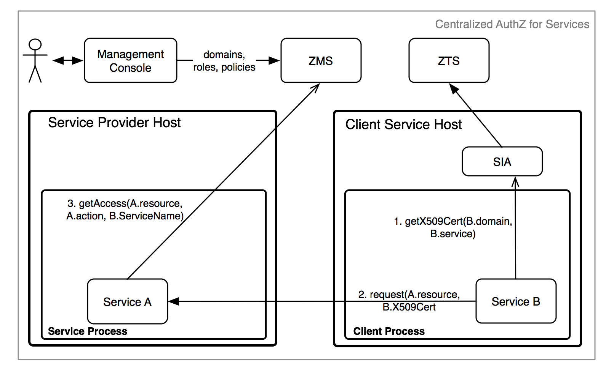

# Go Client/Server Example - Centralized Access Control
-------------------------------------------------------

* [Required Components](#required-components)
* [Service Definition](#service-definition)
* [Resource Definition](#resource-definition)
* [Athenz Management Setup](#athenz-management-setup)
* [Code Changes](#code-changes)
    * [Client Changes](#client-changes)
        * [Client Import Dependency Update](#client-import-dependency-update)
        * [Obtaining NTokens](#obtaining-ntokens)
        * [Build Go zms_svctoken Client Utility](#build-go-zms_svctoken-client-utility)
    * [Server Changes](#server-changes)
        * [Server Project Dependency Update](#server-project-dependency-update)
        * [Authorization Checks](#authorization-checks)
        * [Build Server](#build-server)
* [Deploying Example Servlet](#deploying-example-servlet)
* [Test Cases](#test-cases)
    * [Invalid Access Without ServiceToken](#invalid-access-without-servicetoken)
    * [Movie Editor Access](#movie-editor-access)
    * [TvShow Editor Access](#tvshow-editor-access)
    * [Site Editor Access](#site-editor-access)
    * [Other Test Cases](#other-test-cases)

In the centralized access control model, the service as a principal
requests its NToken from SIA Provider and then presents it to the
target service which would perform an identical check with ZMS to confirm
access.



The required steps to setup the environment for provider and tenant
services to support centralized access control are as follows:

* System administrator creates the provider and tenant domains.
* Tenant Domain administrator generates a public/private key pair
  and registers a service in its domain.
* Provider Domain administrator creates a role and policy that
  grants access to the given role with configured action and resource.
* Provider Domain administrator adds the Tenant Service to the
  role to grant access.
* Tenant Domain administrator installs the private key on the host
  that will be running the client/tenant service.

## Required Components
----------------------

To support centralized access control in your applications,
you only need to install and configure the Athenz ZMS
server along with the Athenz UI. Please follow these guides
to make sure you have both of those components up and
running in your environment:

* [ZMS Server](setup_zms.md)
* [UI Server](setup_ui.md)

To build the client and server components of this example,
you need to download and install Go and Git client
if you don't already have these available on your box:

* [The Go Programming Language](https://golang.org/doc/install)
* [Git client](https://git-scm.com/downloads)

Make sure your GOPATH variable is set and the PATH variable
includes the $(GOPATH)/bin to run the utilities.

## Service Definition
---------------------

Let's first define our service that needs to be Athenz protected.
We have a simple recommendation service that returns either a movie
or tv show for the caller. It has two endpoints:

    GET /rec/v1/movie
    GET /rec/v1/tvshow

So in this first release we just want to protect access to these
endpoints. The traffic is very low - we only expect a couple of
requests an hour so we have decided to use Athenz' centralized
authorization model.

## Resource Definition
----------------------

Defining resources and actions the principals are authorized
to execute is one of the most important tasks
in the authorization process. Based on our endpoints, it's expected
that we'll have 2 general resources:

    movie
    tvshow

The resources are referenced in their own domain namespace. So those
are valid if your domain is specifically created to support this
recommendation service only. But's lets assume we might add rental
support later, so we need to make sure the policies are based on
service specific resources. So we'll define our resources as:

    rec.movie
    rec.tvshow

Support action for these resources would be `read`. We can extend
our authorization policies later on if we need to introduce other
actions - such as `write` or `list` as we add more functionality into
our service.

## Athenz Management Setup
--------------------------

Once we have defined what our resources and actions are, we can
create their respective client and server (also commonly referred
as tenant and provider) roles and policies in Athenz. Go to
Athenz UI and login with your account which should have system
administrator access. Follow the instructions in the following
guide to setup the required access control:

* [Access Control Setup](example_service_athenz_setup.md)

## Code Changes
---------------

Both the client and server implementors need to make changes
in their respective code bases to support centralized authorization
checks. The client needs to make sure to submit its service
identity as part of its request, while the service needs to
carry out the authorization check based on that service
identity to determine if the request should be processed or not.

### Client Changes
------------------

While we'll use the `curl` client to make the http calls
to our example service, we provide a sample client code
that utilizes our zmssvctoken go library to generate
service identity tokens. The full client source code is
available from:

<https://github.com/AthenZ/athenz/blob/master/utils/zms-svctoken/zms-svctoken.go>

#### Client Import Dependency Update
------------------------------------

First you need to update your go client to import the zms service
token library.

```go
import (
    "github.com/AthenZ/athenz/libs/go/zmssvctoken"
)
```

#### Obtaining NTokens
----------------------

The domain administrator must have already generated a public/private key pair
for the service and registered public key in Athenz. The private key must be
available on the host where the client will be running.

```go
    // load private key
    bytes, err := os.ReadFile(privateKeyFile)
    if err != nil {
        log.Fatalln(err)
    }

    // get token builder instance
    builder, err := zmssvctoken.NewTokenBuilder(domain, service, bytes, keyVersion)
    if err != nil {
        log.Fatalln(err)
    }

    // set optional attributes
    builder.SetExpiration(60 * time.Minute)

    tok := builder.Token()

    // get a token for use
    ntoken, err := tok.Value()
```

Once we have our ntoken value, the http client before contacting the
provider service needs to add it as the value for the `Athenz-Principal-Auth`
header:

```go
    req, err := http.NewRequest("GET", "http://recommend-host/rec/v1/movie", nil)
    // ...
    req.Header.Add("Athenz-Principal-Auth", ntoken)
```

#### Build Go zms_svctoken Client Utility
-----------------------------------------

To download, compile and install zms_svctoken utility, execute
the following command:

```shell
$ go get github.com/AthenZ/athenz/utils/zms-svctoken/...
```

### Server Changes
------------------

The full server source code is available from:

<https://github.com/AthenZ/athenz/tree/master/examples/go/centralized-use-case/server>

#### Server Import Dependency Update
------------------------------------

First you need to update your go client to import the zms client
library.

```go
import (
    "github.com/AthenZ/athenz/clients/go/zms"
)
```

#### Authorization Checks
-------------------------

Before any authorization calls, we're going to check to make sure
our request contains the Athenz principal token:

```go

    const authHeader = "Athenz-Principal-Auth"
    
    func movieHandler(w http.ResponseWriter, r *http.Request) {
        // first let's verify that we have an ntoken
        if r.Header[authHeader] == nil {
            http.Error(w, "403 - Missing NToken", 403)
            return
        }
        ...
    }
}
```

Next, the most important part is to determine the resource and action
based on the given http request. Since we have a separate handler for
each endpoint:

```go
    http.HandleFunc("/rec/v1/movie", movieHandler)
    http.HandleFunc("/rec/v1/tvshow", tvshowHandler)
```

each function knows exactly what the resource and the action is.
Finally, we are going to contact ZMS for the authorization check.

```go
    func movieHandler(w http.ResponseWriter, r *http.Request) {
        ...
        // let's generate our resource value which is the
        // <provider domain>:<entity value>
        resource := providerDomain + ":rec.movie"

        // let's check with ZMS if the principal is authorized
        if !authorizeRequest(r.Header[authHeader][0], resource, "read") {
            http.Error(w, "403 - Unauthorized access", 403)
            return
        }
        io.WriteString(w, "Name: Slap Shot; Director: George Roy Hill\n")
    }
    
    func authorizeRequest(ntoken, resource, action string) bool {
        // for our test example we're just going to skip
        // validating self-signed certificates
        tr := http.Transport{}
        config := &tls.Config{}
        config.InsecureSkipVerify = true
        tr.TLSClientConfig = config
        zmsClient := zms.ZMSClient{
                URL:       zmsUrl,
                Transport: &tr,
        }
        zmsClient.AddCredentials(authHeader, ntoken)
        access, err := zmsClient.GetAccess(zms.ActionName(action), zms.ResourceName(resource), "", "")
        if err != nil {
                fmt.Println("Unable to verify access: %v", err)
                return false
        }
        return access.Granted
    }
```

#### Build Server
-----------------

Checkout and build the server component:

```shell
$ go get github.com/AthenZ/athenz/examples/go/centralized-use-case/server
```

## Deploying Example Server
---------------------------

To run the Go server, you just need to specify the ZMS Server url.
The server listens on port 8080:

```shell
$ recommend -zms https://<zms-server>:4443/zms/v1
```

## Test Cases
-------------

Run the following test cases to verify authorization access
for specific services. We're running our go server on the local
box so we're using localhost as the hostname.

* The zms_svctoken utility should already be built and installed
on your host.  `cd` to the directory that includes the private keys for the test
services we created in the section [Athenz Management Setup](#athenz-management-setup)
above.

### Invalid Access Without ServiceToken
---------------------------------------

For this test case we'll just use the curl client directly:

```shell
$ curl http://localhost:8080/rec/v1/movie
403 - Missing NToken
```

### Movie Editor Access
-----------------------

Movie service can successfully access /rec/v1/movie endpoint. So let's
first generate an NToken for this service and then contact our server:

```shell
$ export NTOKEN=`zms_svctoken -domain editors -service movie -private-key movie_private.pem -key-version v0`
$ curl -H "Athenz-Principal-Auth: $NTOKEN" http://localhost:8080/rec/v1/movie
Name: Slap Shot; Director: George Roy Hill
```

Movie service does not have access to /rec/v1/tvshow endpoint:

```shell
$ export NTOKEN=`zms_svctoken -domain editors -service movie -private-key movie_private.pem -key-version v0`
$ curl -H "Athenz-Principal-Auth: $NTOKEN" http://localhost:8080/rec/v1/tvshow
403 - Unauthorized access
```

### TvShow Editor Access
------------------------

TvShow service can successfully access /rec/v1/tvshow endpoint. So let's
first generate an NToken for this service and then contact our server:

```shell
$ export NTOKEN=`zms_svctoken -domain editors -service tvshow -private-key tvshow_private.pem -key-version v0`
$ curl -H "Athenz-Principal-Auth: $NTOKEN" http://localhost:8080/rec/v1/tvshow
Name: Middle; Channel: ABC
```

TvShow service does not have access to /rec/v1/movie endpoint:

```shell
$ export NTOKEN=`zms_svctoken -domain editors -service tvshow -private-key tvshow_private.pem -key-version v0`
$ curl -H "Athenz-Principal-Auth: $NTOKEN" http://localhost:8080/rec/v1/movie
403 - Unauthorized access
```

### Site Editor Access
----------------------

Site service has access to both /rec/v1/tvshow and /rec/v1/movie endpoints:

```shell
$ export NTOKEN=`zms_svctoken -domain editors -service site -private-key site_private.pem -key-version v0`
$ curl -H "Athenz-Principal-Auth: $NTOKEN" http://localhost:8080/rec/v1/movie
Name: Slap Shot; Director: George Roy Hill

$ curl -H "Athenz-Principal-Auth: $NTOKEN" http://localhost:8080/rec/v1/tvshow
Name: Middle; Channel: ABC
```

### Other Test Cases
--------------------

Now you can modify the `movie_editos, tvshow_editors, and site_editors` roles
in the `recommend` domain to add and remove the defined services and then
run the corresponding test cases to verify your access change.
