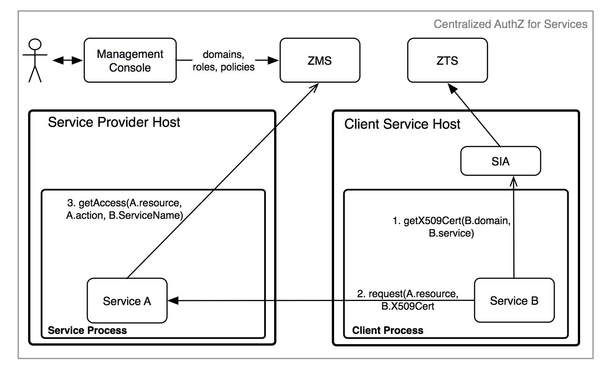

# Java Client/Servlet Example - Centralized Access Control
----------------------------------------------------------

* [Required Components](#required-components)
* [Service Definition](#service-definition)
* [Resource Definition](#resource-definition)
* [Athenz Management Setup](#athenz-management-setup)
* [Code Changes](#code-changes)
    * [Getting an SSL Context to be used in Http Clients](#getting-an-ssl-context-to-be-used-in-http-clients)
        * [Client Project Dependency Update](#client-project-dependency-update)
        * [Build Http Client Utility](#build-http-client-utility)
    * [Servlet Changes](#servlet-changes)
        * [Servlet Project Dependency Update](#servlet-project-dependency-update)
        * [Enable TLS Client Certificate Authentication](#enable-tls-client-certificate-authentication)
        * [Authorization Checks](#authorization-checks)
        * [Build Servlet](#build-servlet)
* [Deploying Example Servlet](#deploying-example-servlet)
* [Test Cases](#test-cases)
    * [Invalid Access Without ServiceToken](#invalid-access-without-servicetoken)
    * [Movie Editor Access](#movie-editor-access)
    * [TvShow Editor Access](#tvshow-editor-access)
    * [Site Editor Access](#site-editor-access)
    * [Other Test Cases](#other-test-cases)

In the centralized access control model, the service as a principal
requests an X509 certificate from SIA Provider and then presents it to the
target service which would perform an identical check with ZMS to confirm
access.



The required steps to setup the environment for provider and tenant
services to support centralized access control are as follows:

* System administrator creates the provider and tenant domains.
* Tenant Domain administrator generates a public/private key pair
  and registers a service in its domain.
* Provider Domain administrator creates a role and policy that
  grants access to the given role with configured action and resource.
* Provider Domain administrator adds the Tenant Service to the
  role to grant access.
* Tenant Domain administrator installs the private key on the host
  that will be running the client/tenant service.

## Required Components
----------------------

To support centralized access control in your applications,
you only need to install and configure the Athenz ZMS
server along with the Athenz UI. Please follow these guides
to make sure you have both of those components up and
running in your environment:

* [ZMS Server](setup_zms.md)
* [UI Server](setup_ui.md)

To build the client and servlet components of this example,
you need to download and install JDK 11, Apache Maven and Git client
if you don't already have these available on your box:

* [Java Platform JDK 11](https://adoptium.net/temurin/releases)
* [Apache Maven](http://maven.apache.org/download.cgi)
* [Git client](https://git-scm.com/downloads)

## Service Definition
---------------------

Let's first define our service that needs to be Athenz protected.
We have a simple recommendation service that returns either a movie
or tv show for the caller. It has two endpoints:

    GET /rec/v1/movie
    GET /rec/v1/tvshow

So in this first release we just want to protect access to these
endpoints. The traffic is very low - we only expect a couple of
requests an hour so we have decided to use Athenz' centralized
authorization model.

## Resource Definition
----------------------

Defining resources and actions the principals are authorized
to execute is one of the most important tasks
in the authorization process. Based on our endpoints, it's expected
that we'll have 2 general resources:

    movie
    tvshow

The resources are referenced in their own domain namespace. So those
are valid if your domain is specifically created to support this
recommendation service only. But's lets assume we might add rental
support later, so we need to make sure the policies are based on
service specific resources. So we'll define our resources as:

    rec.movie
    rec.tvshow

Support action for these resources would be `read`. We can extend
our authorization policies later on if we need to introduce other
actions - such as `write` or `list` as we add more functionality into
our service.

## Athenz Management Setup
--------------------------

Once we have defined what our resources and actions are, we can
create their respective client and server (also commonly referred
as tenant and provider) roles and policies in Athenz. Go to
Athenz UI and login with your account which should have system
administrator access. Follow the instructions in the following
guide to setup the required access control:

* [Access Control Setup](example_service_athenz_setup.md)

## Obtaining X509 Certificate
-----------------------------
The service should obtain an X509 certificate that will be used for authentication
with Athenz.
Follow the steps in the Authentication section to receive a certificate depending on the environment:
[Athenz Service Identity X.509 Certificate for AWS EC2 instances](service_x509_credentials_aws.md)
[Athenz Service Identity X.509 Certificate for AWS ECS containers](service_x509_credentials_aws_ecs.md)
[Athenz Service Identity X.509 Certificate for AWS Fargate tasks](service_x509_credentials_aws_fargate.md)
[Athenz Service Identity X.509 Certificate for AWS EKS pods](service_x509_credentials_aws_eks.md)
[Athenz Service Identity X.509 Certificate for AWS Lambda functions](service_x509_credentials_aws_lambda.md)

## Code Changes
---------------

Both the client and servlet implementors need to make changes
in their respective code bases to support centralized authorization
checks. The client needs to make sure to submit its service
 certificate as part of its request, while the servlet needs to
carry out the authorization check based on that service
identity to determine if it request should be processed or not.

### Getting an SSL Context to be used in Http Clients
----------------------------------------------------------------------

The full client source code is available from:
https://github.com/AthenZ/athenz/tree/master/libs/java/cert_refresher/examples/tls-support/src/main/java/com/yahoo/athenz/example/http/tls/client/HttpTLSClient.java

#### Client Project Dependency Update
-------------------------------------

First you need to update your Java project `pom.xml` file to indicate
the dependency on the Athenz Cert Refresher Library. Checkout the
[Maven Central Athenz Cert Refresher Package](https://search.maven.org/artifact/com.yahoo.athenz/athenz-cert-refresher)
to make sure you're using the latest release version:

```
<dependency>
    <groupId>com.yahoo.athenz</groupId>
    <artifactId>athenz-cert-refresher</artifactId>
    <version>VERSION-NUMBER</version>
</dependency>
```

#### Build Http Client Utility
------------------------------

Checkout and build the client component:

```shell
$ git clone https://github.com/AthenZ/athenz.git
$ cd libs/java/cert_refresher/examples/tls-support/src/main/java/com/yahoo/athenz/example/http/tls/client/
$ mvn clean package
```

Verify that the client is built successfully:

```shell
$ java -cp target/example-http-tls-java-client-1.0.jar HttpExampleClient
Missing required options: k, c, t, p, u
usage: http-example-client
 -k,--keyid <arg>               key identifier
 -c,--cert <arg>                certficate path
 -t,--trustStorePath <arg>      CA TrustStore path
 -p,--trustStorePassword <arg>  CA TrustStore password
 -u,--url <arg>                 request url
```

### Servlet Changes
-------------------

The full servlet source code is available from:

https://github.com/AthenZ/athenz/tree/master/examples/java/centralized-use-case/servlet

#### Servlet Project Dependency Update
--------------------------------------

First you need to update your Java project `pom.xml` file to indicate
the dependency on the Athenz ZMS Java Client Library and the Athenz Cert Refresher Libarry.
Checkout [Maven Central  ZMS Client Package Page](https://search.maven.org/artifact/com.yahoo.athenz/athenz-zms-java-client) and [Maven Central Athenz Cert Refresher Package](https://search.maven.org/artifact/com.yahoo.athenz/athenz-cert-refresher)
to make sure you're using the latest release version:

```
<dependency>
    <groupId>com.yahoo.athenz</groupId>
    <artifactId>athenz-zms-java-client</artifactId>
    <version>VERSION-NUMBER</version>
</dependency>
<dependency>
    <groupId>com.yahoo.athenz</groupId>
    <artifactId>athenz-cert-refresher</artifactId>
    <version>VERSION-NUMBER</version>
</dependency>
```
#### Enable TLS Client Certificate Authentication
-------------------------------------------------

To enable TLS Client Certificate Authentication, follow the steps in
[Server Side Service Identity Authentication](server_side_x509_credentials.md)


#### Authorization Checks
-------------------------

Before any authorization calls, we're going to check to make sure
our request contains the Athenz X509 certificate:

```java
    static final String ATHENZ_HEADER = "Athenz-Principal-Auth";
    
    protected void doGet(HttpServletRequest request,
            HttpServletResponse response) throws ServletException, IOException {

        // retrieve and verify that our request contains an Athenz
        // service authentication certificate
        
        X509Certificate[] certs = (X509Certificate[]) request.getAttribute(JAVAX_CERT_ATTR);
        
        // Assuming only one certificate sent in the request
        if (certs == null || certs[0] == null) {
            response.sendError(403, "Forbidden - No Athenz X509 certificate provided in request");
            return;
        }
        
        ...
    }
```

Next, the most important part is to determine the resource and action
based on the given http request.

```java
    protected void doGet(HttpServletRequest request,
            HttpServletResponse response) throws ServletException, IOException {

        ...
    
        switch (reqUri) {
            case "/movie":
                responseText = "Name: Slap Shot; Director: George Roy Hill";
                athenzResource = "rec.movie";
                athenzAction = "read";
                break;
            case "/tvshow":
                responseText = "Name: Middle; Channel: ABC";
                athenzResource = "rec.tvshow";
                athenzAction = "read";
                break;
            default:
                response.sendError(404, "Unknown endpoint");
                return;
        }
    
        ...
    }
```

Once we have those two values determined, then all that is left
is to contact ZMS for the authorization check.

```java
    protected void doGet(HttpServletRequest request,
            HttpServletResponse response) throws ServletException, IOException {

        ...
        
        // carry out the authorization check with the expected resource
        // and action values
        
        String principalName = x509cert.getSubjectX500Principal().getName();
        Access access = zmsClient.getAccess(athenzAction, athenzResource, null, principalName);
        boolean authorized = access.getGranted();
        if (!authorized) {
            response.sendError(403, "Forbidden - Athenz Authorization Rejected");
            return;
        }
    
        ...
    }
```

#### Build Servlet
------------------

Checkout and build the servlet component:

```shell
$ git clone https://github.com/AthenZ/athenz.git
$ cd examples/java/centralized-use-case/servlet/
$ mvn clean package
```

## Deploying Example Servlet
----------------------------

* Download and install latest [Jetty 9.3.x container](http://www.eclipse.org/jetty/download.html)
* Copy the `athenz-control.war` from the `servlet/target` directory to the Jetty
distribution's `webapps` directory
* Configure ZMS Server's URL in the expected environment variable:
```shell
export ZMS_SERVER_URL=https://<zms-server-hostname>:4443/zms/v1
```
* Configure Valid Issuers file path in the expected environment variable:
```shell
export ATHENZ_ISSUERS_FILEPATH=<Path to valid issuers file>
```
* Configure environment variables for our web app cert, key and truststore:
```shell
export REC_SERVLET_ATHENZ_KEY_PATH=<Path to key>
export REC_SERVLET_ATHENZ_CERT_PATH=<Path to cert>
export REC_SERVLET_ATHENZ_TRUSTSTORE_PATH=<Path to truststore>
export REC_SERVLET_ATHENZ_TRUSTSTORE_PASSWORD=<truststore password>
```

* If the ZMS Server is running with a self-signed certificate,
we need to generate a truststore for the java http client to use
when communicating with the ZMS Server. From your ZMS Server installation,
copy the `zms_cert.pem` file from the `athenz-zms-X.Y/var/zms_server/certs`
directory to the jetty's `etc` subdirectory and execute the following
commands:
```shell
$ keytool -importcert -noprompt -alias zms -keystore zms_truststore.jks -file zms_cert.pem -storepass athenz
$ export JAVA_OPTIONS=-Djavax.net.ssl.trustStore=<full-path-to-jetty-basedir>/etc/zms_truststore.jks
```
* Start the Jetty server by running the following command from
Jetty's distribution base directory:
```shell
bin/jetty.sh start
```

## Test Cases
-------------

Run the following test cases to verify authorization access
for specific services. We're running jetty server on the local
box so we're using localhost as the hostname.

* Copy the `example-http-tls-java-client-1.0.jar` file from the client/target
directory to the directory that includes the private keys for the test
services we created in the section [Athenz Management Setup](#athenz-management-setup)
above.

### Invalid Access Without Cert
---------------------------------------

For this test case we'll just use the curl client directly:

```shell
$ curl http://localhost:8080/athenz-control/rec/v1/movie
<html>
...
<title>Error 403 Forbidden - No Athenz X509 certificate provided in request</title>
...
</html>
```

### Movie Editor Access
-----------------------

Movie service can successfully access /rec/v1/movie endpoint:

```shell
$ java -cp ./example-http-tls-java-client-1.0.jar HttpTLSClient -d editors -s movie -p ./movie_private.pem -k v0 -u http://localhost:8080/athenz-control/rec/v1/movie

Successful response:
Name: Slap Shot; Director: George Roy Hill
```

Movie service does not have access to /rec/v1/tvshow endpoint:

```shell
$ java -cp ./example-http-tls-java-client-1.0.jar HttpTLSClient -d editors -s movie -p ./movie_private.pem -k v0 -u http://localhost:8080/athenz-control/rec/v1/tvshow

Request was forbidden - not authorized
```

### TvShow Editor Access
------------------------

TvShow service can successfully access /rec/v1/tvshow endpoint:

```shell
$ java -cp ./example-http-tls-java-client-1.0.jar HttpTLSClient -d editors -s tvshow -p ./tvshow_private.pem -k v0 -u http://localhost:8080/athenz-control/rec/v1/tvshow

Successful response:
Name: Middle; Channel: ABC
```

TvShow service does not have access to /rec/v1/movie endpoint:

```shell
$ java -cp ./example-http-tls-java-client-1.0.jar HttpTLSClient -d editors -s tvshow -p ./tvshow_private.pem -k v0 -u http://localhost:8080/athenz-control/rec/v1/movie

Request was forbidden - not authorized
```

### Site Editor Access
----------------------

Site service has access to both /rec/v1/tvshow and /rec/v1/movie endpoints:

```shell
$ java -cp ./example-http-tls-java-client-1.0.jar HttpTLSClient -d editors -s site -p ./site_private.pem -k v0 -u http://localhost:8080/athenz-control/rec/v1/movie

Successful response:
Name: Slap Shot; Director: George Roy Hill

$ java -cp ./example-http-tls-java-client-1.0.jar HttpTLSClient -d editors -s site -p ./site_private.pem -k v0 -u http://localhost:8080/athenz-control/rec/v1/tvshow

Successful response:
Name: Middle; Channel: ABC
```

### Other Test Cases
--------------------

Now you can modify the `movie_editos, tvshow_editors, and site_editors` roles
in the `recommend` domain to add and remove the defined services and then
run the corresponding test cases to verify your access change.
