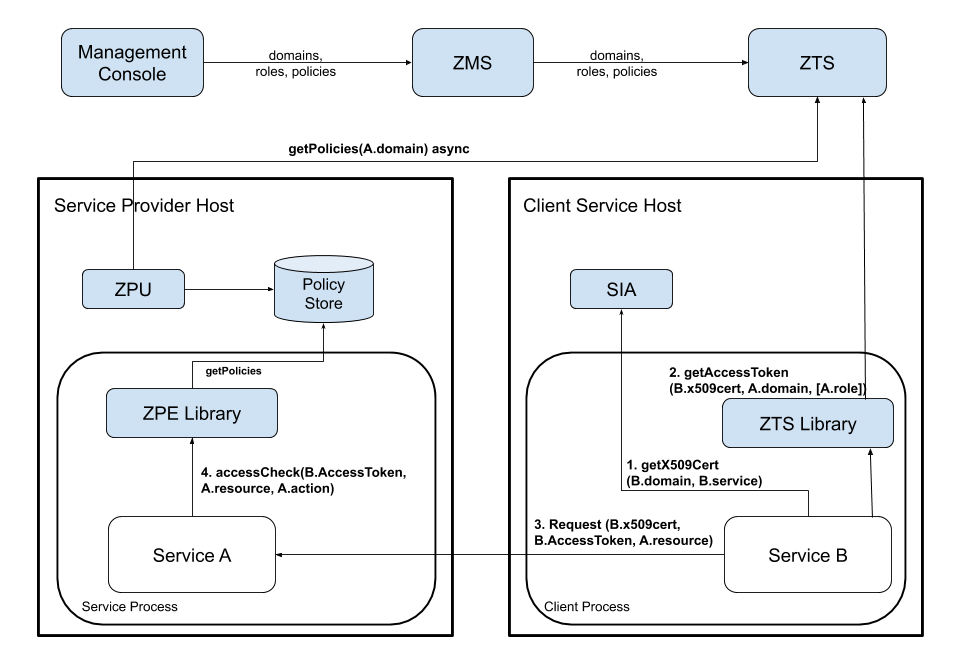

# Java Client/Servlet Example - Decentralized Access Control
------------------------------------------------------------

* [Required Components](#required-components)
* [Service Definition](#service-definition)
* [Resource Definition](#resource-definition)
* [Athenz Management Setup](#athenz-management-setup)
    * [Client (Tenant) Domain](#client-tenant-domain)
        * [Movie Editors](#movie-editors)
        * [TvShow Editors](#tvshow-editors)
        * [Site Editors](#site-editors)
        * [Service View](#service-view)
    * [Server (Provider) Domain](#server-provider-domain)
        * [Authorization Roles and Policies](#authorization-roles-and-policies)
            * [Movie Access](#movie-access)
            * [TvShow Access](#tvshow-access)
            * [Full Access](#full-access)
* [Code Changes](#code-changes)
    * [Client Changes](#client-changes)
        * [Client Project Dependency Update](#client-project-dependency-update)
        * [Obtaining Access Tokens from ZTS Server](#obtaining-access-tokens-from-zts-server)
        * [Build Http Client Utility](#build-http-client-utility)
    * [Servlet Changes](#servlet-changes)
        * [Servlet Project Dependency Update](#servlet-project-dependency-update)
        * [Authorization Checks](#authorization-checks)
        * [Build Servlet](#build-servlet)
* [Deploying Example Servlet](#deploying-example-servlet)
* [Test Cases](#test-cases)
    * [Invalid Access Without RoleToken](#invalid-access-without-roletoken)
    * [Movie Editor Access](#movie-editor-access)
    * [TvShow Editor Access](#tvshow-editor-access)
    * [Site Editor Access](#site-editor-access)
    * [Other Test Cases](#other-test-cases)

In the decentralized access control model, the client service/user uses its 
identity x.509 certificate along with its private key that it got from 
local SIA (1) to get an authorization token (Access Token) from ZTS (2), 
and then presents the access token to a target service to access its resources (3).



The required steps to setup the environment for provider and tenant
services to support decentralized access control are as follows:

* System administrator creates the provider and tenant domains.
* Tenant Domain administrator generates a public/private key pair
  and registers a service in its domain.
* Provider Domain administrator creates a role and policy that
  grants access to the given role with configured action and resource.
* Provider Domain administrator adds the Tenant Service to the
  role to grant access.
* Provider Domain administrator installs Athenz Policy Engine
  Updater (ZPU) on the hosts that will be running the provider
  service. ZPU must be configured with the provider domain name
  and setup to run as a cron job to periodically download the
  latest policy files for the server/provider domain.
* Tenant Domain administrator installs the private key on the host
  that will be running the client/tenant service.

## Required Components
----------------------

To support centralized access control in your applications,
you only need to install and configure all Athenz components:
ZMS and ZTS servers along with the Athenz UI. ZPE Policy
updater needs to be install on the target service host.
Please follow these guides to make sure you have all of
these components up and running in your environment:

* [ZMS Server](setup_zms.md)
* [ZTS Server](setup_zts.md)
* [UI Server](setup_ui.md)

On the provider service's host only install ZPU:

* [ZPU Utility](setup_zpu.md)

To build the client and servlet components of this example,
you need to download and install JDK 11, Apache Maven and Git client
if you don't already have these available on your box:

* [Java Platform JDK 11](https://adoptium.net/temurin/releases)
* [Apache Maven](http://maven.apache.org/download.cgi)
* [Git client](https://git-scm.com/downloads)

## Service Definition
---------------------

Let's first define our service that needs to be Athenz protected.
We have a simple recommendation service that returns either a movie
or tv show for the caller. It has two endpoints:

    GET /rec/v1/movie
    GET /rec/v1/tvshow

So in this first release we just want to protect access to these
endpoints. We're going to get large number of requests per second
so contacting ZMS server for centralized authorization checks is not
an option. Instead, we have decided to use Athenz' decentralized
authorization model.

## Resource Definition
----------------------

Defining resources and actions the principals are authorized
to execute is one of the most important tasks
in the authorization process. Based on our endpoints, it's expected
that we'll have 2 general resources:

    movie
    tvshow

The resources are referenced in their own domain namespace. So those
are valid if your domain is specifically created to support this
recommendation service only. But's lets assume we might add rental
support later, so we need to make sure the policies are based on
service specific resources. So we'll define our resources as:

    rec.movie
    rec.tvshow

Support action for these resources would be `read`. We can extend
our authorization policies later on if we need to introduce other
actions - such as `write` or `list` as we add more functionality into
our service.

## Athenz Management Setup
--------------------------

Once we have defined what our resources and actions are, we can
create their respective client and server (also commonly referred
as tenant and provider) roles and policies in Athenz. Go to
Athenz UI and login with your account which should have system
administrator access. Follow the instructions in the following
guide to setup the required access control:

* [Access Control Setup](example_service_athenz_setup.md)

## Code Changes
---------------

Both the client and servlet implementors need to make changes
in their respective code bases to support decentralized authorization
checks. The client needs to make sure to retrieve its Access Token
from ZTS Service and submit that as part of its request, while
the servlet needs to carry out the authorization check based on
that Access Token to determine if it request should be processed or not.

### Client Changes
------------------

The full client source code is available from:

https://github.com/AthenZ/athenz/tree/master/examples/java/decentralized-use-case/client

#### Client Project Dependency Update
-------------------------------------

First you need to update your Java project `pom.xml` file to indicate
the dependency on the Athenz auth_core and zts java client libraries. Checkout the
[Maven Central Athenz Cert Refresher Package](https://search.maven.org/artifact/com.yahoo.athenz/athenz-cert-refresher)
and [Maven Central ZTS Java Client Package](https://search.maven.org/artifact/com.yahoo.athenz/athenz-zts-java-client)
pages to make sure you're using the latest release version:

```
<dependency>
  <groupId>com.yahoo.athenz</groupId>
  <artifactId>athenz-cert-refresher</artifactId>
  <version>VERSION-NUMBER</version>
</dependency>
<dependency>
  <groupId>com.yahoo.athenz</groupId>
  <artifactId>athenz-zts-java-client</artifactId>
  <version>VERSION-NUMBER</version>
</dependency>
```

#### Obtaining Access Tokens from ZTS Server
--------------------------------------

The service should obtain an X509 certificate that will be used for authentication
with Athenz.
Follow the steps in the Authentication section to receive a certificate depending on the environment:
[Athenz Service Identity X.509 Certificate for AWS EC2 instances](service_x509_credentials_aws.md)
[Athenz Service Identity X.509 Certificate for AWS ECS containers](service_x509_credentials_aws_ecs.md)
[Athenz Service Identity X.509 Certificate for AWS Fargate tasks](service_x509_credentials_aws_fargate.md)
[Athenz Service Identity X.509 Certificate for AWS EKS pods](service_x509_credentials_aws_eks.md)
[Athenz Service Identity X.509 Certificate for AWS Lambda functions](service_x509_credentials_aws_lambda.md)


Then, we need to contact ZTS Server to retrieve an access token for
the given service identity (provided by the ServiceIdentityProvider)
accessing a target service domain:

```java
    // the fields used in the following snippet of code
    // ztsUrl -> ZTS Server Url
    // domainName -> 'recommend'
    // serviceName -> 'movie', 'tvshow' or 'site'
    // providerRole -> 'movie_editors, tvshow_editors, full_access'
    
    KeyRefresher keyRefresher = Utils.generateKeyRefresher(trustStorePath, trustStorePassword,
            certPath, keyPath);
    keyRefresher.startup();
    SSLContext sslContext = Utils.buildSSLContext(keyRefresher.getKeyManagerProxy(),
            keyRefresher.getTrustManagerProxy());

    HttpsURLConnection.setDefaultSSLSocketFactory(sslContext.getSocketFactory());

    ZTSClient ztsClient = new ZTSClient(ztsUrl, sslContext);

    List<String> roles = new ArrayList<>();
    roles.add(providerRole); // Can be several of roles. Our example only use one
    AccessTokenResponse accessTokenResponse = ztsClient.getAccessToken(domainName, roles, serviceName, 0, true);
    String accessToken = accessTokenResponse == null ? null : accessTokenResponse.getToken_type() + " " + accessTokenResponse.getAccess_token();
```

Once we have our Access Token, we can use it in the Authorization header.

```java
    // set our Athenz credentials. The ZTSClient provides the header
    // name that we must use for authorization token while the access
    // token itself provides the token string.
        
    con.setRequestProperty(ZTSClient.getHeader(), accessToken);
```

#### Build Http Client Utility
------------------------------

Checkout and build the client component:

```shell
$ git clone https://github.com/AthenZ/athenz.git
$ cd examples/java/decentralized-use-case/client/
$ mvn clean package
```

Verify that the client is built successfully:

```shell
$ java -cp target/example-java-client-access-token-1.0.jar com.yahoo.athenz.example.accesstoken.HttpExampleClient
Missing required options: k, c, t, p, d, pr, s, u, z
usage: http-example-client
 -k,--keyid <arg>               key identifier
 -c,--cert <arg>                certficate path
 -t,--trustStorePath <arg>      CA TrustStore path
 -p,--trustStorePassword <arg>  CA TrustStore password
 -d,--domain <arg>             domain name
 -pr,--provider-role <arg>     Provider role name
 -s,--service <arg>            service name
 -u,--url <arg>                request url
 -z,--ztsurl <arg>             ZTS Server url
```

### Servlet Changes
-------------------

The full servlet source code is available from:

https://github.com/AthenZ/athenz/tree/master/examples/java/decentralized-use-case/servlet

#### Servlet Project Dependency Update
--------------------------------------

First you need to update your Java project `pom.xml` file to indicate
the dependency on the Athenz ZPE Java Client Library. Checkout the
[Maven Central ZPE Client Package Page](https://search.maven.org/artifact/com.yahoo.athenz/athenz-zpe-java-client)
to make sure you're using the latest release version:

```
<dependency>
  <groupId>com.yahoo.athenz</groupId>
  <artifactId>athenz-zpe-java-client</artifactId>
  <version>VERSION-NUMBER</version>
</dependency>
```

#### Authorization Checks
-------------------------

First, we need to make sure the servlet initialization time,
Athenz ZPE Client library is initialized so it can process and
load any domain policy documents retrieved by ZPE Policy Updater.

```java
    public void init() throws ServletException {
        
        // initialize Athenz ZPE client which will load
        // all policy files into memory
        
        AuthZpeClient.init();
    }
```

Before any authorization calls, we're going to check to make sure
our request contains the Athenz role token:

```java
    static final String ATHENZ_HEADER = "Athenz-Role-Auth";
    
    protected void doGet(HttpServletRequest request,
            HttpServletResponse response) throws ServletException, IOException {

        // retrieve and verify that our request contains an Athenz
        // access token
        
        String accessToken = request.getHeader(ATHENZ_HEADER);
        if (accessToken == null) {
            response.sendError(403, "Forbidden - No Athenz accessToken provided in request");
            return;
        }
        
        ...
    }
```

Next, the most important part is to determine the resource and action
based on the given http request.

```java
    protected void doGet(HttpServletRequest request,
            HttpServletResponse response) throws ServletException, IOException {

        ...
    
        switch (reqUri) {
            case "/movie":
                responseText = "Name: Slap Shot; Director: George Roy Hill";
                athenzResource = "rec.movie";
                athenzAction = "read";
                break;
            case "/tvshow":
                responseText = "Name: Middle; Channel: ABC";
                athenzResource = "rec.tvshow";
                athenzAction = "read";
                break;
            default:
                response.sendError(404, "Unknown endpoint");
                return;
        }
    
        ...
    }
```

Once we have those two values determined, then all that is left
is to use ZPE client library for the authorization check.

```java
    protected void doGet(HttpServletRequest request,
            HttpServletResponse response) throws ServletException, IOException {

        ...
        
        // carry out the authorization check with the expected resource
        // and action values

        AccessCheckStatus status = AuthZpeClient.allowAccess(accessToken,
                athenzResource, athenzAction);
        if (status != AccessCheckStatus.ALLOW) {
            response.sendError(403, "Forbidden - Athenz Authorization Rejected");
            return;
        }
    
        ...
    }
```

#### Build Servlet
------------------

Checkout and build the servlet component:

```shell
$ git clone https://github.com/AthenZ/athenz.git
$ cd examples/java/decentralized-use-case/servlet/
$ mvn clean package
```

## Deploying Example Servlet
----------------------------

* Download and install latest [Jetty 9.3.x container](http://www.eclipse.org/jetty/download.html)
* Copy the `athenz-data.war` from the `servlet/target` directory to the Jetty
distribution's `webapps` directory
* Configure ZPU to download the policy documents for domain `recommend`.
```shell
$ vi <zpu-install-directory>/conf/zpe_policy_updater/zpu.conf
```
In the json file, edit the value for the `domains` field to be set to `recommend`.
Run the zpu utility to retrieve the policy documents from ZTS.
```shell
$ <zpu-directory>/bin/zpu_run.sh
$ ls -lat <zpe-directory>/var/zpe/recommend.pol
```
* Configure ZPE library to look for the policy file and the athenz.conf
files in the expected directory:
```shell
$ export JAVA_OPTIONS="-Dathenz.zpe.policy_dir=<zpu-directory>/var/zpe -Dathenz.athenz_conf=<zpu-directory>/conf/zpe_policy_updater/athenz.conf"
```
* Start the Jetty server by running the following command from
Jetty's distribution base directory:
```shell
bin/jetty.sh start
```

## Test Cases
-------------

Run the following test cases to verify authorization access
for specific services. We're running jetty server on the local
box so we're using localhost as the hostname.

* Copy the `example-java-client-access-token-1.0.jar` file from the client/target
directory to the directory that includes the private keys for the test
services we created in the section [Athenz Management Setup](#athenz-management-setup)
above.
* If the ZTS Server is running with a self-signed certificate,
we need to generate a truststore for the java http client to use
when communicating with the ZTS Server. From your ZTS Server installation,
copy the `zts_cert.pem` file from the `athenz-zts-X.Y/var/zts_server/certs`
directory into the same directory where the client access token utility is
saved (previous step) and execute the following commands:
```shell
$ keytool -importcert -noprompt -alias zts -keystore zts_truststore.jks -file zts_cert.pem -storepass athenz
```

### Invalid Access Without accessToken
---------------------------------------

For this test case we'll just use the curl client directly:

```shell
$ curl http://localhost:8080/athenz-data/rec/v1/movie
<html>
...
<title>Error 403 Forbidden - No Athenz accessToken provided in request</title>
...
</html>
```

### Movie Editor Access
-----------------------

Movie service can successfully access /rec/v1/movie endpoint:

```shell
$ java -Djavax.net.ssl.trustStore=./zts_truststore.jks -cp ./example-java-client-access-token-1.0.jar com.yahoo.athenz.example.accesstoken.HttpExampleClient -t ./zts_truststore.jks -p athenz -s movie -p ./movie_private.pem -d recommend -pr movie_editors -z https://<zts-server>:8443/zts/v1 -u http://localhost:8080/athenz-data/rec/v1/movie

Successful response:
Name: Slap Shot; Director: George Roy Hill
```

Movie service does not have access to /rec/v1/tvshow endpoint:

```shell
$ java -Djavax.net.ssl.trustStore=./zts_truststore.jks -cp ./example-java-client-access-token-1.0.jar com.yahoo.athenz.example.accesstoken.HttpExampleClient -t ./zts_truststore.jks -p athenz -s movie -p ./movie_private.pem -d recommend -pr movie_editors -z https://<zts-server>:8443/zts/v1 -u http://localhost:8080/athenz-data/rec/v1/tvshow

Request was forbidden - not authorized
```

### TvShow Editor Access
------------------------

TvShow service can successfully access /rec/v1/tvshow endpoint:

```shell
$ java -Djavax.net.ssl.trustStore=./zts_truststore.jks -cp ./example-java-client-access-token-1.0.jar com.yahoo.athenz.example.accesstoken.HttpExampleClient -t ./zts_truststore.jks -p athenz -s tvshow -p ./tvshow_private.pem -d recommend -pr tvshow_editors -z https://<zts-server>:8443/zts/v1 -u http://localhost:8080/athenz-data/rec/v1/tvshow

Successful response:
Name: Middle; Channel: ABC
```

TvShow service does not have access to /rec/v1/movie endpoint:

```shell
$ java -Djavax.net.ssl.trustStore=./zts_truststore.jks -cp ./example-java-client-access-token-1.0.jar com.yahoo.athenz.example.accesstoken.HttpExampleClient -t ./zts_truststore.jks -p athenz -s tvshow -p ./tvshow_private.pem -d recommend -pr tvshow_editors -z https://<zts-server>:8443/zts/v1 -u http://localhost:8080/athenz-data/rec/v1/movie

Request was forbidden - not authorized
```

### Site Editor Access
----------------------

Site service has access to both /rec/v1/tvshow and /rec/v1/movie endpoints:

```shell
$ java -Djavax.net.ssl.trustStore=./zts_truststore.jks -cp ./example-java-client-access-token-1.0.jar com.yahoo.athenz.example.accesstoken.HttpExampleClient -t ./zts_truststore.jks -p athenz -s site -p ./site_private.pem -d recommend -pr full_access -z https://<zts-server>:8443/zts/v1 -u http://localhost:8080/athenz-data/rec/v1/movie

Successful response:
Name: Slap Shot; Director: George Roy Hill

$ java -Djavax.net.ssl.trustStore=./zts_truststore.jks -cp ./example-java-client-access-token-1.0.jar com.yahoo.athenz.example.accesstoken.HttpExampleClient -t ./zts_truststore.jks -p athenz -s site -p ./site_private.pem -k v0 -d recommend -pr full_access -z https://<zts-server>:8443/zts/v1 -u http://localhost:8080/athenz-data/rec/v1/tvshow

Successful response:
Name: Middle; Channel: ABC
```

### Other Test Cases
--------------------

Now you can modify the `movie_editos, tvshow_editors, and site_editors` roles
in the `recommend` domain to add and remove the defined services. After you
make the changes, it will take about a minute for the updates to propagate
from ZMS to the ZTS Server. Then you need to run the zpu_run.sh command again
to fetch the updated policy files for the domain onto your host. Then you can
run the corresponding test cases to verify your access change.
