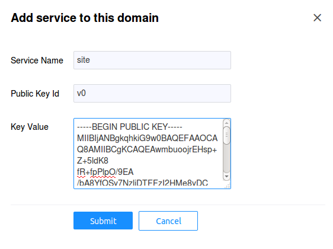
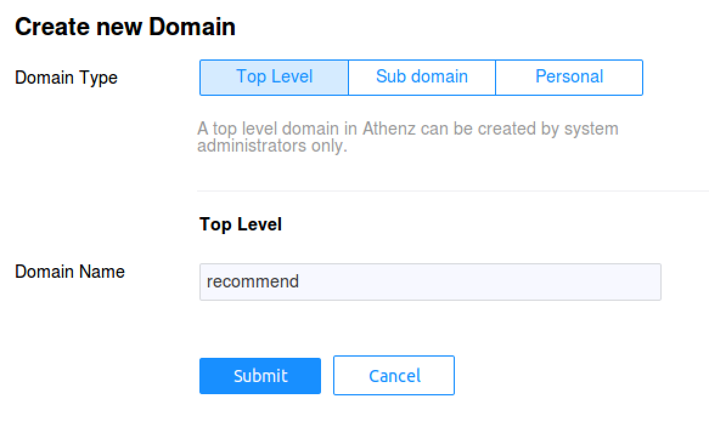
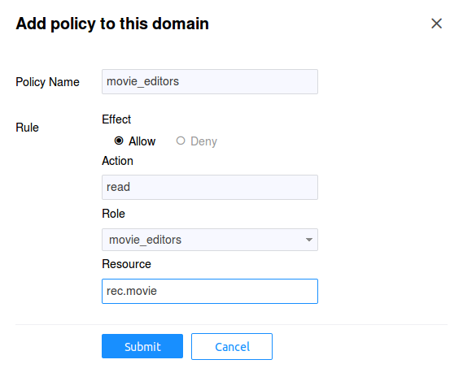

# Example Service Access Control Setup
--------------------------------------

* [Client (Tenant) Domain](#client-tenant-domain)
    * [Movie Editors](#movie-editors)
    * [TvShow Editors](#tvshow-editors)
    * [Site Editors](#site-editors)
    * [Service View](#service-view)
* [Server (Provider) Domain](#server-provider-domain)
    * [Authorization Roles and Policies](#authorization-roles-and-policies)
        * [Movie Access](#movie-access)
        * [TvShow Access](#tvshow-access)
        * [Full Access](#full-access)

We've decided that our resources for the service will be defined
in Athenz as:

    rec.movie
    rec.tvshow

and the only supported action for now would be `read`. Now we can
create their respective client and server (also commonly referred
as tenant and provider) roles and policies in Athenz. Go to
Athenz UI and login with your account which should have system
administrator access.

## Client (Tenant) Domain
-------------------------

The client services will be defined in the `editors` domain so
let's create that domain and services. Click on the
`Create a domain` link in top left corner to add the domain:


### Movie Editors
-----------------

Each service is identified by its private/public key pair. The
`movie` service will be authorized to access the `/rec/v1/movie` 
endpoint from our recommendation service. So we
need to first generate the key pair (at the end we're going to
display the contents of the public key since we'll be using that
when creating the service in the UI):

```shell
$ openssl genrsa -out movie_private.pem 2048
$ openssl rsa -in movie_private.pem -pubout > movie_public.pem
$ cat movie_public.pem
```

Now we need to register the `movie` service in the `editors` domain.
After you login, click on the `editors` domain in the left hand
tree pane, then choose the `Services` tab. Click on the
`Add Service` button. In the `Key Value` field when creating a
service, enter the contents of the `movie_public.pem` file.
For the `Public Key Id` field we'll use `v0`. Each service
can be identified my multiple key pairs. For example, if you
have services running in different geographical data centers,
each data center instance can have its own unique public/private
key pair. It also allows the service administrator to establish
a key rotation policy - e.g. generate a new key pair every 6
months and assign a new key identifier: v0, v1, etc.


### TvShow Editors
------------------

The `tvshow` service will be authorized to access the `/rec/v1/tvshow`
endpoint from our recommendation service. So again, we
need to first generate the key pair (at the end we're going to
display the contents of the public key since we'll be using that
when creating the service in the UI):

```shell
$ openssl genrsa -out tvshow_private.pem 2048
$ openssl rsa -in tvshow_private.pem -pubout > tvshow_public.pem
$ cat tvshow_public.pem
```

Now we need to register the `tvshow` service in the `editors` domain.
After you login, click on the `editors` domain in the left hand
tree pane, then choose the `Services` tab. Click on the
`Add Service` button. In the `Key Value` field when creating a
service, enter the contents of the `tvshow_public.pem` file.
For the `Public Key Id` field we'll use `v0`. See the
`Movie Editors` section for additional details on this field.


### Site Editors
----------------

The `site` service will be authorized to access both `/rec/v1/movie`
and `/rec/v1/tvshow` endpoints from our recommendation service. So we
need to first generate the key pair (at the end we're going to
display the contents of the public key since we'll be using that
when creating the service in the UI):

```shell
$ openssl genrsa -out site_private.pem 2048
$ openssl rsa -in site_private.pem -pubout > site_public.pem
$ cat site_public.pem
```

Finally, we need to register the `site` service in the `editors` domain.
After you login, click on the `editors` domain in the left hand
tree pane, then choose the `Services` tab.Click on the
`Add Service` button. In the `Key Value` field when creating a
service, enter the contents of the `site_public.pem` file.
For the `Public Key Id` field we'll use `v0`. See the
`Movie Editors` section for additional details on this field.



### Service View
----------------

Once all three services are successfully registered, you should
have the following `Services` view for the `editors` domains:


## Server (Provider) Domain
---------------------------

The recommendation service will be run by `recommend` property.
So let's first create this domain in Athenz. Click on the
`Create a domain` link in top left corner to add the domain:



### Authorization Roles and Policies
------------------------------------

Typically since we have two resources and only one action supported
in this use case, we'll be creating 2 roles that will be providing
access control. In this model, if we want one service to have
access to both services, we'll need to add that principal to both
roles. A slightly different approach would be to create yet another
role that provides full access to all recommendation endpoints.

#### Movie Access
-----------------

First we need to create the role that includes principals
authorized to access the movie resource. In our example, we'll
call this role as `movie_editors` and include `editors.movie`
service as a member of this role. After you login, click on
the `recommend` domain in the left hand tree pane, then choose
the `Roles` tab. Click on the `Add Role` button:


Now we need to give access to this role with action `read` to
resource `rec.movie`. Choose the `Policies` tab and click on
the `Add Policy` button:



#### TvShow Access
------------------

Now we need to create the role that includes principals
authorized to access the tvshow resource. In our example, we'll
call this role as `tvshow_editors` and include `editors.tvshow`
service as a member of this role. After you login, click on
the `recommend` domain in the left hand tree pane, then choose
the `Roles` tab. Click on the `Add Role` button:


Now we need to give access to this role with action `read` to
resource `rec.tvshow`. Choose the `Policies` tab and click on
the `Add Policy` button:


#### Full Access
----------------

Finally, we need to create the role that includes principals
authorized to have full access to any resource in our
recommendation service. In our example, we'll call this role
as `full_access` and include `editors.site` service as a member
of this role. After you login, click on the `recommend` domain
in the left hand tree pane, then choose the `Roles` tab. Click
on the `Add Role` button:


Now we need to give access to this role with action `*` to
resource `rec.*`. Since Athenz support glob style wildcards,
having `*` indicates it will match all actions - e.g. `read`,
`write`, etc. And having the resource as `rec.*` indicates that
it will match `rec.movie`, `rec.tvshow` and any other resource
that we create with the prefix `rec.`. Choose the `Policies` tab
and click on the `Add Policy` button:


