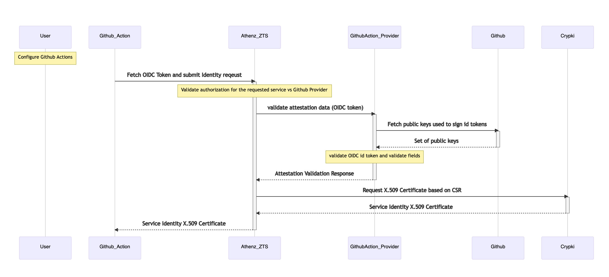

# Service Identity Provider for GitHub Actions
----------------------------------------------

The document describes support for issuing Athenz Identity x.509 certificates to workloads launched with GitHub Actions.

## Request Attestation Data

The attestation data for the x.509 certificate identity registration request would be the OIDC token that a workflow can
obtain from GitHub. The OIDC token must be requested for ZTS audience (e.g. https://zts.athenz.io:4443/zts/v1) so
that if compromised the token cannot be used for any other operation in the GitHub repository.

To obtain OIDC token within GitHub actions:

```
OIDC_TOKEN=$(curl -sLS "${ACTIONS_ID_TOKEN_REQUEST_URL}&audience=https://zts.athenz.io:4443/zts/v1" -H "User-Agent: actions/oidc-client" -H "Authorization: Bearer $ACTIONS_ID_TOKEN_REQUEST_TOKEN")
OIDC_JWT=$(echo $OIDC_TOKEN | jq -j '.value')
```

Here is a sample payload of an OID Token:

```json
{
    "jti": "15a2c4d7-f60e-460d-b034-dbd49e757a0a",
    "sub": "repo:AthenZ/athenz:ref:refs/heads/main",
    "aud": "https:/zts.athenz.io:4443/zts/v1",
    "ref": "refs/heads/main",
    "sha": "40a1653d3e20c5e70421a0493038ac4029834257",
    "repository": "AthenZ/athenz",
    "repository_owner": "athenz",
    "repository_owner_id": "34124938490324394",
    "run_id": "774951243124123438620",
    "run_number": "8",
    "run_attempt": "1",
    "repository_visibility": "internal",
    "repository_id": "134123432143214",
    "actor_id": "1467933413241234324312836",
    "actor": "athenz",
    "workflow": "GitHub Actions Demo",
    "head_ref": "",
    "base_ref": "",
    "event_name": "push",
    "ref_protected": "false",
    "ref_type": "branch",
    "workflow_ref": "AthenZ/athenz/.github/workflows/github-actions-demo.yml@refs/heads/main",
    "workflow_sha": "40a1653d3e20c5e70421a0493038ac4029834257",
    "job_workflow_ref": "AthenZ/athenz/.github/workflows/github-actions-demo.yml@refs/heads/main",
    "job_workflow_sha": "40a1653d3e20c5e70421a0493038ac4029834257",
    "runner_environment": "github-hosted",
    "enterprise_id": "134345756456453645",
    "enterprise": "athenz",
    "iss": "https://token.actions.githubusercontent.com",
    "nbf": 1706833037,
    "exp": 1706833937,
    "iat": 1706833637
}
```

## Sequence Diagram For Obtaining Identity Certificates



## Athenz Identities For GitHub Action

The requirement for the provider is to issue a unique Athenz identity for a given repo/branch. Since the names of the
GitHub organization/repository components are much more extensive than what Athenz supports and GitHub Actions supports
a variety of events that trigger workflows (e.g. push on a tag, release, deployment, etc.), we cannot automatically
generate dynamic service names based on those components.

Instead, the domain administrator will register a service for any GitHub action they desire in their own domain. This
will give them the flexibility to create as many unique service identities they require for each repo/branch/event, or
they can just create two (one main and one pr) if they choose using wildcards in actions/resources which match perfectly
to event names and subjects in OIDC tokens.

To configure a service to be launched by a GitHub Action, the corresponding roles and policies will need to be created
in the tenant’s domain.

For example, `news.prod` domain administrator wants to deploy a service called `api` for its main branch and `api-pr` for
workflows deployed in GitHub Actions. The policy will include the full repo path that is returned in the `sub` claim in
the token and is in the following format for `push` and `pull_requests` events:

	event_name: push
	subject: repo:<org-name>/<repo-name>:ref:refs/heads/<branch>"

	event_name: pull_request
	subject: repo:<org-name>/<repo-name>:pull_request"

In the corresponding Athenz policy the following values will be represented as follows:

	action: github.<event_name>
	resource: <subject>

Domain Name: `news.prod`

Service Name: `api`
Role Name: `github.actions.api`
Member: `news.prod.api`

Service Name: `api-pr`
Role Name: `github.actions.api-pr`
Member: `news.prod.api-pr`

Policy Name: `github.actions`
Assertions:
    `grant github.push to github.actions.api on news.prod:repo:yahoo-news/api:ref:refs/heads/main`
    `grant github.pull_request to github.actions.api on news.prod:repo:yahoo-news/api:pull_request`

To simplify the setup process, the domain administrator should provide a GitHub-Actions template where the
user will just need to provide the service name, event_type and resource values to automatically create
the necessary services, roles and policies.

## Service Identity GitHub Actions Provider

The provider will be implemented as an in-service class based provider. The provider will run as part of the ZTS Service
deployment. No changes are required for the current deployment model.

### Register Instance

The provider will carry out the following checks during the instance registration process:

- Obtain the public keys from GitHub to validate the OIDC token. It will cache the keys to avoid unnecessary calls. It
  will also limit the frequency of how often it will connect to GitHub to fetch the public keys. For example, if it
  receives a token with a key id that is not in its cache, it will attempt to update the local cache by contacting GitHub.
  However, if the key id is not found and another request is received with the same key id, it will not attempt to fetch a
  fresh set of keys from GitHub until the configured timeout has passed.
- Validate the signature of the OIDC token and parse the claims. As part of this validation, the library verifies that the
  token is not expired.
- Validate the following claims from the token:
  - Audience (aud) - must be our configured server e.g. https://zts.athenz.io:4443/zts/v1
  - Enterprise (enterprise) - matches the configured enterprise value. If the enterprise value is not
    configured this check is skipped
  - Issue Time (iat) - the timestamp must be within the configured number of minutes (default 5 mins).
  - Issuer (iss) - matches the configured GitHub issuer
  - Run ID (run_id) - identifies the instance id for the certificate request by including with the
    organization and repository names in the following format: <org-name>:<repo-name>:<run_id>
- Extract the following two attributes for the authorization check:
  - Subject (sub) - subject for the event
  - Event Name (event_name) - name of the event
- Carry out an authorization check with action “GitHub.<event-name>” and the resource “<domain-name>:<subject>”

The identity will be issued for the min(requested number of minutes, max expiry) where max expiry will have a default
configuration value of 6 hours. (That is the max time for a GitHub actions job).

## Refresh Instance

The provider does not support refreshing identity x.509 certificates. Each job will register and use its credentials
every time it runs.

## SSH Host Certificates

The provider does not support ssh host certificates.

## Service Identity Agent for GitHub Actions

A new sia agent is implemented for the GitHub actions. It output the necessary action/resource to be used when
creating assertions in a policy for the given workflow before obtaining the identity service for the given job.
This would allow the user to run the tool the first time to get the subject/event_name and possibly other
details that are included in the OIDC token without running any curl commands directly.

## ZMS Server Configuration Changes

The following changes are necessary for the ZMS server to support GitHub Actions provider:

- Register `sys.auth.github-actions` as a service with the class provider url pointing to the implementation of the GitHub
actions provider class.
- Add the provider identity (e.g. sys.auth.github-actions) to the providers role in the `sys.auth` domain to be authorized
as an official provider.
- Create a role called `provider.sys.auth.github-actions` that includes `sys.auth.github-actions` as a member and create a
policy that allows `launch` action to that role on the resource `dns.<dns-domain-suffix>`. This allows adding sanDNS
values in the certificate in the format `<service-name>.<domain-name>.<dns-domain-suffix>`

## ZTS Server Configuration Changes

The following changes are necessary for the ZTS server to support GitHub Actions provider:

- ZTS enforces IP ranges where services are authorized to request identities for service identities from a given provider.
It is expected that the worker nodes for a team will be configured to run in their own private AWS accounts, for example,
and as such the team needs to provide the NAT gateway IP addresses for the account, so they can be authorized.
