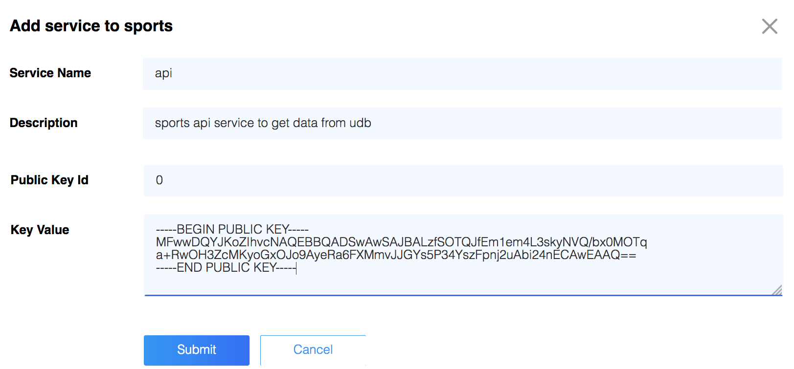
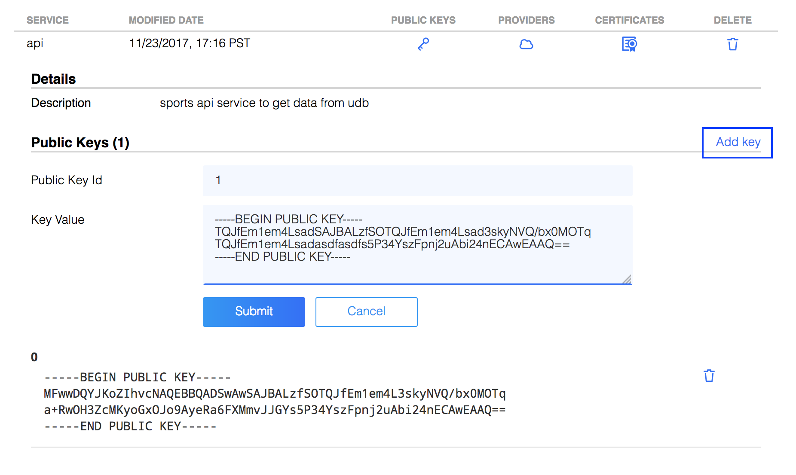
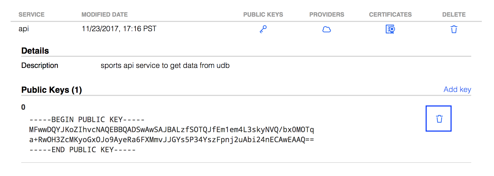

Once a domain has been registered in Athenz, the administrator will
register service identities that are specified in domain roles and
policy assertions. The latter can reference those roles having access to
specified resources. Athenz supports service authentication with
two types of credentials:

- X.509 Certificates (preferred approach) [Instructions](service_x509_credentials.md)
- Public/Private Key Pairs

Before you can register the service identity, you'll need to generate
keys. In this section we'll cover how to create the keys and register the service
identity.

## Key Generation

The registration process requires the domain administrator to generate a
private/public RSA key pair (must be at least 2048 bit) for the service.

The following are the keys and the services that use those keys:

-   **private key** - The SIA server/utility uses the private key to generate a
    `ServiceToken` identifying the service.
-   **public key** - ZMS/ZTS then use the public key to validate the
    `ServiceToken` generated by SIA.

The `openssl` command-line utility is used to generate the key pair:

```
    $ umask 077
    $ openssl genrsa -out service_private.key 2048
    $ openssl rsa -in service_private.key -pubout > service_public.key
```

If using the [zms-cli](zms_client.md) client utility to register the service identity,
the public key file must have an extension of .pem or .key.

### Private Keys

The private key file must be installed on all hosts where the service
will be running. The reason the use of X.509 Certificates is the
preferred approach is because to securely install the private key
on all hosts presents a challenge. 

Each key pair has a key identifier that will be included in the
generated `ServiceTokens` as the value of the `k` component. If the
service’s private key has been compromised or the service has a policy
to periodically rotate the keys, the service administrator will generate
a new key pair, remove the public key with the old identifier, and
register a new public key with a different key identifier. Typically, a
service would start with "0" as its first identifier and increment when
required.

### Key Rotation

If the service’s private key has been compromised or the service has a
policy to periodically rotate the keys, the service administrator will
generate a new key pair, remove the public key with identifier 0 and
register a new public key with a different key identifier. As mentioned above,
the key identifier is included in generated Service Tokens as the value
of the `k` component. See the instructions below how to add and delete
public keys for a service.

## Service Identity Registration

To register a new service identity, select your domain in Athenz UI
and choose the `Services` tab. Select `Add Service` link on the left
side of the screen underneath the Roles/Services/Policies tabs. Enter
the Service name, and optional description, the public key ID, and
the actual public key contents in pem format:



### Add new public key

Once the services view is displayed, Select the `Public Keys` icon on
the same line as the service to see all the registered public key.
Once that view is open, click on the `Add Key` link on the right hand
side. Enter the Key Id and the Key Value which must be a PEM encoded
public key. Click `Submit` to complete your update.



### Delete an existing public key

Once the services view is displayed, Select the `Public Keys` icon on
the same line as the service to see all the registered public key.
Once that view is open, click on the `Delete` trash can icon on the
right hand side of the public key.


