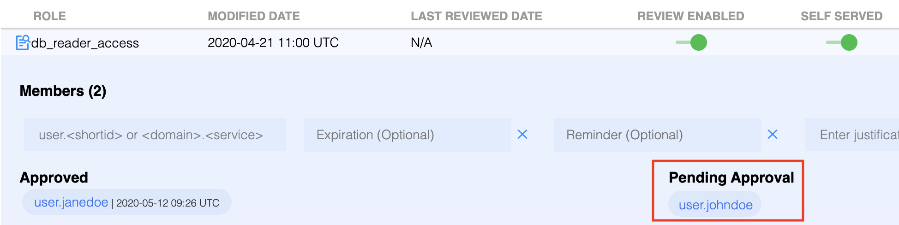
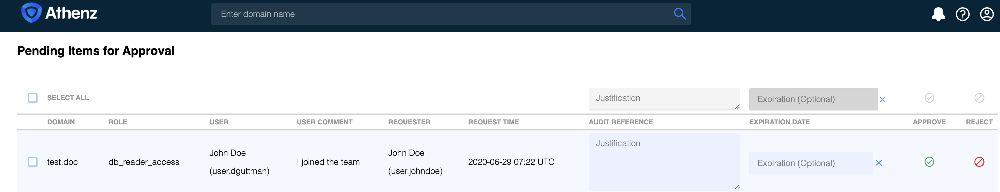

Athenz now supports configuring roles in domains as review-enabled thus requiring two domain
administrator approvals before a principal is added to a role.

## Role Setup

To designate a role as review-enabled, the domain administrator may use either
Athenz UI or [zms-cli](zms_client.md) utility.

To use Athenz UI, the domain administrator will login to their domain role view and
choose the `Review Enabled` slider for the appropriate role. For example, in the following
case, the `db_reader_access` role is configured as review-served.

```
zms-cli -d <domain-name> set-role-review-enabled <role-name> true
```

The show-role command will display the review attribute if it's enabled for a role:

```
$ zms-cli -d home.johndoe set-role-review-enabled read-access true
[domain home.johndoe role read-access review-enabled attribute successfully updated]

$ zms-cli -d home.johndoe show-role read-access
role:
    - name: read-access
      review_enabled: true
      members:
        - user.janedoe
```

## Adding Users to Review Enabled Roles

Unlike a regular role, when any one of the domain administrators adds a user
in a review enabled role, it will be added in pending/inactive state until it is
approved by one of the other domain administrators.

For example, in this use case, the domain administrator  would like to add
`user.bob` principal to the `db_reader_access` role which is configured as
review enabled. When the domain administrator adds the principal id to the role,
it will be added in the `Pending Approval` column.



It will be in pending state until one of the other domain administrators reviews and
either approves or rejects the request.

## Domain Administrator Approval

Once the pending request is processed, all domain administrators will receive an email
notification stating that `user.pgote` would like to be added to the `db_reader_access`
role and they need to either approve or reject the request. The email will include a link
to the Athenz UI workflow page which can also be accessed by clicking on the notifications
icon in the Athenz UI toolbar:


Once in the approval view page, the domain administrator may either approve or reject the request.
The domain administrator will need to provide a justification in the `Audit Reference` field
and optionally specify an expiration date (even if the user didn't request one).



Once approved, the principal will become an active/approved member of the role. If rejected,
the principal's name will be removed from the `Pending Approval` column.

** Important ** The domain administrator that submitted the original request is not authorized
to approve his/her own request. It must be approved by another domain administrator.
This requires that the domain must have at least 2 administrators.

## Deleting Users from Review Enabled Roles

Additional domain administrator approver workflow only applies to adding users in review
enabled roles. The domain administrators have the authorization to remove any principal
from a review enabled role without further approval process.
