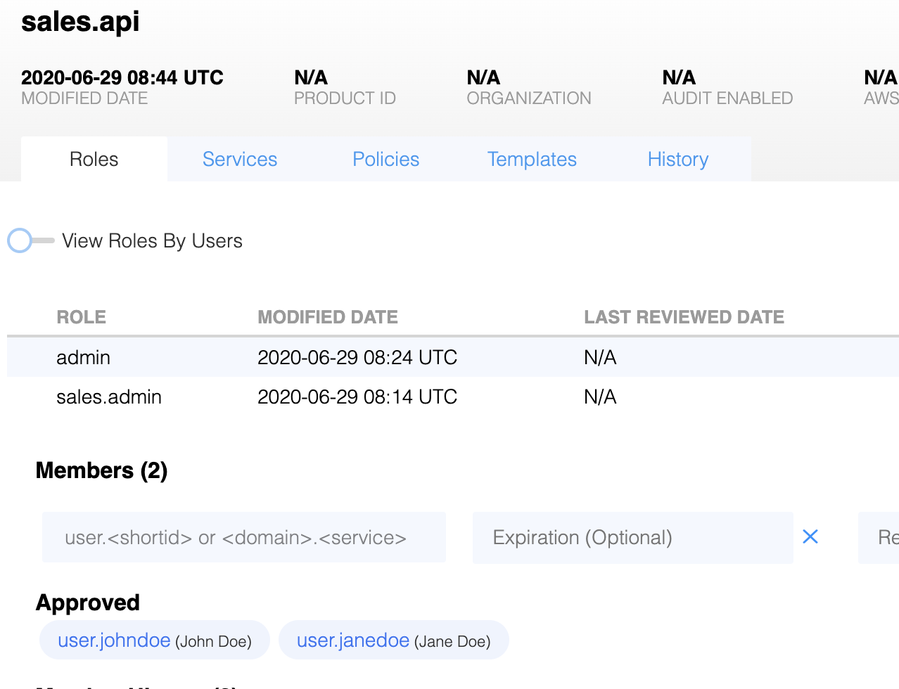

Athenz supports two types of roles that an administrator can create in
their domains: regular and delegated. The regular role just includes list
of principals that may assume that role. The delegated type specifies
the trusted domain who has assumed the management of the members for that
role. 

The delegation scenario involves two domains:

- The "provider-domain" is the domain of the service, where the policies and
  rules are declared,
- The "tenant-domain" (a.k.a. "trusted-domain") is the domain in which
  principals are assigned to the role.

The delegation requires agreement from both domains:

- The provider-domain administrator specifies a role as "delegated" to a
  specific tenant-domain.
- The tenant-domain administrator creates a rule to assume that role
  and maps it to one if its local regular roles for principal membership.

## Definition of required roles and rules

The keywords `PROVIDER_DOMAIN`, `TENANT_DOMAIN`, `PROVIDER_ROLE` and
 `TENANT_ROLE` are place-holders for the actual id's.
 
Steps for establishing a delegated role:
 
- In the provider-domain:
  - Create the role `PROVIDER_ROLE` as "delegated" to the domain
    `TENANT_DOMAIN`.
  - Create various rules for `PROVIDER_ROLE` as usual.
  
- In the tenant-domain:
  - Create role `TENANT_ROLE`
  - Create this rule:
    - Allow
    - Action=`assume_role`
    - Role=`TENANT_ROLE`
    - Resource=`PROVIDER_DOMAIN:role.PROVIDER_ROLE`
  - Assign members to “TENANT_ROLE” as usual.

## Use Case: Domain Administration Delegation

A product team has a top level domain called sales
with its configured set of administrators. They also have created a
subdomain sales.api for the sales API subproduct. Since Athenz
subdomains are completely independent, sales.api has its own admin
role and set of administrators. However, in the case of sales product
these two domains must have the same set of administrators and the
product owner does not want to maintain and manage the admin role
members in two places. The sales.api domain wants to delegate
administration privileges to the parent sales domain.

### Step 1: sales.api change: create an admin role for the delegation

Since Athenz does not allow administrators to remove or modify
the admin role and policy for a domain, first we're going to
create a role that will be delegated to the parent sales domain:

- Select `Add Role` link on the left side of the screen underneath the `Roles`
  tab name. Select a role type as `Delegated` and enter the
  role name and tenant-domain name:

### Step 2: sales.api change: create an admin policy for the delegated role

Next we're going to create a new policy that provides the same
admin privileges to the delegated `sales.admin` role. The
admin policy uses * for the action and * for the resource.

### Step 3: sales change: create a policy to assume the sales.admin role

Now, the domain administrator for sales domain must agree to
assume that role by creating a special policy in its domain. The
unique requirements for this policy are the action which must be
set to `assume_role` and the resource which must be set to the
full role name ({domain-name}:role.{role-name} format) that is
being delegated to this domain. You have a choice to delegate
the membership to any of your local roles. In this use case
since we want to have a single domain admin role, we're going
to delegate the sales.admin role from the sales.api subdomain
to the admin role in sales domain.

### Step 4: verify delegated role membership in sales.api domain

First, let's check the members of the admin role in the sales
domain - it shows two principals as members: user.janedoe and user.johndoe.

For delegated roles, Athenz Web UI automatically retrieves the members
of the role in the tenant-domain that this role is delegated to and
displays them as members without the capability to modify the list.

Now any sales domain administrator is automatically an administrator
of the sales.api subdomain as well.
