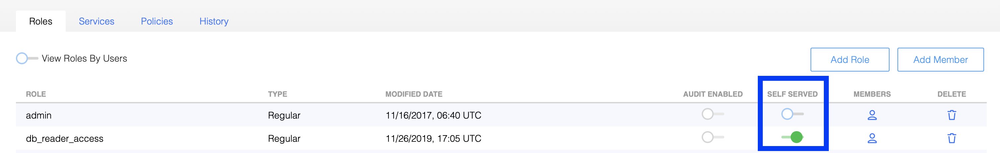
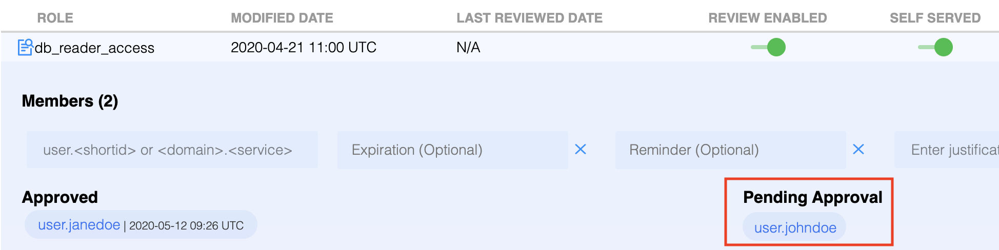
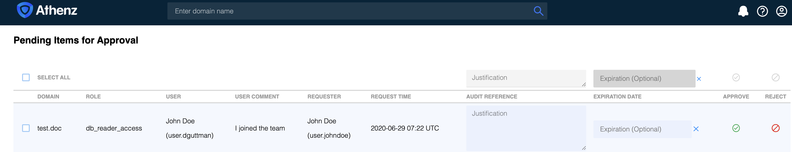

Athenz now supports configuring roles in domains as self-served thus allowing users to request
domain administrators to approve their request to be added to a role.

Athenz can send email notifications for administrators. See [Email Notifications](email_notifications.md) section to enable notifications.

## Role Setup

To designate a role as self-served, the domain administrator may use either
[Athenz UI](setup_ui.md) or [zms-cli](zms_client.md) utility.

To use Athenz UI, the domain administrator will login to their domain role view and
choose the `Self Served` slider for the appropriate role. For example, in the following
case, the `db_reader_access` role is configured as self-served.



The equivalent setup using `zms-cli` would be:

```
zms-cli -d <domain-name> set-role-self-serve <role-name> true
```

## User Access Request

The users can only add themselves (not other users or services) to any self-served roles.
Their access is not active until one of the domain administrators approves the request.
For example, in this use case, `user.johndoe` would like to be added to the `db_reader_access`
role which is configured as self-served. When the user adds his principal id to the role, it
will be added in the `Pending Approval` column.



## Domain Administrator Approval

Once the pending request is processed, all domain administrators will receive an email
notification (if [notifications are enabled](email_notifications.md)) stating that `user.johndoe` would like to be added to the `db_reader_access`
role and they need to either approve or reject the request. The email will include a link
to the Athenz UI workflow page which can also be accessed by clicking on the notifications
icon in the Athenz UI toolbar:


Once in the approval view page, the domain administrator may either approve or reject the request.
The domain administrator will need to provide a justification in the `Audit Reference` field
and optionally specify an expiration date (even if the user didn't request one).



Once approved, the principal will become an active/approved member of the role. If rejected,
the principal's name will be removed from the `Pending Approval` column.
