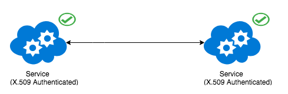

# Athenz Service Identity X.509 Certificates
--------------------------------------------

* [Copper Argos](#-copper-argos)
* [Using Service Registered Public/Private Key Pairs](#-using-service-registered-publicprivate-key-pairs)
* [Using Instance Register Authentication Tokens](#-using-instance-register-authentication-tokens)

Athenz Service Identity x.509 certificates are used to establish standard 
mutual TLS communication with other Athenz Enabled Services.



The services running on the instance can obtain X.509 certificates from ZTS
using one of the approaches listed below.

## Copper Argos
---------------
 
This is the preferred method of obtaining certificates for services. There is a provider
registered in Athenz (e.g. K8S) that is responsible for deploying these instances and validating
the identity certificate requests from these instances when contacted by ZTS.
Refer to our [Copper Argos](copper_argos.md) guide for full details.

# Using Service Registered Public/Private Key Pairs
---------------------------------------------------

In this method, we're creating a public/private key pair where the caller
holds on to the private key and registers the public key in Athenz. To
authenticate the service, the caller generates a token signed by its
private key and sends that to the ZTS server along with its X.509
certificate request (CSR). The ZTS Server validates the service token
using the registered public key and issues the X.509 certificate for the service.
When using this approach we strongly recommend using a different private key
per instance (you generate the private key on the host itself and make sure
it's secure and never leaves the host) so that each instance has a unique
private key/certificate pair.

* Create a public/private key pair for your service and register
  the public key in Athenz. Refer [Service Registration](reg_service_guide.md) for complete 
  details on registering services in Athenz. Store your private key securely. 
  You can store that in a file on the host and make sure only service is
  authorized to access that file.
  
* Download latest `zts-svccert` utility binary release from
  [Maven Central](https://search.maven.org/artifact/com.yahoo.athenz/athenz-utils):
  click on the `Browse` button, choose the latest version directory and then
  download the `athenz-utils-<latest-version>-bin.tar.gz`.

   ```shell
   $ tar xvfz athenz-utils-X.Y-bin.tar.gz
   ```

* Use the private key to obtain X.509 certificate from ZTS using `zts-svccert`
  utility. You need to make sure to pass the correct `key-version` argument
  that matches to the key identifier that was used to register the public key
  for the service in Athenz.

  ```
  zts-svccert -domain <domain> -service <service> -private-key <private key file> -key-version <version> -zts <zts_url> -dns-domain <dns-name>  -cert-file <output certificate file>
  ```
  
  The certificates and keys should be periodically refreshed.

## Using Instance Register Authentication Tokens
------------------------------------------------

The primary disadvantage of using the public/private key pair for fetching
service x.509 certificate details is the number of unique public keys that
need to be registered per service since we strongly recommend of having a
unique private key per instance.

An alternative approach to registering public/private key pairs is first to
request ZTS to issue an instance registration token and then use that token
when requesting a service identity x.509 certificate. In this process, you're
still required to request a unique token per instance, but it no longer requires
Athenz to register the corresponding public key.

During this process, ZTS verifies that the caller has update capabilities
over the service, and the service has been configured to be "launched" by
ZTS Server. Once the user has been authorized, ZTS generates a signed json
web token (JWT) for that instance and returns the token back to the client.
The client then uses that token as its credentials when requesting and
refreshing service identity certificates from ZTS.

* Download latest `zts-svccert` utility binary release from
  [Maven Central](https://search.maven.org/artifact/com.yahoo.athenz/athenz-utils):
  click on the `Browse` button, choose the latest version directory and then
  download the `athenz-utils-<latest-version>-bin.tar.gz`.

   ```shell
   $ tar xvfz athenz-utils-X.Y-bin.tar.gz
   ```

* Use `zts-svccert` with the caller's identity credentials that is authorized
  to manage the required service to request x.509 certificates from the
  Athenz pre-registered `sys.auth.zts` provider.

  ```
  zts-svccert -use-instance-register-token -zts <zts_url> <principal-credentials> -private-key <private-key-path> -provider <provider-name> -domain <domain> -service <service> -instance <instance-id> -dns-domain <dns-name>  -cert-file <output certificate file>
  ```

  The certificates and keys should be periodically refreshed.
