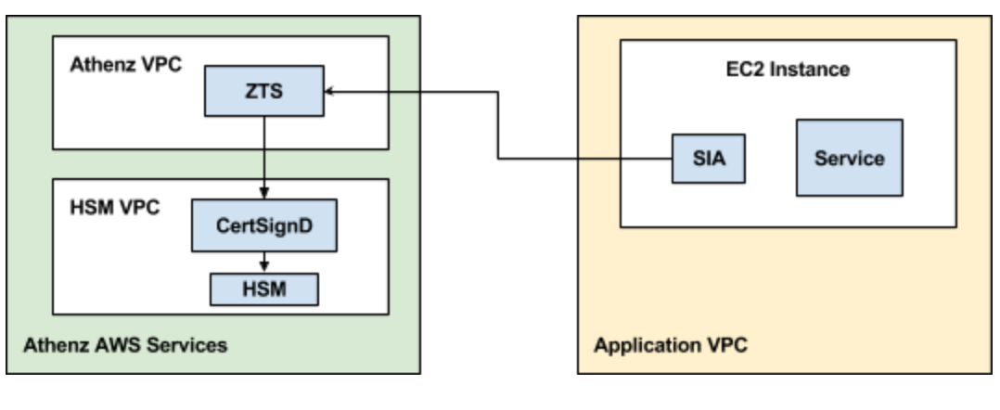
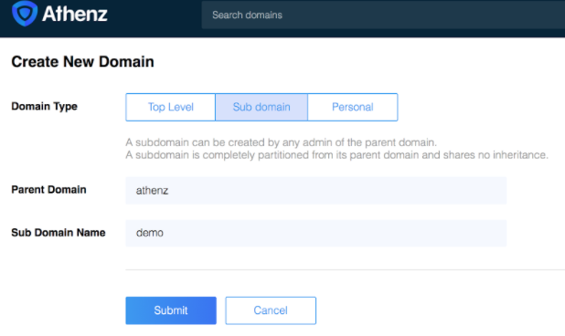
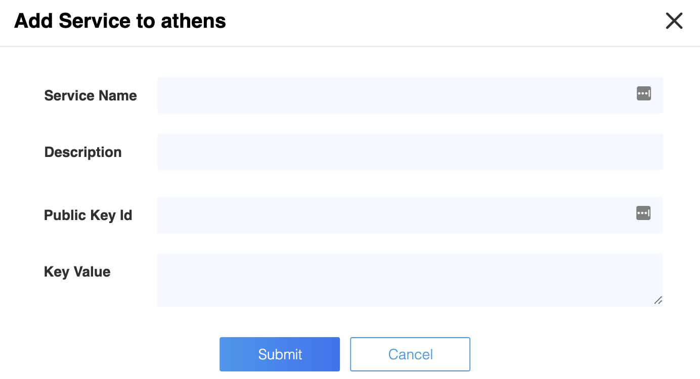
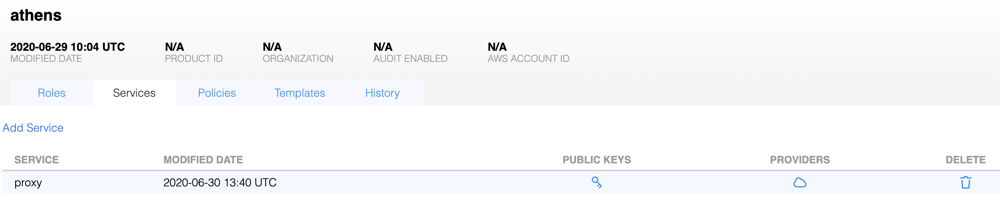
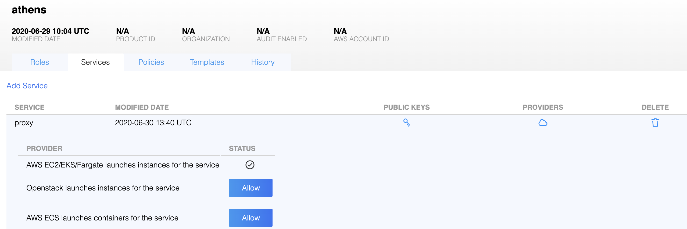
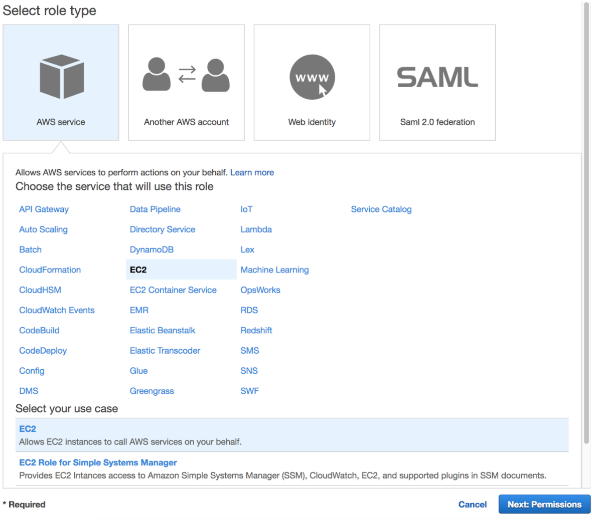
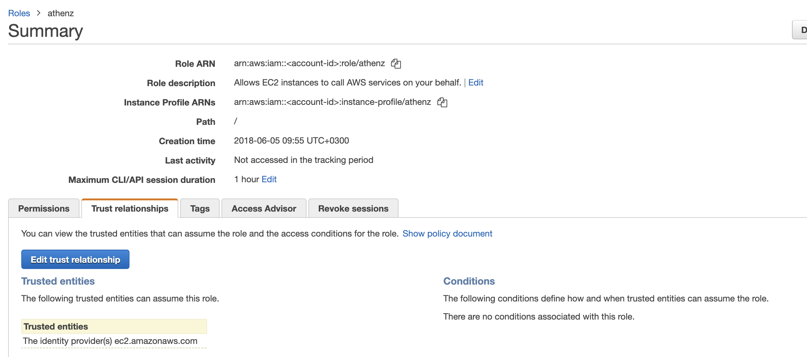
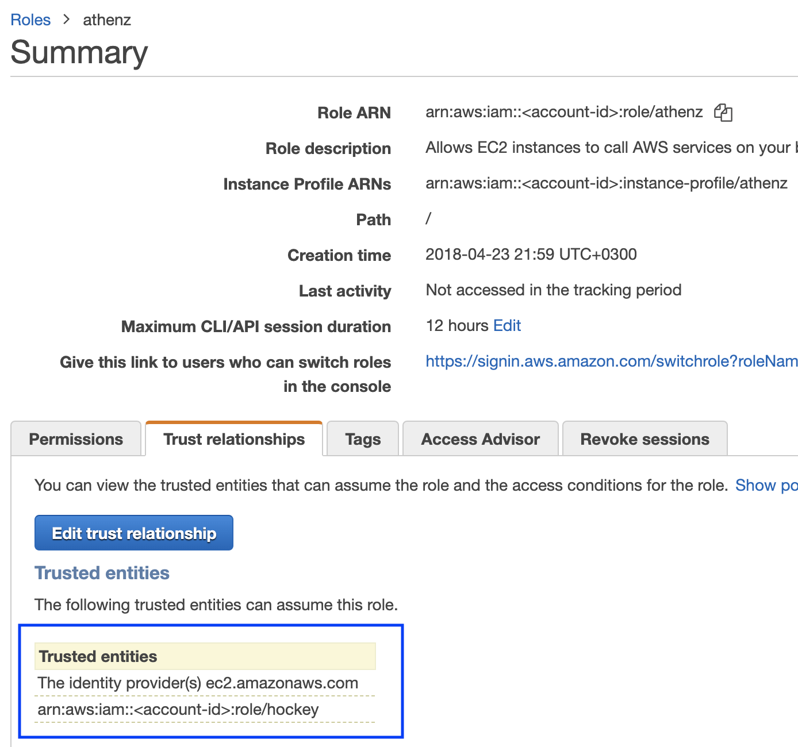

**Bootstrapping AWS EC2 instances with Athenz Service x.509 Identities
requires the instances to have network connectivity to both Athenz ZTS
and AWS STS Services.**

## Domain Registration

Identify your Athenz domain before you can proceed by using Athenz UI.

You may create a top-level domain or a sub domain using Athenz UI or zms-cli.
Only Athenz System Administrators can create top level domains (members of the sys.auth domain's admin role).
To create a top-level domain using zms-cli run the following:

```
zms-cli add-domakn <domain-name> <unique-product-id> <domain-admins separated by space>
```

If you already have top-level domain and need to create a sub domain using Athenz UI:
click the "Create” link next to "My Domains" label in the top right corner
and then click on “Sub Domain” tab and follow the on screen instruction.



Or using zms-cli:
```
zms-cli add-doman <top-doman.sub-domain-name> <domain-admins separated by space>
```

## AWS Account ID Registration

To register an AWS Account with a domain, run the following command:
```
zms-cli -d <domain-name> set-aws-account <aws-account-id>
```

## Athenz Service Identity Registration

Create a service identity for your AWS EC2 instances in your Athenz domain. This full service identity name `<domain>.<service>` will be the IAM role name that you will need to create in AWS IAM and set up a trust relationship with your EC2 Instance Role.

In the Athenz UI, select your domain, select the `Services` tab and then choose `Add a Service` link in the top left corner. You must provide a service name and an optional description for your service. 



## Athenz Service Identity Authorization

Before ZTS can validate and issue X.509 TLS Certificates to the
AWS EC2 instance, it must validate that the service owner has
authorized its service to be launched by AWS EC2 Provider. In the
Athenz UI select your service that was created in the previous
step and click on the icon in the `Providers` column:



Then, click on the `Allow` button to authorize your service to
be launched by AWS EC2 provider.




## IAM Role Setup

There are two IAM roles required for instances to obtain Athenz X.509 certificates:

- EC2 Instance Profile Role
- Athenz Service Identity Assume Role

It is assumed that at this point you have already configured the first
EC2 Instance Profile IAM Role that your EC2 instance will be launched
with. 

The second Athenz Service Identity IAM Assume Role must be created and
must have the `<domain>.<service>` name. This role will not have any
permissions but instead will have a trust relationship with your EC2
instance role such that your EC2 instance role can assume this role.

In the AWS Console, select `IAM` from the Services drop down and then
click on the `Roles` link in the left sidebar. Choose the `Create Role`
button. Under the `AWS Service` type, select `EC2`, then `EC2` again
for the use case and finally choose `Next: Permissions` button in the
bottom right corner.



In the `Attach permissions policy` screen do not choose any permissions
and just click on the `Next: Review` button in the bottom right corner
to continue. Specify the `Role name` in the `<domain>.<service>` format
and choose `Create Role` to complete the process.

In the Roles list view, choose the role just created and choose the
`Trust Relationships` tab.



Click on `Edit trust relationship` button and append a block containing
the following policy to the `Statement` block (Replace the `<account-id>`
and `<ec2-instance-role>` values with their corresponding values for
your environment:

```
 {
   "Effect": "Allow",
   "Principal": {
     "AWS": "arn:aws:iam::<account-id>:role/<ec2-instance-role>"
   },
   "Action": "sts:AssumeRole"
 }
```

Once correctly updated, your EC2 instance role must appear in the `Trusted entities` table:



### Setup for Services with Region Specific Instance Profile Roles

The IAM Role setup is identical when you have the same service
being deployed in multiple regions with role names that
are specific to each region. Since IAM roles are global, you only need
to create a single Athenz IAM Role in the `<domain>.<service>` format.
Then, when you're setting up your trust relationship, you'll authorize
all your region specific profile roles to have the capability to
assume the Athenz `<domain>.<service>` role.

## Installing SIA

The AWS SIA source is part of the Athenz project and can be found in:
```
provider/aws/sia-ec2
``` 
Follow the readme for instructions on how to install it.

## SIA Configuration Setup

When building your image, you can include the following configuration
file called `sia_config` in the `/etc/sia` directory. It must include
the following required fields:

```
{
  "version": "1.0.0",
  "service": "<service name>",
  "accounts": [
    {
      "domain": "<domain name>",
      "account": "<aws account id associated with domain name>"
    }
  ]
}
```

The domain/account/service values here must match to the IAM Role
created earlier. For example, if the service identity name is `api`
in domain `sports` whose corresponding aws account id is `123456789`,
then the `sia_config` file will be as follows:

```
{
  "version": "1.0.0",
  "service": "api",
  "accounts": [
    {
      "domain": "sports",
      "account": "123456789"
    }
  ]
}
```

### Private Key File Ownership

By default SIA agent runs as root and the private key is only readable
by root. If your service is running as another user, you can configure
SIA agent to automatically change the ownership of the private key file
to the configured user.
For example, if you want the private key to be owned by `ec2-user`, then
your `sia_config` configuration file would be as follows:

```
{
  "version": "1.0.0",
  "service": "api",
  "accounts": [
    {
      "domain": "sports",
      "account": "123456789",
      "user": "ec2-user"
    }
  ]
}
```


## Private Key and Certificate Setup

By default, the private key for the service identity is available in
the `/var/lib/sia/keys` directory and has the name `<domain>.<service>.key.pem`.
The private key is in PKCS#1 format. The corresponding X.509 certificate
is in the `/var/lib/sia/certs` directory and has the name
`<domain>.<service>.cert.pem`. The certificate is valid for 30 days and will
be refreshed automatically by SIA every day. It is the responsibility of the
application owner to update their container/application to refresh and use
the latest certificate before it expires. In the same `/var/lib/sia/certs`
directory SIA will also generate the Athenz CA certificate file called `ca.cert.pem`.

### Role Certificate Support

In addition to requesting Athenz service identity certificate, SIA provides
the capability to request Athenz Role Certificates as well. If you want to change the default behavior or request
SIA to automatically retrieve role certificates for your service, as part
of building your ami image, you can include the following additional fields
in the configuration file:

```
{
  "version": "1.0.0",
  "service": "<service name>",
  "accounts": [
    {
      "domain": "<domain name>",
      "account": "<aws account id associated with domain name>",
      "roles": {
        "<role-domain1>:role.<role-name1>": {
        },
        "<role-domain2>:role.<role-name2>": {
        }
      }
    }
  ]
}
```

The role certificates will also be stored in the `/var/lib/sia/certs` directory
and have the name of `<role-domain1>:role.<role-name1>.cert.pem`. They are also
valid for 30 days and SIA will automatically refresh them once a day.

## Setup Without SIA Configuration File

If a property deploying their service in AWS meets the following 2 requirements:

- does not need any role certificates to be retrieved by SIA automatically
- has the option to name their EC2 instance role

then they have the option for a simpler setup without including a sia configuration
file in their image.

In this model, the property would name their EC2 instance role as
`<domain>.<service>-service`. The property must still follow the full steps as
described in the [IAM Role Setup](#iam-role-setup) section to setup the
`<domain>.<service>` role, but the requirement to have a sia_config file is
no longer present. When SIA is running and is not able to find the sia_config
file, it will check if the instance profile arn has the `<domain>.<service>-service`
format. If it does, then it would drop `-service` part to parse the rest of the
string to extract the Athenz domain and service values and determine the assume
role name that it needs to fetch temporary credentials for before contacting ZTS Server.

## Non Standard Instance Profile Name

If a property deploying their service in AWS does not have the
capability to name their instance profile role name as
`<domain>.<service>-service` due to legacy requirements, the following
steps can be followed to configure SIA to use the non-standard
instance profile name.

- The property must still follow the full steps as
described in the [IAM Role Setup](#iam-role-setup) section to setup the
`<domain>.<service>` role and the trust relationship.
- The property must install a SIA config file `/etc/sia/sia_config`
specifying the service name that will be deployed on this instance

### Independent Instance Profile and Role Names

It is possible to setup only a single role within AWS IAM in the format
`<domain>.<service>` and name the IAM profile name as `<domain>.<service>-service`
without creating a separate role. However, there is currently no support in the
AWS UI console for naming your IAM role and IAM instance profile independently.
You can do this with Cloud Formation, Ansible, TF, the AWS API, or the CLI.
Here is an example using the CLI - replace `<domain>`, `<service>` and
`<account-id>` parameters with their respective values for your environment:

```
aws iam create-role --role-name <domain>.<service> --assume-role-policy-document='{"Version":"2012-10-17","Statement":[{"Effect":"Allow","Principal":{"Service":"ec2.amazonaws.com"},"Action":"sts:AssumeRole"}]}'

aws iam create-instance-profile --instance-profile-name <domain>.<service>-service

aws iam update-assume-role-policy --role-name <domain>.<service> --policy-document '{"Version":"2012-10-17","Statement":[{"Effect":"Allow","Principal":{"Service":"ec2.amazonaws.com"},"Action":"sts:AssumeRole"},{"Effect":"Allow","Principal":{"AWS":"arn:aws:iam::<account-id>:role/<domain>.<service>"},"Action":"sts:AssumeRole"}]}'

aws iam add-role-to-instance-profile --instance-profile-name <domain>.<service>-service --role-name <domain>.<service>
```

However, this model is not recommended from security perspective if your
`<domain>.<service>` role has access to other AWS services. Temporary credentials
for that role are sent to Athenz ZTS service as your authentication credentials
and, as such, you do not want to expose those additional access capabilities
to the ZTS Server.

## Troubleshooting

SIA process outputs all of its messages to syslog, so if there are any issues
with your configuration, it will be reported in syslog. You can execute:
`sudo grep siad /var/log/messages` and see what operation sia was not able
to complete successfully. The agent is configured to run every 20 seconds in
case of a failure, so you'll most likely see the same block being repeated
multiple times. ZTS server allows instances to obtain x.509 certificates only
during the first 30 minutes after the initial bootstrap time so even if you
address the configuration issues, once the 30 mins have passed, the instance
will no longer be able to obtain its x.509 service identity certificate. The
only option at that time is to terminate and launch a new instance.
