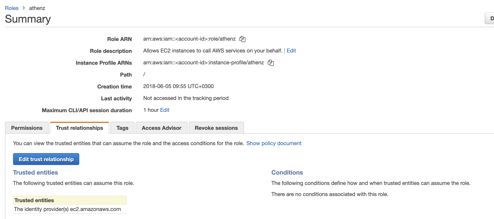
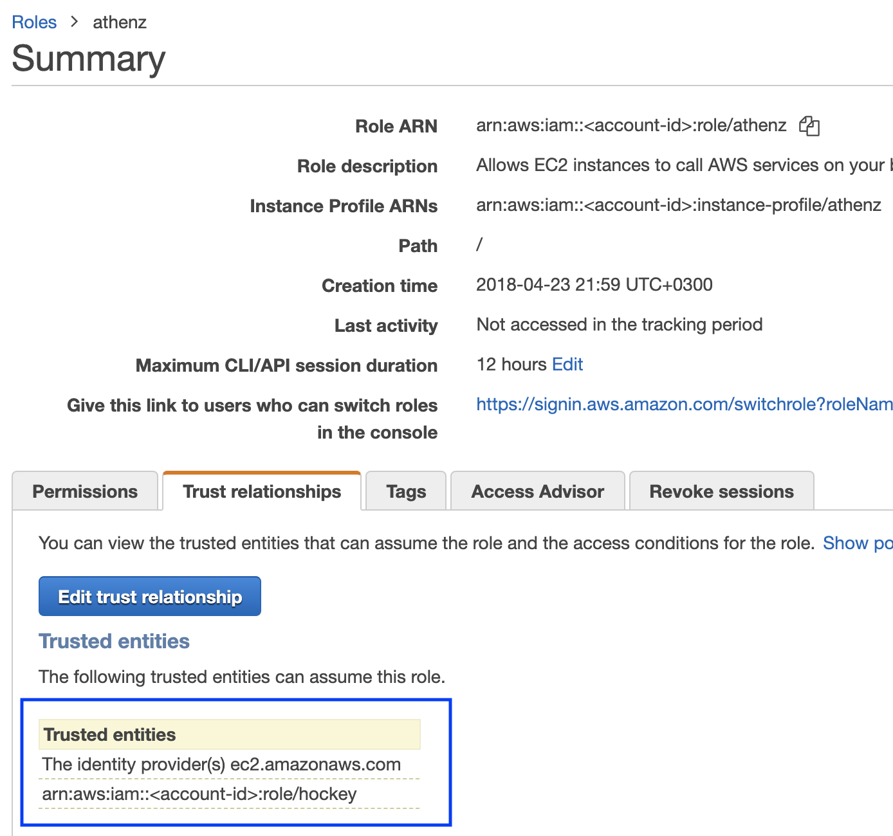

## Domain Registration

Identify your Athenz domain before you can proceed by visiting Athenz UI.

Follow the [instructions documented for EC2 instances](service_x509_credentials_aws.md#domain-registration) to register your domain if one doesn't exist already.

## AWS Account ID Registration

To register an AWS Account with a domain, run the following command:
```
zms-cli -d <domain-name> set-aws-account <aws-account-id>
```

## Athenz Service Identity Registration

Create a service identity for your AWS ECS containers in your Athenz domain. This full service identity name `<domain>.<service>` will be the IAM role name that you will need to create in AWS IAM and set up a trust relationship with your ECS Container Role.

In the Athenz UI, select your domain, select the `Services` tab and then choose `Add a Service`  link in the top left corner. You must provide a service name and an optional description for your service.


## Athenz Service Identity Authorization Role and Policy

Before ZTS can validate and issue X.509 TLS Certificates to the AWS ECS, it must validate that the service owner has authorized its service to be launched by AWS ECS Provider. In the Athenz UI select your service that was created in the previous step and click on the icon in the `Providers` column:


Then, click on the `Allow` button to authorize your service to be launched by AWS ECS provider.


## ECS Container Metadata Support

In AWS the ECS must be configured with metadata support. This is required such that SIA agent can
retrieve the Task ID that is used to identify the container uniquely. You need to set the
`ECS_ENABLE_CONTAINER_METADATA` container agent variable to `true`. You can set this variable
in the `/etc/ecs/ecs.config` configuration file and restart the ecs agent. You can also set
it as a Docker environment variable at run time when the agent container is started.
For more information, see
[Amazon ECS Container Metadata](https://docs.aws.amazon.com/AmazonECS/latest/developerguide/container-metadata.html).

## IAM Role Setup

There are two IAM roles required for instances to obtain Athenz X.509 certificates:

- ECS Container Profile Role
- Athenz Service Identity Assume Role

It is assumed that at this point you have already configured the first ECS Container Profile IAM Role that your container will be launched with. The second Athenz Service Identity IAM Assume Role must be created and must have the `<domain>.<service>` name. This role will not have any permissions but instead will have a trust relationship with your ECS container role such that your ECS container role can assume this role.

In the AWS Console, select `IAM` from the Services drop down and then click on the `Roles` link in the left sidebar. Choose the `Create Role` button. Under the `AWS Service` type, select `EC2`, then `EC2` again for the use case and finally choose `Next: Permissions` button in the bottom right corner.


In the `Attach permissions policy` screen do not choose any permissions and just click on the `Next: Review` button in the bottom right corner to continue. Specify the `Role name` in the `<domain>.<service>` format and choose `Create Role` to complete the process.

In the Roles list view, choose the role just created and choose the `Trust Relationships` tab.



Click on `Edit trust relationship` button and append a block containing the following policy to the `Statement` block (Replace the `<account-id>` and `<ecs-container-role>` values with their corresponding values for your environment:

```
 {
   "Effect": "Allow",
   "Principal": {
     "AWS": "arn:aws:iam::<account-id>:role/<ecs-container-role>"
   },
   "Action": "sts:AssumeRole"
 }
```

Once correctly updated, your ECS container role must appear in the `Trusted entities` table:



## Installing SIA in Container

The AWS SIA source is part of the Athenz project and can be found in:
```
provider/aws/sia-ec2
``` 
Follow the readme for instructions on how to install it.

Typically you run the `siad` binary in your container and let it run continuously to register and refresh your service certificate daily
since `systemd` does not run in a typical docker image. If you only want to run `siad` as a command line
utility that just registers and refreshes the service and role certificates when executed, you can use the following
command line options (Register must be called once within the first 30 mins when the instance is bootstrapped):

- Instance Register: `/usr/sbin/siad -cmd post`
- Service Certificate Refresh: `/usr/sbin/siad -cmd rotate`
- Role Certificate Refresh: `/usr/sbin/siad -cmd rolecert`

## SIA Configuration Setup

When building your container image, you must include the following configuration file
called `sia_config` in the `/etc/sia` directory. It must include the following required fields:

```
{
  "version": "1.0.0",
  "service": "<service name>",
  "accounts": [
    {
      "domain": "<domain name>",
      "account": "<aws account id associated with domain name>"
    }
  ]
}
```

The domain/account/service values here must match to the IAM Role created earlier. For example, if the service identity name is `api` in domain `sports` whose corresponding aws account id is `123456789`, then the `sia_config` file will be as follows:

```
{
  "version": "1.0.0",
  "service": "api",
  "accounts": [
    {
      "domain": "sports",
      "account": "123456789"
    }
  ]
}
```

### Private Key File Ownership

By default SIA agent runs as root and the private key is only readable by root. If your service is running as another user, you can configure SIA agent to automatically change the ownership of the private key file to the configured user.
For example, if you want the private key to be owned by `ec2-user`, then your `sia_config` configuration file would be as follows:

```
{
  "version": "1.0.0",
  "service": "api",
  "accounts": [
    {
      "domain": "sports",
      "account": "123456789",
      "user": "ec2-user"
    }
  ]
}
```

## Private Key and Certificate Setup

By default, the private key for the service identity is available in the `/var/lib/sia/keys` directory and has the name `<domain>.<service>.key.pem`. The private key is in PKCS#1 format. The corresponding X.509 certificate is in the `/var/lib/sia/certs` directory and has the name `<domain>.<service>.cert.pem`. The certificate is valid for 30 days and will be refreshed automatically by SIA every day. It is the responsibility of the application owner to update their container/application to refresh and use the latest certificate before it expires. In the same `/var/lib/sia/certs` directory SIA will also generate the Athenz CA certificate file called `ca.cert.pem`.

In addition to requesting Athenz service identity certificate, SIA provides the capability to request Athenz Role Certificates as well. If you want to change the default behavior or request SIA to automatically retrieve role certificates for your service, as part of building your ami image, you can include the following additional fields in the configuration file:

```
{
  "version": "1.0.0",
  "service": "<service name>",
  "accounts": [
    {
      "domain": "<domain name>",
      "account": "<aws account id associated with domain name>",
      "roles": {
        "<role-domain1>:role.<role-name1>": {
        },
        "<role-domain2>:role.<role-name2>": {
        }
      }
    }
  ]
}
```

The role certificates will also be stored in the `/var/lib/sia/certs` directory and have
the name of `<role-domain1>:role.<role-name1>.cert.pem`. They are also valid for 30 days
and SIA will automatically refresh them once a day.
