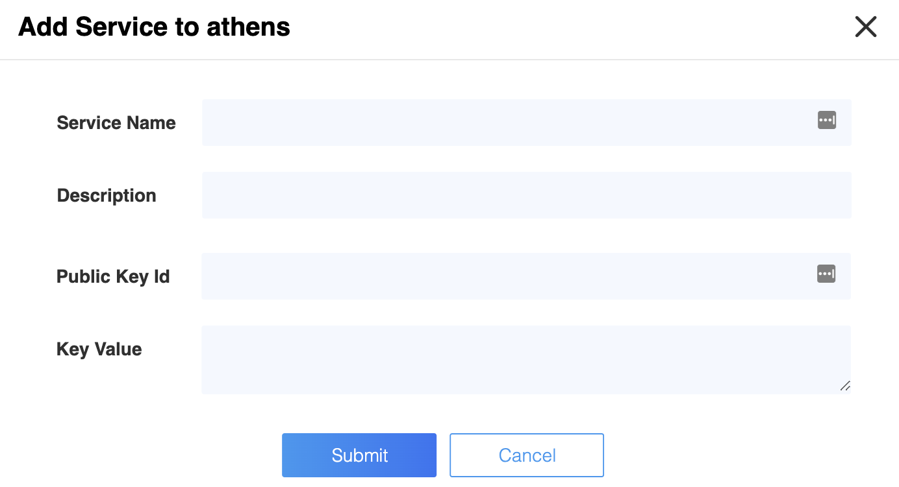

> **Important:** Certificate Signing is an expensive operation (both on the client and
>  the server side) so if your application is going to launch large number of instances
>  of your lambda function, then you must not fetch Athenz x.509 certificates directly
>  within your lambda function. The recommended approach for that scenario is have one
>  lambda function to fetch the Athenz X.509 Certificate Identity private key and the
>  public certificate, store them in AWS Parameter Store and update those daily. Then
>  have all other lambda functions authorized based on their IAM credentials to fetch
>  and use that x.509 certificate.

## Domain Registration

Identify your Athenz domain before you can proceed by visiting Athenz UI.

Follow the [instructions documented for EC2 instances](service_x509_credentials_aws.md#domain-registration) to register your domain if one doesn't exist already.

## AWS Account ID Registration

To register an AWS Account with a domain, run the following command:
```
zms-cli -d <domain-name> set-aws-account <aws-account-id>
```

## Athenz Service Identity Registration

Create a service identity for your AWS Lambda function in your Athenz domain. This full service identity name `<domain>.<service>` will be the IAM role name that you will need to create in AWS IAM and set up a trust relationship with your Lambda Function Execution Role.

In the Athenz UI, select your domain, select the `Services` tab and then choose `Add a Service`  link in the top left corner. You must provide a service name and an optional description for your service.



## Athenz Service Identity Authorization Role and Policy

Before ZTS can validate and issue X.509 TLS Certificates to the AWS Lambda, it must validate that the service owner has authorized its service to be launched by AWS Lambda Provider. The following role and policy must be created in your Athenz domain for this authorization:

When viewing your domain details, choose the `Roles` tab and select
`Add Role` link on the left side of the screen underneath the tab names.
Role details are as follows (don't forget to press the `Add` button after
specifying the role member before pressing the `Submit` button):

```
Role Category: Regular
Role Name: aws_lambda_launch_provider
Add Member(s): athens.aws-lambda.*
```

Then choose the `Policies` tab and select `Add Policy` link on the left side
of the screen underneath the tab names. Policy details are as follows
(make sure to replace `<your-service-name>` in the Rule Resource
with your actual service name):

```
Policy Name: aws_lambda_launch_provider
Rule Effect: Allow
Rule Action: launch
Rule Role: aws_lambda_launch_provider
Rule Resource: service.<your-service-name>
```

## IAM Role Setup

There are two IAM roles required for instances to obtain Athenz X.509 certificates:

- Lambda Function Execution Role
- Athenz Service Identity Assume Role

It is assumed that at this point you have already configured the first Lambda Function Execution Role that your code will be launched with (roles created through the AWS console are created with /service-role/ path). The second Athenz Service Identity IAM Assume Role must be created and must have the `<domain>.<service>` name. This role will not have any permissions but instead will have a trust relationship with your Lambda execution role such that your Lambda execution role can assume this role.

In the AWS Console, select `IAM` from the Services drop down and then click on the `Roles` link in the left sidebar. Choose the `Create Role` button. Under the `AWS Service` type, select `Lambda` and choose `Next: Permissions` button in the bottom right corner.


In the `Attach permissions policy` screen do not choose any permissions and just click on the `Next: Review` button in the bottom right corner to continue. Specify the `Role name` in the `<domain>.<service>` format and choose `Create Role` to complete the process.

In the Roles list view, choose the role just created and choose the `Trust Relationships` tab.


Click on `Edit trust relationship` button and append a block containing the following policy to the `Statement` block Replace the `<account-id>` and `<lambda-execution-role>` values with their corresponding values for your environment. For the `<lambda-execution-role>` make sure to include the full path since roles created through the AWS console are created with `/service-role/` path:

```
 {
   "Effect": "Allow",
   "Principal": {
     "AWS": "arn:aws:iam::<account-id>:role/<lambda-execution-role>"
   },
   "Action": "sts:AssumeRole"
 }
```

Once correctly updated, your Lambda role must appear in the `Trusted entities` table:


## Private Key and Certificate Setup

Since we're dealing with functions in this use case, we cannot have a SIA agent daemon running to generate a private key for the service and then retrieve a corresponding x.509 certificate from the ZTS Server. Instead, the function being invoked will be responsible for generating a private key and then a csr for its request. Finally, it will submit that request to the ZTS Server to retrieve its X.509 certificate which then it can use  along with its generated private key to establish TLS connections to other Verizon Media Athenz enabled services. Athenz Team provides functions/methods in Go and Java programming languages to quickly generate a private key and request its corresponding X.509 certificate from ZTS Server.

Important consideration when dealing with Lambda functions:

* The code to do this needs to prefetch and cache the certificate in a way that does not block every invocation, as minting a new certificate is somewhat expensive.
* The short lifetime and stateless nature of the function means it cannot rotate its certificates. It just gets new ones when needed.

### Java

The following function is available in the Athenz ZTS Java Client:

```
/**
 * For AWS Lambda functions generate a new private key, request a
 * x.509 certificate based on the requested CSR and return both to
 * the client in order to establish tls connections with other
 * Athenz enabled services.
 * @param domainName name of the athenz domain
 * @param serviceName name of the athenz service
 * @param account AWS account name that the function runs in
 * @param provider name of the provider service for AWS Lambda
 * @return AWSLambdaIdentity with private key and certificate
 */
public AWSLambdaIdentity getAWSLambdaServiceCertificate(String domainName,
        String serviceName, String account, String provider);
```

For example, here is a quick program that can be compiled and packaged into lambda.jar and deployed as a Lambda function in AWS. It retrieves a private key and the corresponding x.509 certificate and returns as output.

First you need to update your Java project `pom.xml` file to indicate
the dependency on the Athenz zts java client libraries. Checkout the
[Maven Central ZTS Java Client Package](https://search.maven.org/artifact/com.yahoo.athenz/athenz-zts-java-client/)
pages to make sure you're using the latest release version:

```xml
  <dependencies>
    <dependency>
      <groupId>com.yahoo.athenz</groupId>
      <artifactId>athenz-zts-java-client</artifactId>
      <version>1.10.4</version>
    </dependency>
  </dependencies>
```

Next, is the Lambda function handler implementation:

```
package com.amazonaws.lambda.demo;

import com.amazonaws.services.lambda.runtime.Context;
import com.amazonaws.services.lambda.runtime.RequestHandler;
import com.yahoo.athenz.zts.AWSLambdaIdentity;
import com.yahoo.athenz.zts.ZTSClient;

public class LambdaFunctionHandler implements RequestHandler<Object, String> {

    @Override
    public String handleRequest(Object input, Context context) {

        final String athenzDomain = "athens"; // replace this with your domain name
        final String athenzService = "lambda"; // replace this with your service name
        final String awsAccount = "123456789"; // replace this with your account number
        final String athenzProvider = "<lambada-name>.<lambada region>"; // replace with labada name and region. for example: "athens.aws-labmda.us-west-2"
        final String ztsUrl = "https://zts-address/zts/v1"; // replace this with your zts Url (ending with /zts/v1)
        final String certDn = "ou=Athenz,o=Oath"; // the dn you want included in cert
        final String certDomain = "aws.cert.domain"; // cert domain

        // our key and cert to display for test purposes

        String certificate;
        String privateKey;

        // generate a private key and retrieve the corresponding
        // certificate from Athenz ZTS Service

        try (ZTSClient client = new ZTSClient(ztsUrl)) {
            ZTSClient.setX509CsrDetails(certDn, certDomain);
            AWSLambdaIdentity lambdaIdentity = client.getAWSLambdaServiceCertificate(athenzDomain,
                    athenzService, awsAccount, athenzProvider);

            certificate = lambdaIdentity.getX509Certificate().toString();
            privateKey = lambdaIdentity.getPrivateKey().toString();
        }

        // just return our data so we can see it in our aws console

        return "Lambda - Private Key: " + privateKey + " Certificate: " + certificate;
    }
}
```

### Go

The following function is available in the `/sia-ec2/util` package:

```
func GetAWSLambdaServiceCertificate(ztsUrl, domain, service, account, region string) (tls.Certificate, error)
```

Change the `ztsUrl` field with your zts (ending with `/zts/v1`). The `domain` is your Athenz domain name while `service` is the service name that your Lambda function will run as. The `account` field is the AWS account id while `region` is where this function will be running.

For example, here is a quick program that can be compiled and packaged into main.zip and deployed as a Lambda function in AWS. It retrieves a private key and the corresponding x.509 certificate and returns as output.

```
package main

import (
    "crypto/rsa"
    "encoding/pem"
    "fmt"

    "github.com/aws/aws-lambda-go/lambda"
    "util"
)

type Request struct {
    Zts     string `json:"zts"`
    Region  string `json:"region"`
    Domain  string `json:"domain"`
    Account string `json:"account"`
    Service string `json:"service"`
}

type Response struct {
    PrivateKey      string `json:"privatekey"`
    X509Certificate string `json:"certificate"`
    Message         string `json:"message"`
}

func Handler(req Request) (Response, error) {
    x509Cert, err := util.GetAWSLambdaServiceCertificate(req.Zts, req.Domain, req.Service, req.Account, req.Region)
    var resp Response
    if err != nil {
        resp.Message = fmt.Sprintf("Unable to get certificate: %v", err)
    } else {
        resp.PrivateKey = util.PrivatePem(x509Cert.PrivateKey.(*rsa.PrivateKey))
        resp.X509Certificate = string(pem.EncodeToMemory(&pem.Block{Type: "CERTIFICATE", Bytes: x509Cert.Certificate[0]}))
        resp.Message = "Success"
    }
    return resp, err
}

func main() {
    lambda.Start(Handler)
}
```

Here is a sample input for this function. Our domain is called athens and the service is called lambda-function-test.

```
{
  "zts": "https://zts.com:4443/zts/v1",
  "region": "us-west-2",
  "domain": "athens",
  "service": "lambda-function-test",
  "account": "123456789"
}
```
