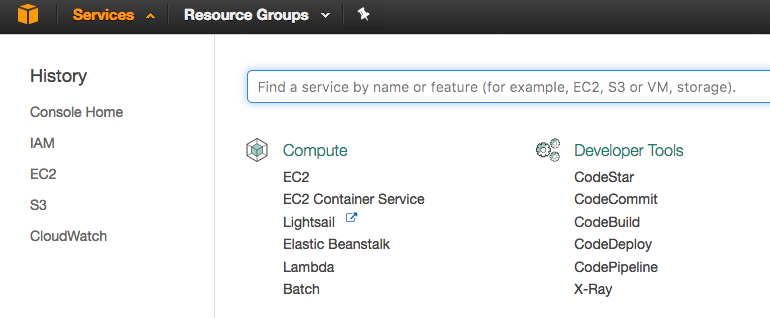
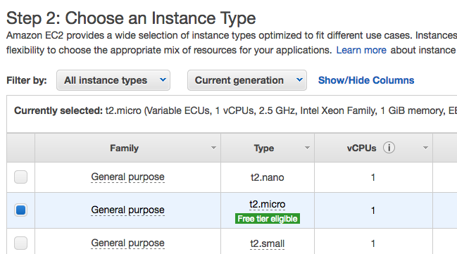
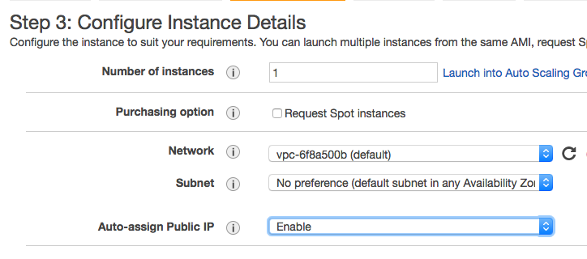
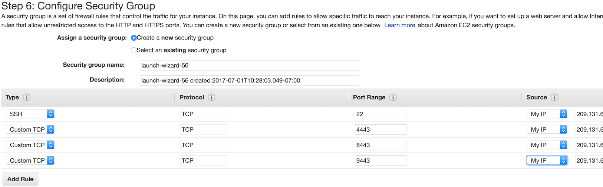

# Setup Amazon EC2 instance
---------------------------

* [Requirements](#requirements)
    * [AWS Account](#aws-account)
* [Launch EC2 instance](#launch-ec2-instance)
* [Start/Stop Athenz](#startstop-athenz)
* [Access Athenz UI](#access-athenz-ui)

## Requirements
---------------

### AWS account
---------------

AWS account is required to create an ec2 instance for athenz. If you don't
have an AWS account, you can check out [AWS Free Tier](https://aws.amazon.com/free/).


## Launch EC2 instance
----------------------

Once you are signed into AWS console, select `Services` and click on `EC2`:



Launch a new instance by clicking on `Launch Instance`:


On `Step 1: Choose an Amazon Machine Image (AMI)`, click on `Community AMIs`
and search for "Athenz" in the `Search community AMIs` field:


You might get back multiple matches. Pick the latest image with the most
recent timestamp after the `Athenz` name. Click on `Select` button next
to the image name to continue.

On `Step 2: Choose an Instance Type` pick an instance with multiple vCPUs
and at 8GiB. However, for evaluation purposes, you can also pick `t2.micro`
type to be eligible for Free tier.



Then, click on `Next:Configure Instance Details` button in the left bottom
corner to continue.

On `Step 3: Configure Instance Details` select `Enable` for the
`Auto-assign Public IP` option so that your instance reachable from
the Internet:



Click on `Next: Add Storage`, then on `Next: Add Tags` and finally on
`Next: Configure Security Group` to get to Step 6.

On `Step 6: Configure Security Group` select `Add Rule`, choose
`Custom TCP Rule` for Type field, 4443 for Port Range field and
select `My IP` for Source field. Repeat adding a rule for ports 8443
and 9443. Once completed, your setup should be:

By default, AWS has a TCP rule for SSH access from all IP
addresses with a warning "Rules with source of 0.0.0.0/0 allow all
IP addresses to access your instance. We recommend setting security
group rules to allow access from known IP addresses only.". It
is strongly recommended for the SSH Rule to pick `My IP` from
the Source drop down field or configure SSH access from your
company IP range only. Same requirement would also apply
for Athenz 4443, 8443, and 9443 port access as well.



Next, click on `Review and Launch` and then on `Launch`.
Finally, select an existing key pair or create a new key
pair for your instance, check the acknowledgement box and
click on `Launch Instances` to launch your Athenz EC2 instance.

## Start/Stop Athenz
--------------------

After your EC2 instance is launched, you need to ssh to your
instance and start Athenz services. During the first start-up,
the Athenz services will be automatically configured with default
settings and self-signed certificates. After you have connected
and logged onto your instance, execute the following commands:

```shell
$ cd /opt/athenz
$ sudo ./start.sh
```

The EC2 instance includes all three Athenz Services - ZMS, ZTS and UI.
They're running on the following ports:

| Service | Port |
|---------|------|
|   ZMS   | 4443 |
|   ZTS   | 8443 |
|   UI    | 9443 |

To stop Athenz, execute the following commands:

```shell
$ cd /opt/athenz
$ sudo ./stop.sh
```

## Access Athenz UI
-------------------

To access Athenz UI, open your browser with url

```
https://<ec2-instance-public-dns-name>:9443/athenz
```

Since the services are running with self-signed certificates, configure your browser to
ignore the warnings regarding the UI server certificate.

The administrator must first access the ZMS Server endpoint in the browser to
accept the exception since the Athenz UI contacts ZMS Server to get an authorized
token for the user when logging in. The administrator must access:

```
https://<ec2-instance-public-dns-name>:4443/zms/v1/schema
```

The instance is configured with the following default user details:

 |  User  | Password |
 |--------|----------|
 | athenz |  athenz  |

