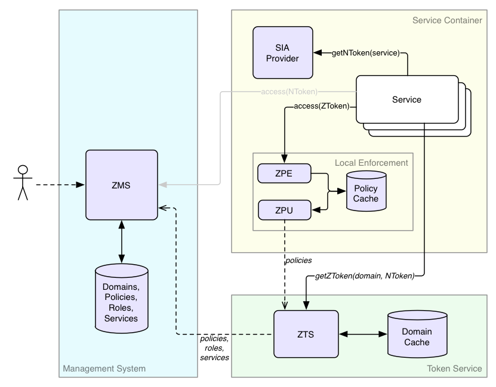

# Architecture - System View
----------------------------

* [System Diagram](#system-diagram)
    * [ZMS](#zms-authz-management-system)
    * [ZTS](#zts-authz-token-system)
    * [SIA](#sia-service-identity-agent-provider)
    * [ZPE](#zpe-authz-policy-engine)
    * [ZPU](#zpu-authz-policyengine-updater)

## System Diagram
-----------------

Before we go into the details of the authorization flow, it's important
to understand the subsystems involved. The authorization (AuthZ) system
shown in the figure below consists of several logical subsystems, which
we will elaborate on in the following section.

### ZMS (authZ Management System)
---------------------------------

ZMS is the source of truth for domains, roles, and policies for
centralized authorization. In addition to allowing CRUD operations
on the basic entities, ZMS provides an API to replicate the entities,
per domain, to ZTS. ZMS supports a centralized call to check if a
principal has access to a resource both for internal management
system checks, as well as a simple centralized deployment. Because
ZMS supports service identities, ZMS can authenticate services.

For centralized authorization, ZMS may be the only Athenz subsystem
that you need to interact with.

### ZTS (authZ Token System)
----------------------------

ZTS, the authentication token service, is only needed to support
decentralized or data plane functionality. In many ways, ZTS is like a
local replica of ZMS's data to check a principal's authentication and
confirm membership in roles within a domain. The authentication is in
the form of a signed ZToken that can be presented to any decentralized
service that wants to authorize access efficiently. Multiple ZTS
instances can be distributed to different locations as needed to scale
for issuing tokens.

### SIA (Service Identity Agent) Provider
-----------------------------------------

SIA (Service Identity Agent) Provider is part of the container,
although likely built with Athenz libraries. As services are
authenticated by their private keys, the job of the SIA Provider
is to generate a X509 certificate and sign it with the given private key so
that the service can present that certificate to ZMS/ZTS as its identity
credentials. The corresponding public key must be registered in
ZMS so Athenz services can validate the signature.

### ZPE (AuthZ Policy Engine)
-----------------------------

Like ZTS, ZPE, the authorization policy engine is only needed to support
decentralized authorization. ZPE is the subsystem of Athenz that
evaluates policies for a set of roles to yield an allowed or a denied
response.

ZPE is a library that your service calls and only refers to a local
policy cache for your services domain (a small amount of data).

### ZPU (AuthZ PolicyEngine Updater)
------------------------------------

Like ZTS and ZPE, ZPU is only needed to support decentralized
authorization. The policy updater is the utility that retrieves from ZTS
the policy files for provisioned domains on a host, which ZPE uses to
evaluate access requests.
